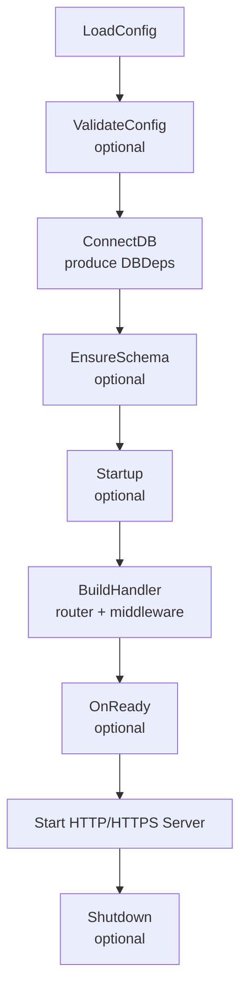
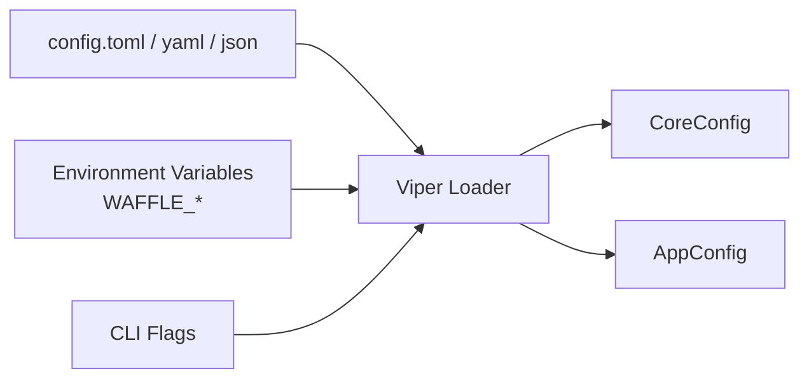
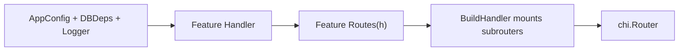
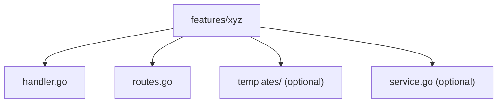
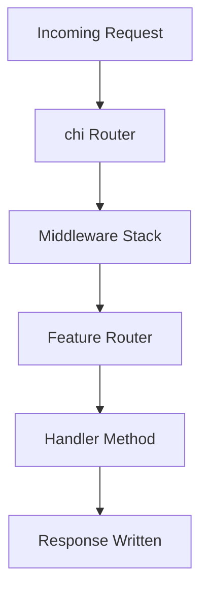
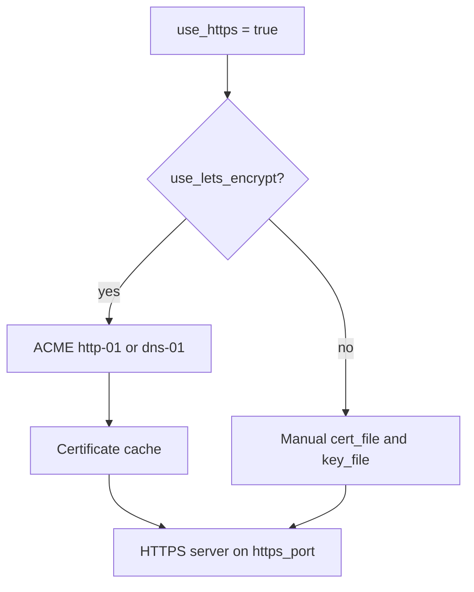
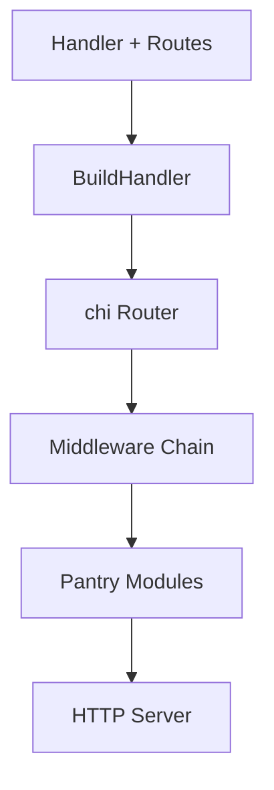
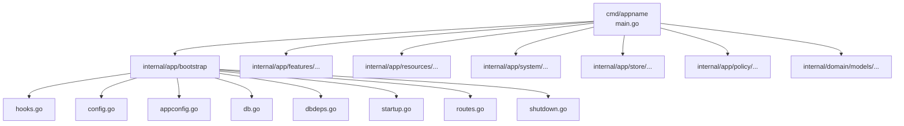

# WAFFLE Architecture Diagrams  
*A unified, linkable collection of diagrams illustrating core WAFFLE concepts.*

This file exists as the **central diagram index** for all WAFFLE documentation.  
Each diagram has a stable heading so other docs can link directly to it using GitHub’s auto‑generated anchors.

Diagrams are provided in two formats:

- **Mermaid diagrams** (rendered visually on GitHub)  
- **ASCII equivalents** (for plaintext readers, AI systems, and terminals)

Use these diagrams for:

- linking from other docs (e.g., Quickstart, Developer Docs, How‑To)
- teaching materials
- architectural overviews
- wafflestudio.ai documentation pages

---

# 🟦 WAFFLE Lifecycle
*(How WAFFLE boots, connects, and serves your app)*

## Mermaid


## ASCII
```
LoadConfig
    ↓
ValidateConfig (optional)
    ↓
ConnectDB (produces DBDeps)
    ↓
EnsureSchema (optional)
    ↓
Startup (optional)
    ↓
BuildHandler (construct routes + middleware)
    ↓
OnReady (optional, signals ready to accept traffic)
    ↓
Start HTTP/HTTPS Server
    ↓
Shutdown (optional, on termination)
```

A WAFFLE application always follows this strict lifecycle.
- **LoadConfig** should be lightweight and only read configuration.
- **ValidateConfig** performs additional validation beyond what `LoadConfig` does.
- **ConnectDB** initializes all long‑lived backend connections; nothing else should create DB clients.
- **EnsureSchema** runs only at startup to guarantee indexes, migrations, and boot‑time structure.
- **Startup** performs one-time initialization tasks after DB connections are ready.
- **BuildHandler** constructs the handler graph, routes, middleware, and feature wiring—this stage should avoid I/O.
- **OnReady** is called after the handler is built but before blocking on the server; useful for signaling readiness to load balancers, writing ready files for Kubernetes, or starting background workers.
- **Start Server** launches the HTTP/HTTPS listener using the fully prepared handler.
- **Shutdown** performs graceful cleanup when the server receives a termination signal.

---

# 🟩 Configuration Flow  
*(How config values move into CoreConfig and AppConfig)*

## Mermaid


## ASCII
```
config file ─┐
env vars ────┼──→ Viper Loader → CoreConfig
CLI flags ───┘                  → AppConfig
```

This flow shows how WAFFLE builds both `CoreConfig` and `AppConfig`.  
- Configuration may come from files, environment variables, or CLI flags.  
- WAFFLE merges these sources using Viper: **CLI > Env > File > Defaults**.  
- `CoreConfig` drives framework behavior (ports, HTTPS, logging, ACME, etc.).  
- `AppConfig` contains only application‑specific values that you define in your service.  
This separation keeps the framework clean and predictable.
```

---

# 🟧 Handler / Routes / BuildHandler Relationship  
*(How WAFFLE wires HTTP behavior together)*

## Mermaid


## ASCII
```
AppConfig + DBDeps + Logger
            ↓
        Handler
            ↓
     Routes(h *Handler)
            ↓
     Mounted in BuildHandler
            ↓
         chi.Router
```

This diagram explains how WAFFLE wires HTTP behavior together.  
- A **Handler** holds everything a feature needs (config, DBDeps, logger).  
- **Routes(h)** creates a subrouter bound to that handler instance.  
- **BuildHandler** mounts each feature’s subrouter at a top‑level path.  
- The final **chi.Router** is the complete routing graph passed to the server.  
This structure allows WAFFLE to remain explicit, testable, and easy to reason about.

---

# 🟨 Feature Folder Structure  
*(Recommended WAFFLE feature-based organization)*

## Mermaid


## ASCII
```
internal/app/features/xyz/
    handler.go
    routes.go
    templates/       (optional)
    service.go       (optional)
```

Each feature lives in its own folder under `internal/app/features/...`.  
- `handler.go` contains business logic and handler methods.  
- `routes.go` binds these handler methods to HTTP routes.  
- `templates/` may include HTMX/Tailwind partials.  
- `service.go` is optional and holds internal feature logic.  
This pattern keeps code isolated, modular, and discoverable.

---

# 🟪 Request Flow Through WAFFLE  
*(What happens when an HTTP request arrives)*

## Mermaid


## ASCII
```
Incoming Request
      ↓
   chi Router
      ↓
Middleware Stack
      ↓
Feature Subrouter
      ↓
Handler Method
      ↓
Response
```

This diagram shows what happens when WAFFLE receives an HTTP request.  
- The request enters the **chi router**, which applies global middleware.  
- It then flows into the feature‑specific subrouter bound in `BuildHandler`.  
- The router dispatches to the correct handler method.  
- The handler writes a response using only explicit dependencies.  
This predictable path makes debugging and performance tuning easier.

---

# 🟥 TLS / HTTPS / ACME Flow  
*(How WAFFLE manages HTTPS and Let’s Encrypt)*

## Mermaid


## ASCII
```
use_https = true
        ↓
   use_lets_encrypt?
       ↙        ↘
   yes           no
   ↓             ↓
ACME client   Manual cert_file/key_file
   ↓             ↓
Certificate Cache
        ↓
   HTTPS Server
```

WAFFLE supports both manual TLS and automatic Let’s Encrypt.  
- When **use_lets_encrypt=true**, WAFFLE performs ACME challenges (http‑01 or dns‑01).  
- Certificates are cached and automatically renewed.  
- When **manual TLS** is used, you provide `cert_file` and `key_file`.  
- In both cases, WAFFLE launches the HTTPS server once certificates are ready.  
This design avoids complexity for developers while supporting secure deployments.

---

# 🟫 WAFFLE Pantry Integration
*(Where optional helpers plug into the architecture)*

## Mermaid


## ASCII
```
Handlers & Routes
       ↓
   BuildHandler
       ↓
    chi Router
       ↓
 Middleware Chain
       ↓
 Pantry Modules
       ↓
   HTTP Server
```

The pantry provides optional helpers that fit naturally into the architecture.

**Core Utilities:**
- `pantry/email` — SMTP email sending with async queue and templates
- `pantry/fileserver` — Pre-compressed static file serving
- `pantry/cache` — Memory and Redis caching with middleware
- `pantry/session` — Session management (memory/Redis stores)
- `pantry/crypto` — Password hashing, encryption, secure random
- `pantry/errors` — Structured error handling and HTTP error responses

**Authentication & Authorization:**
- `pantry/auth/jwt` — JWT token creation, validation, middleware
- `pantry/auth/oauth2` — OAuth2 providers (Google, GitHub, Microsoft, Apple, etc.)
- `pantry/auth/apikey` — API key authentication middleware

**Database & Persistence:**
- `pantry/db/postgres` — PostgreSQL connection helpers
- `pantry/db/mysql` — MySQL connection helpers
- `pantry/db/sqlite` — SQLite connection helpers
- `pantry/db/redis` — Redis client helpers
- `pantry/mongo` — MongoDB utilities (cursor helpers, keyset pagination)

**Background Processing:**
- `pantry/jobs` — Job runner, scheduler (cron), worker pools
- `pantry/mq/rabbitmq` — RabbitMQ message queue
- `pantry/mq/sqs` — AWS SQS message queue

**HTTP & API:**
- `pantry/ratelimit` — Rate limiting middleware
- `pantry/requestid` — Request ID propagation
- `pantry/timeout` — Request timeouts and context helpers
- `pantry/pagination` — Offset and keyset pagination
- `pantry/retry` — Retry logic with circuit breaker

**Real-time & Push:**
- `pantry/websocket` — WebSocket connections with hub
- `pantry/sse` — Server-Sent Events broker
- `pantry/notify` — Multi-channel notifications
- `pantry/fcm` — Firebase Cloud Messaging
- `pantry/apns` — Apple Push Notifications

**Content & Internationalization:**
- `pantry/templates` — Template engine with HTMX support
- `pantry/i18n` — Internationalization and localization
- `pantry/pdf` — PDF generation

**Integrations:**
- `pantry/storage` — Cloud storage (S3, GCS, Azure)
- `pantry/search` — Search engines (Elasticsearch, Meilisearch)
- `pantry/webhook` — Webhook sending with retries
- `pantry/geo` — Geolocation and distance calculations

**Operations:**
- `pantry/health` — Health check endpoints
- `pantry/pprof` — Performance profiling endpoints
- `pantry/feature` — Feature flags
- `pantry/audit` — Audit logging
- `pantry/validate` — Struct validation with i18n
- `pantry/testing` — Test helpers and mocks
- `windowsservice` — Windows Service Control Manager adapter

Because pantry modules are utilities, they compose cleanly with features and routing without adding framework complexity.

---

# 🟦 WAFFLE Project Structure (Scaffolded)

## Mermaid


## ASCII
```
cmd/appname/main.go
internal/
  app/
    bootstrap/
      hooks.go        # Wires lifecycle functions into app.Hooks
      config.go       # LoadConfig and ValidateConfig
      appconfig.go    # AppConfig struct
      db.go           # ConnectDB and EnsureSchema
      dbdeps.go       # DBDeps struct
      startup.go      # Startup hook
      routes.go       # BuildHandler (HTTP routing)
      shutdown.go     # Shutdown hook
    features/
      README.md
    resources/
      README.md
    system/
      README.md
    store/
      README.md
    policy/
      README.md
  domain/
    models/
      README.md
```

This directory layout is produced automatically by `makewaffle`.
- `bootstrap/` holds lifecycle integration with 8 files covering all WAFFLE hooks.
- `features/` holds handler logic, templates, and routing for each feature.
- `resources/` holds embedded files (templates, images, JSON) via `go:embed`.
- `system/` holds app-specific shared utilities used across features.
- `store/` holds persistence/repository code.
- `policy/` is for authorization and business rule logic.
- `domain/models/` defines your business entities.
Each empty directory includes a README.md explaining its purpose.
This structure ensures consistency across all WAFFLE‑based services.

---

# 🧇 Linking to Diagrams from Other Docs

You may deep‑link to any diagram heading using GitHub’s anchor format, e.g.:

```markdown
See the [WAFFLE Lifecycle](./architecture.md#-waffle-lifecycle) diagram.
```

Each heading in this file is intentionally stable and anchor-safe.

---

# ⭐ Summary

This document gathers **all WAFFLE architecture diagrams in one place** and provides:

- Mermaid diagrams for GitHub rendering
- ASCII diagrams for plaintext readers
- Stable anchors for deep-linking
- A shared visual vocabulary for the framework

Use these diagrams to enhance clarity across the entire WAFFLE documentation set.

---

## See Also

- [Development Guide](../guides/development/README.md) — Full WAFFLE reference
- [Routes & Middleware Guide](./routing.md) — Routing patterns
- [Operational Endpoints Guide](./operational-endpoints.md) — Health, metrics, and pprof
- [WAFFLE Quickstart Guide](../guides/getting-started/quickstart.md) — Quick overview
- [makewaffle CLI Guide](../guides/getting-started/makewaffle.md) — Scaffold new applications