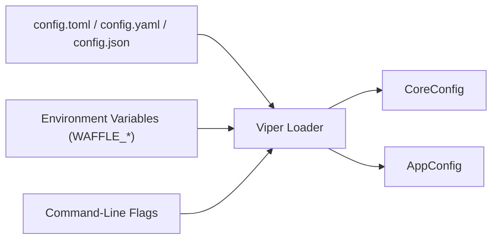

# WAFFLE Configuration Overview  
*A complete guide to how configuration works in WAFFLE applications.*

WAFFLE’s configuration system is designed to be:

- **explicit**  
- **predictable**  
- **simple to override**  
- **easy to teach**  
- **easy for AI to generate**  

This document explains the **whole picture** of how WAFFLE handles configuration values, including:

1. Configuration sources  
2. How values flow into `CoreConfig` and `AppConfig`  
3. The environment variable prefix  
4. Configuration precedence  
5. Example config files  
6. How to reference config values in your handlers  
7. Links to additional pattern/example documents  

Everything here applies to all WAFFLE applications.

---


# 🧱 1. WAFFLE Configuration Sources

### WAFFLE Configuration Flow Diagram



See also the full version in  
[Configuration Flow](./architecture.md#-configuration-flow).

By default, configuration may come from three places:

### ✔ 1. **Configuration files**
WAFFLE supports (via Viper):

- `config.toml`
- `config.yaml` / `config.yml`
- `config.json`
- `.env` (loaded via godotenv for local development)

Files are loaded automatically if present in the working directory.

### ✔ 2. **Environment variables**  
Environment variables always use the **`WAFFLE_` prefix**.

Examples:

```
WAFFLE_ENV=production
WAFFLE_GREETING="Hello WAFFLE"
WAFFLE_PORT=8080
```

### ✔ 3. **Command-line flags**  
If the developer chooses to add flag overrides, WAFFLE will always place CLI flags at the highest precedence.

*(WAFFLE itself does not require flags by default, but apps may add them.)*

---

# 🧩 2. How Config Maps Into `CoreConfig` and `AppConfig`

WAFFLE distinguishes between two kinds of configuration:

## **A. CoreConfig**
Provided by WAFFLE itself.
Controls framework-level behavior such as:

- **Runtime:** `env`, `log_level`
- **HTTP:** `http_port`, `https_port`, `use_https`, `read_timeout`, `read_header_timeout`, `write_timeout`, `idle_timeout`, `shutdown_timeout`
- **TLS/ACME:** `cert_file`, `key_file`, `use_lets_encrypt`, `lets_encrypt_email`, `lets_encrypt_cache_dir`, `domain`, `lets_encrypt_challenge`, `route53_hosted_zone_id`, `acme_directory_url`
- **CORS:** `enable_cors`, `cors_allowed_origins`, `cors_allowed_methods`, `cors_allowed_headers`, `cors_exposed_headers`, `cors_allow_credentials`, `cors_max_age`
- **DB Timeouts:** `db_connect_timeout`, `index_boot_timeout`
- **HTTP Behavior:** `max_request_body_bytes`, `enable_compression`, `compression_level`

This struct is defined inside WAFFLE. See [WAFFLE Provided Configuration Variables](./waffle-provided-config-vars.md) for the complete reference.

## **B. AppConfig**  
Defined **per application** and generated by `makewaffle`.

**File:**  
`internal/app/bootstrap/appconfig.go`  
**Created by:** makewaffle

Example:

```go
package bootstrap

type AppConfig struct {
    Greeting string
}
```

Values for these fields come from:

- config file keys  
- environment variables  
- CLI flags (if added)

Example mappings:

```
config.toml → greeting = "Hello"
env var     → WAFFLE_GREETING=Hello
```

---

# 🏷 3. Environment Variable Prefix (`WAFFLE_`)

WAFFLE uses the prefix:

```
WAFFLE_
```

to prevent naming collisions with other software.

Examples:

- `WAFFLE_PORT=8080`  
- `WAFFLE_GREETING="Hi"`  
- `WAFFLE_ENV=production`  

Later, WAFFLE may expose a configurable prefix for app-level fields.  
For now, the prefix is consistent and predictable — an advantage for clarity and teaching.

---

# TLS Configuration

WAFFLE supports both manual TLS certificates and automatic Let's Encrypt ACME.

## Manual TLS

```toml
use_https = true
cert_file = "/path/to/cert.pem"
key_file = "/path/to/key.pem"
https_port = 443
```

## Let's Encrypt (Automatic)

```toml
use_https = true
use_lets_encrypt = true
lets_encrypt_email = "admin@example.com"
domain = "example.com"
https_port = 443

# Optional
lets_encrypt_cache_dir = "letsencrypt-cache"  # Default
lets_encrypt_challenge = "http-01"             # or "dns-01"
```

### TLS Configuration Fields

| Field | Type | Default | Description |
|-------|------|---------|-------------|
| `use_https` | bool | false | Enable HTTPS server |
| `https_port` | int | 443 | HTTPS listen port |
| `cert_file` | string | "" | Path to TLS certificate (manual TLS) |
| `key_file` | string | "" | Path to TLS private key (manual TLS) |
| `use_lets_encrypt` | bool | false | Enable automatic ACME certificates |
| `lets_encrypt_email` | string | "" | ACME account email (required for Let's Encrypt) |
| `lets_encrypt_cache_dir` | string | "letsencrypt-cache" | Directory to cache certificates |
| `domain` | string | "" | Domain for TLS certificate |
| `lets_encrypt_challenge` | string | "http-01" | ACME challenge type: `http-01` or `dns-01` |
| `route53_hosted_zone_id` | string | "" | Route 53 zone ID (required for dns-01) |
| `acme_directory_url` | string | auto | ACME directory URL (defaults to staging for non-prod, production for prod) |

### ACME Challenge Types

**http-01 (default):**
- WAFFLE must listen on HTTP port 80 for the ACME challenge
- Simpler setup, works for most deployments

**dns-01:**
- Uses Route 53 DNS TXT records for verification
- Required for wildcard certificates
- Set `route53_hosted_zone_id` to your hosted zone ID

> **Note on http‑01 challenges:**
> When using Let's Encrypt with http‑01, WAFFLE must listen on **HTTP port 80** so the ACME server can reach `http://<domain>/.well-known/acme-challenge/...`.
> If you want your WAFFLE app to listen on another port (such as `8080`), you must terminate TLS at a **reverse proxy** (e.g., nginx, Caddy, Cloudflare) and set `use_lets_encrypt = false` so WAFFLE does not attempt to handle ACME itself.

---

# 🥇 4. Configuration Precedence

WAFFLE resolves configuration values in this order (lowest → highest):

1. **Default values** in `CoreConfig` or `AppConfig`
2. **Config file** (`config.toml`, `.yaml`, `.json`)
3. **Environment variables** (e.g., `WAFFLE_GREETING`)
4. **Command-line flags** (if used by the app)

This mirrors industry-standard precedence rules.

---

# 📝 5. Example Configuration Files

Below are examples showing how WAFFLE maps config file fields to Go struct fields.

## **TOML**

```toml
# CoreConfig (framework)
env = "development"
log_level = "debug"
http_port = 8080

# AppConfig (your app)
greeting = "Hello from TOML"
```

Equivalent environment variables:

```
WAFFLE_ENV=development
WAFFLE_LOG_LEVEL=debug
WAFFLE_HTTP_PORT=8080
WAFFLE_GREETING="Hello from TOML"
```

## **YAML**

```yaml
# CoreConfig (framework)
env: development
log_level: debug
http_port: 8080

# AppConfig (your app)
greeting: "Hello from YAML"
```

## **JSON**

```json
{
  "env": "development",
  "log_level": "debug",
  "http_port": 8080,
  "greeting": "Hello from JSON"
}
```

---

# 🧩 6. Accessing Configuration Inside Your App

Configuration is loaded in:

**File:**  
`internal/app/bootstrap/hooks.go`

The WAFFLE lifecycle loads core config and app config:

```go
coreCfg, appCfg, err := LoadConfig(logger)
```

These are passed into your handlers in:

```go
handler := feature.NewHandler(coreCfg, appCfg, deps, logger)
```

Inside a handler method:

```go
func (h *Handler) ServeHome(w http.ResponseWriter, r *http.Request) {
    message := h.AppCfg.Greeting
    w.Write([]byte(message))
}
```

Handlers always receive configuration explicitly — never magically.

---

# 🧭 7. How Configuration Fits Into the WAFFLE Lifecycle

WAFFLE's config loading occurs at the top of the lifecycle:

```
LoadConfig (returns CoreConfig + AppConfig)
    ↓
ValidateConfig (optional, app-specific validation)
    ↓
ConnectDB (uses config to create DBDeps)
    ↓
EnsureSchema (optional, creates indexes/migrations)
    ↓
Startup (optional, one-time initialization)
    ↓
BuildHandler (receives config, builds router)
    ↓
OnReady (optional, signals ready for traffic)
    ↓
HTTP Server (blocks until shutdown signal)
    ↓
Shutdown (optional, cleanup resources)
```

See [WAFFLE Lifecycle](./architecture.md#-waffle-lifecycle) for the full diagram.

This ensures:

- consistent startup
- easy testing
- predictable flow
- simple reasoning
- clear AI code generation  

---

# 🔗 8. Related Example Documents

- **[Examples of AppConfig Patterns](./examples-of-appconfig-patterns.md)**  
  How to structure your AppConfig for real-world apps.

- **[DBDeps Usage Examples](./dbdeps/usage-examples.md)**
  How configuration passes into DB dependencies.

- **[Handler Structure Examples](./handler-structure-examples.md)**  
  How config flows into handlers.

- **[WAFFLE Provided Configuration Variables](./waffle-provided-config-vars.md)**  
  Full list of built-in CoreConfig keys, types, defaults, and constraints.

---

# ⭐ Summary

WAFFLE’s configuration system is designed to be:

- predictable  
- explicit  
- easy for beginners  
- powerful for experts  
- AI-friendly  

This document provides the complete view of:

- configuration sources  
- env prefix behavior  
- mapping into Go structs  
- precedence  
- examples  
- how config flows through the lifecycle  

Use this doc as the authoritative reference for all future WAFFLE config usage.
