# WAFFLE Routes & Middleware Guide 
*Practical patterns for routing, subrouters, authentication, and composable middleware.*

This guide shows **concrete examples** of how to structure routes and apply middleware in WAFFLE services.  
Each example is short, focused, and directly usable in your WAFFLE apps.

---

# 📌 Mental Model: How WAFFLE Routing Works

WAFFLE uses the Chi router under the hood.
A key part of the architecture is:

- **Top-level router** decides *where* a feature lives.
- **Feature** decides *what happens inside its own namespace*.

The top-level router is created using `router.New()`, which returns a Chi router pre-configured with WAFFLE's standard middleware stack:

- **RequestID** — Unique ID for each request (for tracing)
- **RealIP** — Extract client IP from X-Forwarded-For headers
- **Recoverer** — Panic recovery with stack trace logging
- **Compression** — Response compression (if enabled via config)
- **Body size limit** — Enforce MaxRequestBodyBytes from config
- **HTTP metrics** — Prometheus request duration histograms
- **Request logging** — Structured access logs
- **JSON 404/405 handlers** — Consistent error responses

For example:

```go
// BuildHandler (top-level) in internal/app/bootstrap/routes.go
func BuildHandler(coreCfg *config.CoreConfig, appCfg AppConfig, deps DBDeps, logger *zap.Logger) (http.Handler, error) {
    r := router.New(coreCfg, logger)  // WAFFLE router with middleware
    r.Mount("/about", about.Routes())
    return r, nil
}
```

```go
// Feature: about (in internal/app/features/about/routes.go)
func Routes() chi.Router {
    r := chi.NewRouter()  // bare Chi router for subroutes
    r.Get("/", Handler)   // final path: /about
    return r
}
```

This "composition model" keeps features self-contained while leaving URL layout to the top level.

### WAFFLE Routing Diagram

```mermaid
flowchart LR
    A["Top‑level BuildHandler"] --> B["r.Mount('/about', about.Routes())"]
    B --> C["Feature Routes()"]
    C --> D["chi.Subrouter"]
    D --> E["Handler Methods"]
```



See also the more detailed version in  
[Handler / Routes / BuildHandler Relationship](./architecture.md#-handler--routes--buildhandler-relationship).

---

# 📂 Where to Put This Code in a WAFFLE App

To keep these examples grounded, here’s how they map to real files in a WAFFLE project.

For a feature named **about**:

- The feature’s routes live in a file you create:

  ```text
  internal/app/features/about/routes.go
  ```

  This is where functions like `Routes()` or `MountRoutes(r chi.Router)` live.

- The top-level router lives in a file generated by **makewaffle**:

  ```text
  internal/app/bootstrap/routes.go
  ```

  Inside this file, the `BuildHandler` function is responsible for wiring features into the main router.
  When you see lines like:

  ```go
  r.Mount("/about", about.Routes())
  ```

  they belong inside `BuildHandler` in `internal/app/bootstrap/routes.go`.

Summary:

- **You create**: `internal/app/features/<feature>/routes.go`
- **makewaffle creates**: `internal/app/bootstrap/routes.go` (and you extend `BuildHandler` there)

Now the examples below will specify both the feature file and the top-level wiring point so it's clear where each piece of code goes.

---

# ⚠️ A Note About Auth Middleware in These Examples

The examples below use `auth.RequireAuth` and `auth.RequireRole(...)` to demonstrate middleware patterns. **These are not part of WAFFLE.** They represent custom middleware you would implement for your application's authentication and authorization needs.

The import path `github.com/you/myapp/internal/app/middleware/auth` is a placeholder showing where you might put your own auth middleware. The examples demonstrate the *pattern* for applying middleware to routes—not WAFFLE-provided authentication.

You'll need to implement your own auth middleware based on your application's requirements (JWT, sessions, OAuth, etc.).

---

# 🍰 Example 1: Feature With Public + Authenticated Routes

You want:

- `/about` → **public**
- `/about/change` → **requires auth**

### Feature Router

```go
// internal/app/features/about/routes.go
package about

import (
    "net/http"
    "github.com/go-chi/chi/v5"
    "github.com/you/myapp/internal/app/middleware/auth" // your custom auth middleware
)

func Routes() chi.Router {
    r := chi.NewRouter()

    // Public route: /about
    r.Get("/", func(w http.ResponseWriter, r *http.Request) {
        w.Write([]byte("Public About Page"))
    })

    // Authenticated subroutes: /about/...
    r.Group(func(pr chi.Router) {
        pr.Use(auth.RequireAuth)

        pr.Get("/change", func(w http.ResponseWriter, r *http.Request) {
            w.Write([]byte("You must be logged in to see this."))
        })
    })

    return r
}
```

### Mounted in BuildHandler

```go
r.Mount("/about", about.Routes())
```

---

# 🍽️ Example 2: Role-Based Routing (Admin / Leader Only)

Goal:

- `/about/change` → any authenticated user  
- `/about/change/leader` → **authenticated** + **role = admin OR leader**

### Feature Router With Nested Groups

```go
func Routes() chi.Router {
    r := chi.NewRouter()

    // Public
    r.Get("/", PublicHandler)

    // Authenticated-only area
    r.Group(func(pr chi.Router) {
        pr.Use(auth.RequireAuth)

        pr.Get("/change", ChangeHandler)

        // Role-restricted area
        pr.Group(func(rr chi.Router) {
            rr.Use(auth.RequireRole("admin", "leader"))

            rr.Get("/change/leader", LeaderChangeHandler)
        })
    })

    return r
}
```

### Mounted the same way:

```go
r.Mount("/about", about.Routes())
```

This yields:

- `/about` → public  
- `/about/change` → authenticated  
- `/about/change/leader` → admin/leader only  

---

# 🧱 Example 3: Feature Owning Its Full Path (MountRoutes style)

Some developers prefer that each feature declare **its own URL prefix**, rather than relying on `Mount()`.

This pattern mirrors the one used in your StrataHub service.

### Feature Implementation

```go
package settings

import (
    "github.com/go-chi/chi/v5"
    "github.com/you/myapp/internal/app/middleware/auth" // your custom auth middleware
)

func MountRoutes(r chi.Router) {
    r.Group(func(pr chi.Router) {
        pr.Use(auth.RequireAuth)

        pr.Get("/settings", SettingsPageHandler)
        pr.Post("/settings/update", SettingsUpdateHandler)
    })
}
```

### BuildHandler

```go
settings.MountRoutes(r)
```

### Result

- Feature controls both:
  - The URL layout (`/settings`)
  - The middleware applied to those paths

Use this pattern when:

- You want the feature to be fully self-contained  
- You don't need the top level to choose the mount point  
- You want consistency with existing services that use MountRoutes

---

# 🧩 Example 4: Combining Subrouter and MountRoutes Patterns

WAFFLE supports both patterns, and you can mix them:

- `/about` → mounted subrouter
- `/settings` → MountRoutes style

Example BuildHandler:

```go
r.Mount("/about", about.Routes())
settings.MountRoutes(r)
account.MountRoutes(r)
r.Mount("/profile", profile.Routes())
```

This lets each feature choose the pattern that makes sense for its shape.

---

# 🔧 Example 5: Adding Middleware to a Feature (Logging, CORS, Rate Limits)

You can apply arbitrary middleware inside a feature’s subrouter.

### Logging middleware

```go
r.Use(logging.RequestLogger(logger))
```

### CORS (feature-level CORS)

```go
import "github.com/dalemusser/waffle/middleware"

// Config-driven CORS (uses coreCfg.CORS settings)
r.Use(middleware.CORSFromConfig(coreCfg))

// Or permissive CORS for development/internal APIs
r.Use(middleware.CORSPermissive())

// Or custom CORS options
r.Use(middleware.CORS(middleware.CORSOptions{
    AllowedOrigins:   []string{"https://app.example.com"},
    AllowedMethods:   []string{"GET", "POST", "PUT", "DELETE"},
    AllowCredentials: true,
}))
```

### Custom middleware

```go
r.Use(func(next http.Handler) http.Handler {
    return http.HandlerFunc(func(w http.ResponseWriter, r *http.Request) {
        // ... do something before ...
        next.ServeHTTP(w, r)
        // ... or after ...
    })
})
```

Everything is additive and composable.

---

# 🛠️ Example 6: Mounting Multiple Routes Under the Same Feature

Often a feature has multiple subrouters:

```go
func Routes() chi.Router {
    r := chi.NewRouter()
    r.Get("/", ListHandler)
    return r
}

func AdminRoutes() chi.Router {
    r := chi.NewRouter()
    r.Use(auth.RequireRole("admin"))
    r.Get("/", AdminDashboard)
    return r
}
```

### BuildHandler

```go
r.Mount("/items", items.Routes())          // /items
r.Mount("/items/admin", items.AdminRoutes()) // /items/admin
```

The mount point determines URL layout; the feature determines behavior.

---

# 🧠 Summary: When to Use Each Pattern

| Pattern | Strengths | Use When |
|---|---|---|
| **Subrouter + r.Mount(prefix, Routes())** | Clean composition, top-level decides URL structure | You want top-level control of prefixes (recommended for WAFFLE beginners) |
| **Feature-owned MountRoutes(r)** | Encapsulates routes & middleware | Feature should fully own its URL namespace |
| **Nested groups inside feature** | Fine-grained auth / role control | You need mixed public & protected paths under single prefix |
| **Middleware inside subrouter** | Local behavior | Feature-specific logging, CORS, or rate limits |

---

## See Also

- [Operational Endpoints Guide](./operational-endpoints.md) — Health, metrics, and pprof
- [makewaffle CLI Guide](../guides/getting-started/makewaffle.md) — Scaffold new WAFFLE applications
- [How to Write Your First WAFFLE Service](../guides/getting-started/first-service.md) — Step-by-step tutorial
- [WAFFLE Quickstart Guide](../guides/getting-started/quickstart.md) — Quick overview
- [Development Guide](../guides/development/README.md) — Detailed reference
- [Handler Structure Examples](../guides/patterns/handlers.md) — Handler patterns
