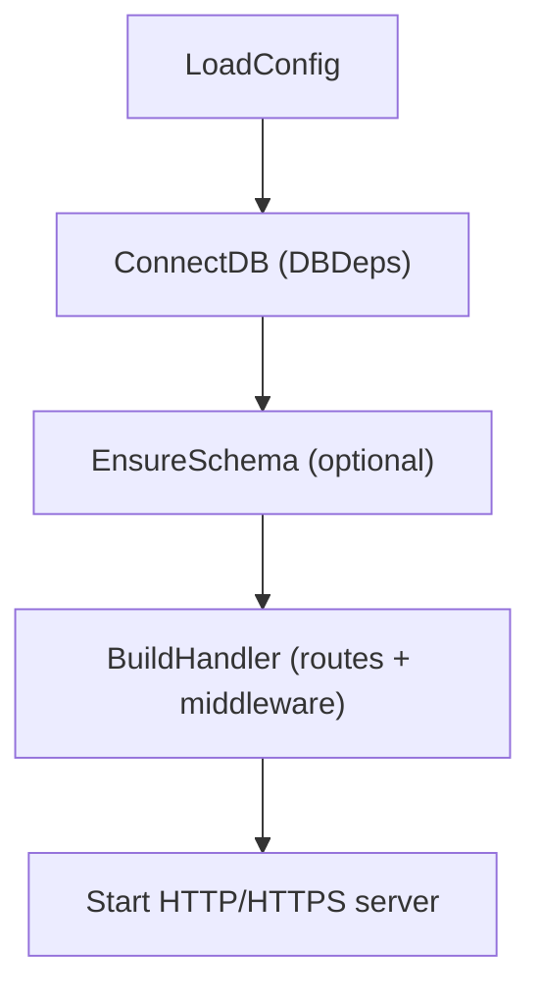
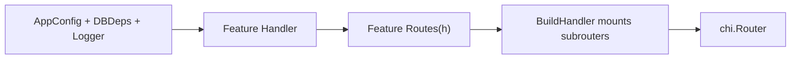

# WAFFLE Framework – Developer Documentation
*A foundation for building production-grade Go web services*

---

## 1. What WAFFLE Is

WAFFLE (Web Application Framework for Flavorful Layered Engineering) is a Go framework that standardizes:

- Application lifecycle  
- Logging (structured, environment-aware)  
- Configuration  
- Metrics  
- Server startup (HTTP/HTTPS/Let’s Encrypt)  
- Middleware  
- Graceful shutdown  
- Health checks  
- Reusable utilities (toolkit)

WAFFLE is **not** a monolithic server. Instead, it provides the **infrastructure layer** so each application can focus on its domain—for example:

- StrataHub
- StrataLog
- StrataSave

Every WAFFLE-based application follows the same structure, uses the same lifecycle, and inherits the same operational guarantees.

---

## 2. High-Level Architecture

A WAFFLE service is structured into layers:

```
┌──────────────────────────┐
│     Application Code     │
└──────────────┬───────────┘
               │
┌──────────────┴───────────┐
│        WAFFLE Core       │
└──────────────┬───────────┘
               │
┌──────────────┴────────────┐
│      WAFFLE Toolkit       │
└───────────────────────────┘
```

Where:

- **Core** – the cross-platform framework for building WAFFLE apps  
- **Toolkit** – optional, reusable helpers  
- **App** – the domain logic unique to the service  

---

## 3. Core: The Application Lifecycle (`app.Run`)

Every WAFFLE service begins with:

```go
app.Run(context.Background(), hooks)
```

This hands all lifecycle control to WAFFLE.

### 3.1 WAFFLE Lifecycle Diagram



For more detail, see the  
[WAFFLE Lifecycle](./waffle-architecture-diagrams.md#waffle-lifecycle) diagram.

### 3.1 Hooks

Each service defines a `Hooks[C, D]` struct:

```go
type Hooks[C any, D any] struct {
    Name          string
    LoadConfig    func(*zap.Logger) (*config.CoreConfig, C, error)
    ConnectDB     func(context.Context, *config.CoreConfig, C, *zap.Logger) (D, error)
    EnsureSchema  func(context.Context, *config.CoreConfig, C, D, *zap.Logger) error
    BuildHandler  func(*config.CoreConfig, C, D, *zap.Logger) (http.Handler, error)
}
```

WAFFLE calls these functions in order and manages everything else.

---

## 4. Configuration

WAFFLE applications load both:

- **CoreConfig** – shared across all WAFFLE services  
- **AppConfig** – specific to the individual service  

Example:

```go
LoadConfig(logger) (*config.CoreConfig, AppConfig, error)
```

CoreConfig includes fields like:

```go
Env
LogLevel
HTTPPort
HTTPSPort
UseHTTPS
UseLetsEncrypt
ShutdownTimeout
DBConnectTimeout
IndexBootTimeout
```

---

## 5. Logging

WAFFLE provides:

1. **Bootstrap Logger** – minimal logger available before config loads  
2. **Final Logger** – environment- and level-aware based on config  

Both use `zap.Logger`.

Every hook receives the final logger.

---

## 6. Metrics

WAFFLE automatically registers:

- Runtime metrics  
- Process metrics  
- Standard HTTP metrics  

You get them for free whenever you call `app.Run`.

---

## 7. Database Connections

WAFFLE has no database preference.  
Applications define their own DB bundle `D` and connect through:

```go
ConnectDB(ctx, coreCfg, appCfg, logger) (DBDeps, error)
```

Your DBDeps struct can contain Mongo clients, Redis connections, anything.

---

## 8. Schema Initialization

If your service requires schema work such as indexes or migrations, use:

```go
EnsureSchema(ctx, coreCfg, appCfg, dbDeps, logger)
```

WAFFLE supplies context timeout and logs errors.

---

## 9. Routing / HTTP Handlers

Applications assemble a router in:

```go
BuildHandler(coreCfg, appCfg, dbDeps, logger) (http.Handler, error)
```

Most services will use Chi:

```go
r := chi.NewRouter()
r.Get("/status", statusHandler)
return r, nil
```

WAFFLE imposes no router or structure beyond this.

### 9.1 Handler → Routes → BuildHandler Diagram



See also the  
[Handler / Routes / BuildHandler Relationship](./waffle-architecture-diagrams.md#handler--routes--buildhandler-relationship) diagram.

---

## 10. Server Startup

WAFFLE’s server layer handles:

- HTTP vs HTTPS  
- Automatic Let’s Encrypt certificates  
- Redirecting HTTP → HTTPS when needed  
- Graceful shutdown via context  
- Concurrent ACME and main server  
- SIGINT/SIGTERM handling  
- Timeouts  

All via:

```go
server.ListenAndServeWithContext(ctx, coreCfg, handler, logger)
```

Applications do not call `ListenAndServe` directly.

---

## 11. Graceful Shutdown

WAFFLE supports:

- **Linux/macOS**: SIGINT/SIGTERM signals  
- **Windows Services**: SCM Stop events if using toolkit/windowsservice  

Shutdown flow:

1. WAFFLE receives stop signal  
2. Cancels the root context  
3. HTTP server begins graceful termination  
4. Active requests complete within timeout  
5. Logger syncs  
6. Clean exit  

This behavior is automatic.

---

## 12. Health Checks

WAFFLE includes a unified health framework:

```go
checks := map[string]health.Check{
    "db": func(ctx context.Context) error { return client.Ping(ctx, nil) },
}
health.Mount(r, checks, logger)
```

- All checks OK → `200 OK`
- Any check fails → `503 Service Unavailable`
- HEAD support for load balancers  

---

## 13. Toolkit

The WAFFLE **toolkit** contains reusable libraries not part of the core lifecycle.

Current modules include:

### 13.1 `toolkit/cors`

Reusable CORS middleware:

```go
r.Use(cors.Default())
```

### 13.2 `toolkit/windowsservice`

Windows SCM adapter:

```go
prg := &windowsservice.Program[AppConfig, DBDeps]{Hooks: hooks}
service.New(prg, cfg)
```

Non‑Windows builds ignore this automatically.

### Future toolkit candidates

As services evolve, the toolkit may add:

- validation helpers  
- db wrappers  
- view rendering helpers  
- Mongo error helpers  
- pagination utilities  

Toolkit grows as true cross‑service needs emerge.

---

## 14. WAFFLE Repository Structure

```
waffle/
  app/
  config/
  server/
  logging/
  metrics/
  middleware/
  httputil/
  health/
  toolkit/
    cors/
    windowsservice/
```

Services import WAFFLE with:

```go
"github.com/dalemusser/waffle/app"
"github.com/dalemusser/waffle/config"
"github.com/dalemusser/waffle/server"
"github.com/dalemusser/waffle/toolkit/cors"
```

---

## 15. Application Structure (WAFFLE apps)

A standard WAFFLE-based service looks like:

```
cmd/
  appname/
    main.go

internal/
  app/
    bootstrap/
      appconfig.go
      dbdeps.go
      hooks.go
    features/
    policy/
    store/
  domain/
    models/
```

This structure keeps domain, storage, policy, and handlers cleanly separated.

---

## 16. Developer Workflow for New WAFFLE Apps

1. Create new repo  
2. `go mod init github.com/dalemusser/<appname>`  
3. `go get github.com/dalemusser/waffle`  
4. Define the Hooks  
5. Implement routing in `BuildHandler`  
6. Add toolkit helpers as needed  
7. Run with `app.Run`  

---

## 17. WAFFLE Development Philosophy

WAFFLE believes in:

- Go clean  
- Go fast  
- Go layered  
- Go composable  
- Go build  
- Go ship  
- Go again  

WAFFLE removes the boilerplate so your applications stay flavorful, focused, and maintainable.

---

## 18. Summary

WAFFLE provides:

- Unified configuration  
- Unified lifecycle  
- Unified logging  
- Unified metrics  
- Unified health checks  
- Unified graceful shutdown  
- First-class HTTPS and ACME integration  
- Optional reusable toolkit helpers  
- Clean separation between framework and application  

It is the foundation for all Strata applications, enabling StrataHub, StrataLog, and StrataSave to share a consistent, powerful spine while keeping their domain logic lightweight and deliciously layered.