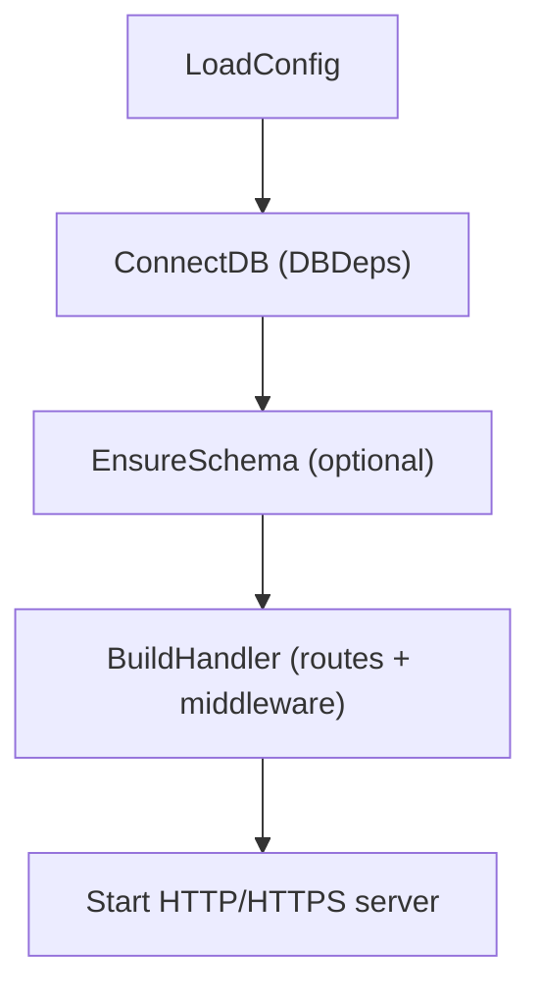
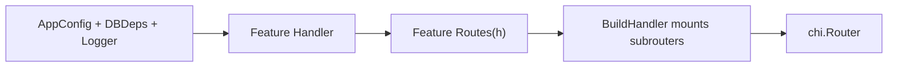

# WAFFLE Framework – Developer Documentation
*A foundation for building production-grade Go web services*

---

## 1. What WAFFLE Is

WAFFLE (Web Application Framework for Flavorful Layered Engineering) is a Go framework that standardizes:

- Application lifecycle  
- Logging (structured, environment-aware)  
- Configuration  
- Metrics  
- Server startup (HTTP/HTTPS/Let’s Encrypt)  
- Middleware  
- Graceful shutdown  
- Health checks  
- Reusable utilities (toolkit)

WAFFLE is **not** a monolithic server. Instead, it provides the **infrastructure layer** so each application can focus on its domain—for example:

- StrataHub
- StrataLog
- StrataSave

Every WAFFLE-based application follows the same structure, uses the same lifecycle, and inherits the same operational guarantees.

---

## 2. High-Level Architecture

A WAFFLE service is structured into layers:

```
┌──────────────────────────┐
│     Application Code     │
└──────────────┬───────────┘
               │
┌──────────────┴───────────┐
│        WAFFLE Core        │
└──────────────┬───────────┘
               │
┌──────────────┴───────────┐
│      WAFFLE Toolkit       │
└───────────────────────────┘
```

Where:

- **Core** – the cross-platform framework for building WAFFLE apps  
- **Toolkit** – optional, reusable helpers  
- **App** – the domain logic unique to the service  

---

## 3. Core: The Application Lifecycle (`app.Run`)

Every WAFFLE service begins with:

```go
app.Run(context.Background(), hooks)
```

This hands all lifecycle control to WAFFLE.

### 3.1 Hooks

Each service defines a `Hooks[C, D]` struct:

```go
type Hooks[C any, D any] struct {
    Name          string
    LoadConfig    func(*zap.Logger) (*config.CoreConfig, C, error)
    ConnectDB     func(context.Context, *config.CoreConfig, C, *zap.Logger) (D, error)
    EnsureSchema  func(context.Context, *config.CoreConfig, C, D, *zap.Logger) error
    BuildHandler  func(*config.CoreConfig, C, D, *zap.Logger) (http.Handler, error)
}
```

WAFFLE calls these functions in order and manages everything else.

---

## 4. Configuration

WAFFLE applications load both:

- **CoreConfig** – shared across all WAFFLE services  
- **AppConfig** – specific to the individual service  

Example:

```go
LoadConfig(logger) (*config.CoreConfig, AppConfig, error)
```

CoreConfig includes fields like:

```go
Env
LogLevel
HTTPPort
HTTPSPort
UseHTTPS
UseLetsEncrypt
ShutdownTimeout
DBConnectTimeout
IndexBootTimeout
```

---

## 5. Logging

WAFFLE provides:

1. **Bootstrap Logger** – minimal logger available before config loads  
2. **Final Logger** – environment- and level-aware based on config  

Both use `zap.Logger`.

Every hook receives the final logger.

---

## 6. Metrics

WAFFLE automatically registers:

- Runtime metrics  
- Process metrics  
- Standard HTTP metrics  

You get them for free whenever you call `app.Run`.

---

## 7. Database Connections

WAFFLE has no database preference.  
Applications define their own DB bundle `D` and connect through:

```go
ConnectDB(ctx, coreCfg, appCfg, logger) (DBDeps, error)
```

Your DBDeps struct can contain Mongo clients, Redis connections, anything.

---

## 8. Schema Initialization

If your service requires schema work such as indexes or migrations, use:

```go
EnsureSchema(ctx, coreCfg, appCfg, dbDeps, logger)
```

WAFFLE supplies context timeout and logs errors.

---

## 9. Routing / HTTP Handlers

Applications assemble a router in:

```go
BuildHandler(coreCfg, appCfg, dbDeps, logger) (http.Handler, error)
```

Most services will use Chi:

```go
r := chi.NewRouter()
r.Get("/status", statusHandler)
return r, nil
```

WAFFLE imposes no router or structure beyond this.

---

## 10. Server Startup

WAFFLE’s server layer handles:

- HTTP vs HTTPS  
- Automatic Let’s Encrypt certificates  
- Redirecting HTTP → HTTPS when needed  
- Graceful shutdown via context  
- Concurrent ACME and main server  
- SIGINT/SIGTERM handling  
- Timeouts  

All via:

```go
server.ListenAndServeWithContext(ctx, coreCfg, handler, logger)
```

Applications do not call `ListenAndServe` directly.

---

## 11. Graceful Shutdown

WAFFLE supports:

- **Linux/macOS**: SIGINT/SIGTERM signals  
- **Windows Services**: SCM Stop events if using toolkit/windowsservice  

Shutdown flow:

1. WAFFLE receives stop signal  
2. Cancels the root context  
3. HTTP server begins graceful termination  
4. Active requests complete within timeout  
5. Logger syncs  
6. Clean exit  

This behavior is automatic.

---

## 12. Health Checks

WAFFLE includes a unified health framework:

```go
checks := map[string]health.Check{
    "db": func(ctx context.Context) error { return client.Ping(ctx, nil) },
}
health.Mount(r, checks, logger)
```

- All checks OK → `200 OK`
- Any check fails → `503 Service Unavailable`
- HEAD support for load balancers  

---

## 13. Toolkit

The WAFFLE **toolkit** contains reusable libraries not part of the core lifecycle.

Current modules include:

### 13.1 `toolkit/cors`

Reusable CORS middleware:

```go
r.Use(cors.Default())
```

### 13.2 `toolkit/windowsservice`

Windows SCM adapter:

```go
prg := &windowsservice.Program[AppConfig, DBDeps]{Hooks: hooks}
service.New(prg, cfg)
```

Non‑Windows builds ignore this automatically.

### Future toolkit candidates

As services evolve, the toolkit may add:

- validation helpers  
- db wrappers  
- view rendering helpers  
- Mongo error helpers  
- pagination utilities  

Toolkit grows as true cross‑service needs emerge.

---

## 14. WAFFLE Repository Structure

```
waffle/
  app/
  config/
  server/
  logging/
  metrics/
  middleware/
  httputil/
  health/
  toolkit/
    cors/
    windowsservice/
```

Services import WAFFLE with:

```go
"github.com/dalemusser/waffle/app"
"github.com/dalemusser/waffle/config"
"github.com/dalemusser/waffle/server"
"github.com/dalemusser/waffle/toolkit/cors"
```

---

## 15. Application Structure (WAFFLE apps)

A standard WAFFLE-based service looks like:

```
cmd/
  appname/
    main.go

internal/
  app/
    bootstrap/
      appconfig.go
      dbdeps.go
      hooks.go
    features/
    policy/
    store/
  domain/
    models/
```

This structure keeps domain, storage, policy, and handlers cleanly separated.

---

## 16. Developer Workflow for New WAFFLE Apps

1. Create new repo  
2. `go mod init github.com/dalemusser/<appname>`  
3. `go get github.com/dalemusser/waffle`  
4. Define the Hooks  
5. Implement routing in `BuildHandler`  
6. Add toolkit helpers as needed  
7. Run with `app.Run`  

---

## 17. WAFFLE Development Philosophy

WAFFLE believes in:

- Go clean  
- Go fast  
- Go layered  
- Go composable  
- Go build  
- Go ship  
- Go again  

WAFFLE removes the boilerplate so your applications stay flavorful, focused, and maintainable.

---

## 18. Summary

WAFFLE provides:

- Unified configuration  
- Unified lifecycle  
- Unified logging  
- Unified metrics  
- Unified health checks  
- Unified graceful shutdown  
- First-class HTTPS and ACME integration  
- Optional reusable toolkit helpers  
- Clean separation between framework and application  

It is the foundation for all Strata applications, enabling StrataHub, StrataLog, and StrataSave to share a consistent, powerful spine while keeping their domain logic lightweight and deliciously layered.
# WAFFLE Framework – Developer Documentation  
*A complete, architecture‑aware guide for building production‑grade WAFFLE services*

This document explains **how WAFFLE works internally**, how WAFFLE applications are structured, and how all parts fit together through the **WAFFLE lifecycle**.

If you want a step‑by‑step beginner’s guide, see:  
**[First WAFFLE Service How‑To](./first-waffle-service-howto.md)**  
If you want configuration details, see:  
**[WAFFLE Configuration Overview](./examples/about_waffle_config.md)**  
**[WAFFLE Provided Configuration Variables](./examples/waffle-provided-config-vars.md)**

---

# 🟦 1. What WAFFLE Is

WAFFLE (Web Application Framework for Flavorful Layered Engineering) is a Go framework that provides the **foundation** for building reliable, maintainable, production‑ready web services.

WAFFLE standardizes:

- Application lifecycle  
- Configuration loading  
- Structured logging  
- Metrics  
- TLS / HTTPS / Let’s Encrypt  
- Middleware  
- Routing patterns  
- Graceful shutdown  
- Health checks  
- Reusable utilities (Toolkit)

WAFFLE is *not* a monolithic application server.  
It is a **framework and lifecycle engine** that every WAFFLE‑based service inherits.

---

# 🧇 2. High‑Level Architecture

```
┌──────────────────────────┐
│     Your Application     │  ← Features, handlers, DB code, policies
└──────────────┬───────────┘
               │
┌──────────────┴───────────┐
│        WAFFLE Core        │  ← Lifecycle, config, logging, server, metrics
└──────────────┬───────────┘
               │
┌──────────────┴───────────┐
│      WAFFLE Toolkit       │  ← Optional helpers: CORS, Windows services, etc.
└───────────────────────────┘
```

Every WAFFLE service shares:

- the same lifecycle  
- the same configuration model  
- the same startup/shutdown behavior  
- the same routing patterns  
- the same conceptual structure  

This consistency is what makes the WAFFLE ecosystem powerful.

---

# 🟩 3. The WAFFLE Lifecycle

Every WAFFLE service starts with:

```go
app.Run(context.Background(), Hooks)
```

This hands full lifecycle control to WAFFLE:

```
LoadConfig
    ↓
ConnectDB (produces DBDeps)
    ↓
EnsureSchema
    ↓
BuildHandler (wires routes + middleware)
    ↓
Start HTTP/HTTPS Server
```


This lifecycle is the **core mental model** for all WAFFLE apps.

### 3.1 WAFFLE Lifecycle Diagram



For more detail, see the [WAFFLE Lifecycle](./waffle-architecture-diagrams.md#waffle-lifecycle) diagram in the architecture diagrams collection.

---

# 🟧 4. Hooks: Connecting Your App to the Lifecycle

Each service defines:

**File:** `internal/app/bootstrap/hooks.go`  
**Created by:** makewaffle (scaffolded)

```go
type Hooks[C any, D any] struct {
    Name          string
    LoadConfig    func(*zap.Logger) (*config.CoreConfig, C, error)
    ConnectDB     func(context.Context, *config.CoreConfig, C, *zap.Logger) (D, error)
    EnsureSchema  func(context.Context, *config.CoreConfig, C, D, *zap.Logger) error
    BuildHandler  func(*config.CoreConfig, C, D, *zap.Logger) (http.Handler, error)
}
```

WAFFLE calls these in order:

1. **LoadConfig** → loads CoreConfig + AppConfig  
2. **ConnectDB** → database or backend clients  
3. **EnsureSchema** → indexes, migrations  
4. **BuildHandler** → routing & middleware  
5. WAFFLE starts the server  

Hooks are where your application attaches to WAFFLE’s lifecycle.

---

# 🟦 5. Configuration

WAFFLE loads two config structs:

### **CoreConfig**  
Provided by WAFFLE. Controls:

- Logging  
- Ports  
- HTTPS  
- Let’s Encrypt  
- CORS  
- Timeouts  
- Request limits  

### **AppConfig**  
Defined by your service.  
**File:** `internal/app/bootstrap/appconfig.go`

Example:

```go
type AppConfig struct {
    Greeting string
}
```

### Further Reading

- **[WAFFLE Configuration Overview](./examples/about_waffle_config.md)**  
- **[WAFFLE Provided Configuration Variables](./examples/waffle-provided-config-vars.md)**  
- **[Examples of AppConfig Patterns](./examples/examples-of-appconfig-patterns.md)**

---

# 🧠 6. Logging

WAFFLE uses `zap.Logger` and creates two loggers automatically:

### 6.1 Bootstrap Logger  
Available before config loads.

### 6.2 Final Logger  
Configured from CoreConfig, passed into every lifecycle stage.

Every hook receives:

```go
ConnectDB(ctx, coreCfg, appCfg, logger)
```

Logging is unified across all services.

---

# 📊 7. Metrics

WAFFLE automatically registers:

- Go runtime metrics  
- OS/process metrics  
- HTTP request histograms  

No additional setup needed—metrics are enabled when `app.Run` is called.

---

# 🗄️ 8. Databases and Backend Dependencies

Applications define their own DB dependency bundle.

**File:** `internal/app/bootstrap/dbdeps.go`  
**Created by:** makewaffle

Example:

```go
type DBDeps struct {
    Mongo *mongo.Client
    Redis *redis.Client
}
```

DBDeps is created in:

```go
ConnectDB(ctx, coreCfg, appCfg, logger)
```

Full examples:  
- [DBDeps Usage Examples](./examples/dbdeps-usage-examples.md)
- [Mongo Example](./examples/dbdeps-mongo.md)
- [Postgres Example](./examples/dbdeps-postgres.md)
- [Redis Example](./examples/dbdeps-redis.md)

---

# 🧩 9. Schema Initialization

If your service needs migrations, indexes, or boot‑time schema:

```go
EnsureSchema(ctx, coreCfg, appCfg, dbDeps, logger)
```

WAFFLE provides the timeout and error handling.

---

# 🛣️ 10. Routing and Handlers

### WAFFLE encourages **feature‑based organization**:

```
internal/app/features/users/
    handler.go
    routes.go
```

### Typical handler pattern:

**File:** `internal/app/features/abc/handler.go`

```go
type Handler struct {
    AppCfg bootstrap.AppConfig
    DB     bootstrap.DBDeps
    Log    *zap.Logger
}
```

### Routes receive a handler:

**File:** `internal/app/features/abc/routes.go`

```go
func Routes(h *Handler) chi.Router {
    r := chi.NewRouter()
    r.Get("/", h.Index)
    return r
}
```

### Mounted inside BuildHandler:

```go
h := abc.NewHandler(appCfg, deps, logger)
r.Mount("/abc", abc.Routes(h))
```


Learn more:  
- **[Handler Structure Examples](./examples/handler-structure-examples.md)**  
- **[Routes & Middleware Guide](./routes-and-middleware-guide.md)**

### 10.1 Handler / Routes / BuildHandler Diagram



See also the [Handler / Routes / BuildHandler Relationship](./waffle-architecture-diagrams.md#handler--routes--buildhandler-relationship) diagram.

---

# 🔌 11. Server Startup (HTTP / HTTPS / ACME)

WAFFLE abstracts:

- HTTP vs HTTPS  
- Automatic Let’s Encrypt  
- http‑01 / dns‑01 flows  
- ACME challenge server  
- HTTP→HTTPS redirects  
- Timeouts  
- Graceful shutdown  

Applications call only:

```go
server.ListenAndServeWithContext(ctx, coreCfg, handler, logger)
```

Full TLS behavior is documented in:  
- **[WAFFLE Configuration Overview](./examples/about_waffle_config.md)**  
- **[WAFFLE Provided Configuration Variables](./examples/waffle-provided-config-vars.md)**

---

# 🛑 12. Graceful Shutdown

WAFFLE handles:

- SIGINT / SIGTERM  
- Windows Service stop signals  
- Context cancellation  
- Request draining  
- Logger syncing  

Applications do nothing special—WAFFLE manages everything.

---

# ❤️‍🩹 13. Health Checks

WAFFLE provides:

```go
health.Mount(r, checks, logger)
```

Checks are simple functions:

```go
"db": func(ctx context.Context) error { return client.Ping(ctx, nil) }
```

- All checks OK → `200 OK`  
- Any check fails → `503 Service Unavailable`

Load‑balancer friendly. HEAD supported.

---

# 🧰 14. Toolkit

Toolkit modules are **optional, reusable helpers** shipped with WAFFLE.

### Included:

#### `toolkit/cors`  
CORS middleware:

```go
r.Use(cors.Default())
```

See: **[CORS Examples](./examples/cors-examples.md)**

#### `toolkit/windowsservice`  
Windows SCM integration:

See: **[Windows Service Examples](./examples/windows-service-examples.md)**

### Future candidates:

- validation  
- pagination  
- template helpers  
- database error utilities  

Toolkit grows where true cross‑service value emerges.

---

# 📁 15. WAFFLE Repository Structure

```
waffle/
  app/
  config/
  server/
  logging/
  metrics/
  middleware/
  httputil/
  health/
  toolkit/
```

Importing looks like:

```go
"github.com/dalemusser/waffle/app"
"github.com/dalemusser/waffle/config"
"github.com/dalemusser/waffle/server"
"github.com/dalemusser/waffle/toolkit/cors"
```

---

# 📚 16. Application Structure for WAFFLE Services

```
cmd/
  appname/
    main.go

internal/
  app/
    bootstrap/
      appconfig.go
      dbdeps.go
      hooks.go
    features/
    policy/
    store/
  domain/
    models/
```

This structure is consistent across all WAFFLE apps and is reinforced by **makewaffle** scaffolding.

---

# 🛠️ 17. Developer Workflow

For new WAFFLE applications:

1. Create a new repo  
2. Run:  
   ```bash
   makewaffle new myservice --module github.com/you/myservice
   ```
3. Modify `AppConfig` and `DBDeps`  
4. Add features in `internal/app/features/`  
5. Mount them in `BuildHandler`  
6. Add toolkit modules (e.g., CORS)  
7. Run with:  
   ```bash
   go run ./cmd/myservice
   ```

---

# 🎓 18. WAFFLE Development Philosophy

WAFFLE embraces:

- Clarity  
- Explicitness  
- Predictability  
- Server‑driven architecture  
- Teaching‑friendly patterns  
- AI‑friendly code structure  

WAFFLE avoids magic.  
You always know where code lives, how data flows, and why things work.

---

# 🧇 19. Summary

WAFFLE provides:

- A unified lifecycle  
- Clear configuration model  
- Queryable health  
- Structured logging  
- First‑class HTTPS and ACME  
- Metrics out of the box  
- Graceful shutdown  
- Feature‑based routing  
- Optional toolkit helpers  

It is the foundation for the Strata ecosystem and any Go web application that values **clarity, correctness, and composability**.

For more guides:
- **[First WAFFLE Service How‑To](./first-waffle-service-howto.md)**
- **[Routes & Middleware Guide](./routes-and-middleware-guide.md)**
- **[WAFFLE Configuration Overview](./examples/about_waffle_config.md)**
- **