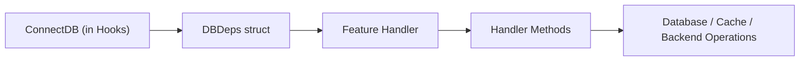

# DBDeps Usage Examples  
*Practical examples showing how to use DBDeps inside WAFFLE features and handlers.*

DBDeps is the struct where you place **long‑lived backend dependencies** such as database clients, caches, or service SDKs.  
This document focuses on **how to use DBDeps inside routes, handlers, and features**, regardless of which backend (Mongo, Postgres, Redis, etc.) you're using.

---


# 🧱 1. Passing DBDeps Into a Feature Handler

### DBDeps Flow Diagram



See the full architectural context in  
[WAFFLE Lifecycle](../waffle-architecture-diagrams.md#-waffle-lifecycle).

A common and recommended pattern is to construct handlers that store DBDeps.

### File: `internal/app/features/items/handler.go`

```go
package items

import "github.com/you/hello/internal/app/bootstrap"

type Handler struct {
    deps bootstrap.DBDeps
}

func NewHandler(deps bootstrap.DBDeps) *Handler {
    return &Handler{deps: deps}
}
```

This gives your feature full access to all DBDeps fields (`MongoDB`, `Postgres`, `Redis`, etc.).

---

# 🧩 2. Using DBDeps Inside a Handler Method

Example using MongoDB:

```go
func (h *Handler) ListItems(w http.ResponseWriter, r *http.Request) {
    collection := h.deps.MongoDB.Collection("items")

    cur, err := collection.Find(r.Context(), bson.D{})
    if err != nil {
        http.Error(w, "db error", http.StatusInternalServerError)
        return
    }
    defer cur.Close(r.Context())

    var items []Item
    if err := cur.All(r.Context(), &items); err != nil {
        http.Error(w, "db decode error", http.StatusInternalServerError)
        return
    }

    writeJSON(w, items)
}
```

Example using Postgres:

```go
func (h *Handler) CountItems(w http.ResponseWriter, r *http.Request) {
    var count int
    err := h.deps.Postgres.QueryRowContext(r.Context(),
        "SELECT COUNT(*) FROM items",
    ).Scan(&count)

    if err != nil {
        http.Error(w, "db error", http.StatusInternalServerError)
        return
    }

    w.Write([]byte(fmt.Sprintf("Total items: %d", count)))
}
```

Example using Redis:

```go
func (h *Handler) HitCounter(w http.ResponseWriter, r *http.Request) {
    hits, err := h.deps.Redis.Incr(r.Context(), "hits").Result()
    if err != nil {
        http.Error(w, "redis error", http.StatusInternalServerError)
        return
    }

    w.Write([]byte(fmt.Sprintf("Hits: %d", hits)))
}
```

---

# 🔌 3. Wiring Handlers Into Routes

Feature router example:

### File: `internal/app/features/items/routes.go`

```go
package items

import (
    "github.com/go-chi/chi/v5"
)

func Routes(deps bootstrap.DBDeps) chi.Router {
    r := chi.NewRouter()

    h := NewHandler(deps)

    r.Get("/", h.ListItems)
    r.Get("/count", h.CountItems)
    r.Get("/hits", h.HitCounter)

    return r
}
```

---

# 🧩 4. Wiring Routes Into BuildHandler

Because `Routes()` now requires DBDeps, update your BuildHandler pattern:

### File: `internal/app/bootstrap/hooks.go`

```go
r.Mount("/items", items.Routes(dbDeps))
```

Full example:

```go
func BuildHandler(coreCfg *config.CoreConfig, appCfg AppConfig, deps DBDeps, logger *zap.Logger) (http.Handler, error) {
    r := chi.NewRouter()

    // Pass DBDeps to any feature routers that need it
    r.Mount("/items", items.Routes(deps))
    r.Mount("/about", about.Routes()) // no DB needed

    return r, nil
}
```

Features that don’t need DBDeps can continue using simple `Routes()` functions.

---

# 🔄 5. Supporting Both DB‑Dependent and DB‑Independent Routes

Sometimes a feature may have routes that require DBDeps and others that don’t.

Two options:

### Option A — Pass DBDeps into the feature router even if some routes don’t need it

```go
func Routes(deps bootstrap.DBDeps) chi.Router {
    r := chi.NewRouter()
    h := NewHandler(deps)

    r.Get("/", PublicPage)
    r.Get("/data", h.LoadData)

    return r
}
```

### Option B — Provide two route constructors

```go
func PublicRoutes() chi.Router {
    r := chi.NewRouter()
    r.Get("/", PublicPage)
    return r
}

func DataRoutes(deps bootstrap.DBDeps) chi.Router {
    r := chi.NewRouter()
    h := NewHandler(deps)
    r.Get("/data", h.LoadData)
    return r
}
```

Then mount them separately:

```go
r.Mount("/feature", feature.PublicRoutes())
r.Mount("/feature", feature.DataRoutes(deps))
```

---

# 🧠 Summary

This document showed how to **use DBDeps inside WAFFLE features**, including:

- Creating handlers that store DBDeps  
- Calling DBDeps-backed clients in handler functions  
- Passing DBDeps into feature routers  
- Mounting DBDeps-aware routes in BuildHandler  
- Supporting mixed public + DB-backed routes  


For a full example of building composite handlers that include DBDeps, config, logging, and other shared dependencies, see  
**[Handler Structure Examples](./handler-structure-examples.md)**.

