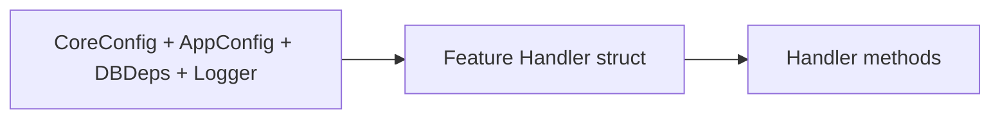

## 🧱 1. Composite Handler Struct in a Feature

### Handler Structure Diagram



See the full version in  
[Handler / Routes / BuildHandler Relationship](../waffle-architecture-diagrams.md#-handler--routes--buildhandler-relationship).

**File:** `internal/app/features/items/handler.go`

```go
package items

import (
    "github.com/dalemusser/waffle/config"
    "go.uber.org/zap"
    "github.com/you/hello/internal/app/bootstrap"
)

// Handler contains everything the items feature needs.
type Handler struct {
    DB      bootstrap.DBDeps
    Logger  *zap.Logger
    CoreCfg *config.CoreConfig
    AppCfg  bootstrap.AppConfig
}
```
