# Middleware Examples  
*Practical patterns for adding and using middleware in WAFFLE applications.*

WAFFLE uses Chi under the hood, which makes middleware composition easy and predictable.  
These examples show how to apply middleware at the **application level**, **feature level**, **route group level**, and **per-route level**.

### WAFFLE Middleware Chain Diagram

```mermaid
flowchart LR
    A["Incoming Request"] --> B["App‑Wide Middleware<br/>(BuildHandler)"]
    B --> C["Feature‑Level Middleware<br/>(Routes)"]
    C --> D["Sub‑Group Middleware<br/>(r.Group)"]
    D --> E["Per‑Route Middleware<br/>(r.With)"]
    E --> F["Handler Method"]
    F --> G["Response"]
```



See the full architectural context in  
[Request Flow Through WAFFLE](../waffle-architecture-diagrams.md#-request-flow-through-waffle).

All examples follow the standard WAFFLE file structure:

```
internal/app/bootstrap/hooks.go          — BuildHandler (top-level router)
internal/app/features/<feature>/routes.go — feature routers
```

---

# 🧱 1. App‑Wide Middleware (BuildHandler)

This applies middleware to **every request** in the entire application.

Open:

```
internal/app/bootstrap/hooks.go
```

Add middleware inside `BuildHandler`, right after creating the router:

```go
func BuildHandler(coreCfg *config.CoreConfig, appCfg AppConfig, deps DBDeps, logger *zap.Logger) (http.Handler, error) {
    r := chi.NewRouter()

    // Example: Logging middleware
    r.Use(logging.RequestLogger(logger))

    // Example: CORS (app-wide)
    r.Use(cors.Default())

    // Mount features here:
    r.Mount("/about", about.Routes())

    return r, nil
}
```

**Use this when:**  
You want consistent behavior (logging, CORS, panic recovery, request IDs) across the entire app.

---

# 🧩 2. Feature‑Level Middleware (inside a feature router)

Apply middleware only to a specific feature's routes.

**File:** `internal/app/features/profile/routes.go`

```go
package profile

import (
    "net/http"
    "github.com/go-chi/chi/v5"
    "github.com/dalemusser/waffle/toolkit/cors"
)

func Routes() chi.Router {
    r := chi.NewRouter()

    // Logging only for profile pages
    r.Use(logging.FeatureLogger("profile"))

    // CORS only for this feature
    r.Use(cors.Default())

    // Public root
    r.Get("/", func(w http.ResponseWriter, r *http.Request) {
        w.Write([]byte("Public profile"))
    })

    return r
}
```

**Use this when:**  
You want a feature to behave differently from the rest of the app.

---

# 🔐 3. Auth Middleware Applied to a Sub‑Group

This is one of the most common real‑world patterns:

- `/profile` → public  
- `/profile/edit` → requires authentication  

```go
func Routes() chi.Router {
    r := chi.NewRouter()

    r.Get("/", PublicProfile)

    // Protected section
    r.Group(func(pr chi.Router) {
        pr.Use(auth.RequireAuth)

        pr.Get("/edit", EditProfile)
        pr.Post("/edit", SaveProfile)
    })

    return r
}
```

**Use this for:**  
Features with a mix of public and protected pages.

---

# 🧩 4. Role‑Based Middleware Inside a Feature

Nested groups allow fine‑grained permission control.

```go
func Routes() chi.Router {
    r := chi.NewRouter()

    r.Get("/", PublicDashboard)

    // Authenticated section
    r.Group(func(pr chi.Router) {
        pr.Use(auth.RequireAuth)

        r.Get("/settings", UserSettings)

        // Admin-only area
        pr.Group(func(ar chi.Router) {
            ar.Use(auth.RequireRole("admin"))
            ar.Get("/admin", AdminDashboard)
            ar.Get("/admin/stats", AdminStats)
        })
    })

    return r
}
```

**Use this when:**  
A feature contains multiple privilege levels.

---

# 🎣 5. Custom Middleware Example (Before + After Behavior)

A minimal custom middleware showing the basic pattern:

```go
func RequestTime(next http.Handler) http.Handler {
    return http.HandlerFunc(func(w http.ResponseWriter, r *http.Request) {
        start := time.Now()
        next.ServeHTTP(w, r)
        fmt.Printf("Request took: %v\n", time.Since(start))
    })
}
```

Apply it at any level:

```go
r.Use(RequestTime)
```

**Use this when:**  
You want to measure, wrap, restrict, transform, or observe requests.

---

# 🧪 6. Middleware on a Single Route

Chi allows middleware to be applied directly to a route.

```go
r.With(rateLimitMiddleware).Get("/expensive", ExpensiveHandler)
```

Or:

```go
r.With(cors.Default()).Post("/submit", FormSubmit)
```

**Use this when:**  
Only one or two routes need special behavior.

---

# ⚙️ 7. Combining Middleware Patterns

Middleware can stack:

```go
r.Group(func(pr chi.Router) {
    pr.Use(logging.RequestLogger(logger))
    pr.Use(auth.RequireAuth)
    pr.Use(rateLimitMiddleware)

    pr.Get("/secure", secureHandler)
})
```

Order matters:

1. General middlewares (logging, request IDs)
2. CORS
3. Auth / permissions
4. Feature-specific logic

---

# 🧠 Summary

This document covered practical ways to use middleware in WAFFLE:

- App-wide (BuildHandler)
- Feature-wide
- Auth + role-based subgroups
- Custom middleware
- Per-route middleware
- Mixed and layered middleware

These examples complement the broader  
**[Routes & Middleware Guide](../routes-and-middleware-guide.md)**.

