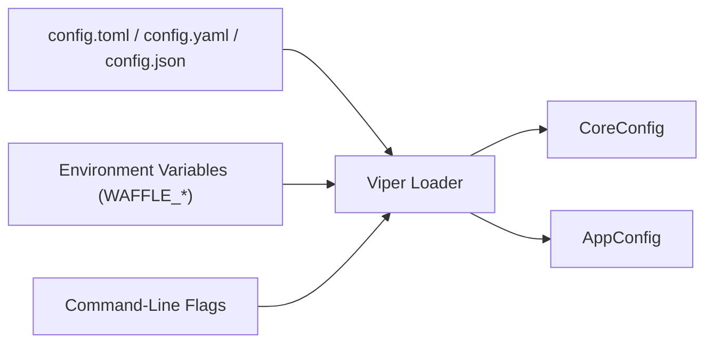

# WAFFLE Provided Configuration Variables  
*A complete reference to all built‑in WAFFLE CoreConfig variables, their meanings, requirements, and how to set them.*

This document complements the broader configuration overview in  
**[WAFFLE Configuration Overview](./about-waffle-config.md)** by listing **every WAFFLE‑provided configuration variable**, including:

- Config file key  
- Environment variable name (WAFFLE_…)  
- Command‑line flag (if/when implemented)  
- Type & defaults  
- Descriptions & constraints  
- Example TOML, environment variable, and CLI usage (all matching)  

---

### WAFFLE Configuration Flow Diagram



See the full diagram in  
[Configuration Flow](../waffle-architecture-diagrams.md#-configuration-flow).

# 🧇 Table of All WAFFLE CoreConfig Variables  
*A concise, at‑a‑glance reference.*

| Config File Key | Environment Variable | CLI Flag (future) | Description |
|-----------------|----------------------|-------------------|-------------|
| env | WAFFLE_ENV | --env | Runtime environment (dev, prod, etc.) |
| log_level | WAFFLE_LOG_LEVEL | --log-level | Logging verbosity (debug, info, warn, error) |
| http_port | WAFFLE_HTTP_PORT | --http-port | HTTP listening port |
| https_port | WAFFLE_HTTPS_PORT | --https-port | HTTPS listening port |
| use_https | WAFFLE_USE_HTTPS | --use-https | Enables HTTPS |
| use_lets_encrypt | WAFFLE_USE_LETS_ENCRYPT | --use-lets-encrypt | Enables ACME/Let’s Encrypt |
| lets_encrypt_email | WAFFLE_LETS_ENCRYPT_EMAIL | --lets-encrypt-email | Email for ACME account |
| lets_encrypt_cache_dir | WAFFLE_LETS_ENCRYPT_CACHE_DIR | --lets-encrypt-cache-dir | Directory for ACME cache |
| cert_file | WAFFLE_CERT_FILE | --cert-file | TLS certificate path (manual) |
| key_file | WAFFLE_KEY_FILE | --key-file | TLS key path (manual) |
| domain | WAFFLE_DOMAIN | --domain | Domain for TLS/ACME |
| lets_encrypt_challenge | WAFFLE_LETS_ENCRYPT_CHALLENGE | --lets-encrypt-challenge | ACME challenge type |
| route53_hosted_zone_id | WAFFLE_ROUTE53_HOSTED_ZONE_ID | --route53-hosted-zone-id | Hosted zone for DNS-01 |
| enable_cors | WAFFLE_ENABLE_CORS | --enable-cors | Enables CORS |
| cors_allowed_origins | WAFFLE_CORS_ALLOWED_ORIGINS | --cors-allowed-origins | CORS allowed origins |
| cors_allowed_methods | WAFFLE_CORS_ALLOWED_METHODS | --cors-allowed-methods | CORS allowed methods |
| cors_allowed_headers | WAFFLE_CORS_ALLOWED_HEADERS | --cors-allowed-headers | CORS allowed request headers |
| cors_exposed_headers | WAFFLE_CORS_EXPOSED_HEADERS | --cors-exposed-headers | Response headers exposed by CORS |
| cors_allow_credentials | WAFFLE_CORS_ALLOW_CREDENTIALS | --cors-allow-credentials | Allows credentialed CORS |
| cors_max_age | WAFFLE_CORS_MAX_AGE | --cors-max-age | CORS preflight cache duration |
| db_connect_timeout | WAFFLE_DB_CONNECT_TIMEOUT | --db-connect-timeout | DB connection timeout |
| index_boot_timeout | WAFFLE_INDEX_BOOT_TIMEOUT | --index-boot-timeout | Startup index/schema timeout |
| enable_compression | WAFFLE_ENABLE_COMPRESSION | --enable-compression | Enables gzip compression |
| max_request_body_bytes | WAFFLE_MAX_REQUEST_BODY_BYTES | --max-request-body-bytes | Max request body size |

---

# 🧱 Detailed Variable Reference  
*(This section contains full types, defaults, descriptions, and constraints.)*

## 🧊 Runtime & Logging

### env / WAFFLE_ENV
- **Type:** string  
- **Default:** "dev"  
- **Description:**  
  Logical runtime environment. Typically "dev" or "prod".  
  Used to branch behavior (e.g., enable debug logging in dev, stricter settings in prod).

### log_level / WAFFLE_LOG_LEVEL
- **Type:** string  
- **Default:** "debug"  
- **Description:**  
  Logging verbosity. Common values: "debug", "info", "warn", "error".  
  Controls how much detail appears in logs.

---

## 🌐 HTTP / HTTPS

### http_port / WAFFLE_HTTP_PORT
- **Type:** int  
- **Default:** 80  
- **Description:**  
  Port for the HTTP listener. Must be in 1..65535.  
- **Constraints:**  
  - Cannot be equal to https_port when use_https=true.

### https_port / WAFFLE_HTTPS_PORT
- **Type:** int  
- **Default:** 443  
- **Description:**  
  Port for the HTTPS listener when TLS is enabled. Must be in 1..65535.  
- **Constraints:**  
  - When use_https=true, https_port must not equal http_port.  
  - When use_https=true, https_port cannot be 80 (reserved for the redirect/ACME server).

### use_https / WAFFLE_USE_HTTPS
- **Type:** bool  
- **Default:** false  
- **Description:**  
  Enables HTTPS when true.  
- **Constraints:**  
  - If use_https=true and use_lets_encrypt=false, both cert_file and key_file must be provided (manual TLS).  
  - If use_https=true and use_lets_encrypt=true, auto-TLS is used and manual cert/key must be absent.

---

## 🔐 TLS / Let’s Encrypt

### use_lets_encrypt / WAFFLE_USE_LETS_ENCRYPT
- **Type:** bool  
- **Default:** false  
- **Description:**  
  If true, WAFFLE uses Let’s Encrypt (ACME) to obtain certificates.  
- **Constraints:**  
  - Requires use_https=true.  
  - Cannot be combined with cert_file or key_file (no manual certs).  
  - Requires valid domain and lets_encrypt_email.  
  - lets_encrypt_challenge must be "http-01" or "dns-01".  
  - For "dns-01", route53_hosted_zone_id must be set.

### lets_encrypt_email / WAFFLE_LETS_ENCRYPT_EMAIL
- **Type:** string  
- **Default:** ""  
- **Description:**  
  Email address for the ACME account.  
- **Constraints:**  
  - Required when use_lets_encrypt=true.  
  - Must contain "@" (basic email sanity).

### lets_encrypt_cache_dir / WAFFLE_LETS_ENCRYPT_CACHE_DIR
- **Type:** string  
- **Default:** "letsencrypt-cache"  
- **Description:**  
  Directory where ACME certificates and account data are cached.

### cert_file / WAFFLE_CERT_FILE
- **Type:** string  
- **Default:** ""  
- **Description:**  
  Path to TLS certificate file for manual TLS.  
- **Constraints:**  
  - When use_https=true and use_lets_encrypt=false, both cert_file and key_file must be non-empty.  
  - Must be empty when use_lets_encrypt=true.

### key_file / WAFFLE_KEY_FILE
- **Type:** string  
- **Default:** ""  
- **Description:**  
  Path to TLS private key file for manual TLS.  
- **Constraints:**  
  - When use_https=true and use_lets_encrypt=false, both cert_file and key_file must be non-empty.  
  - Must be empty when use_lets_encrypt=true.

### domain / WAFFLE_DOMAIN
- **Type:** string  
- **Default:** ""  
- **Description:**  
  Canonical domain used for TLS/ACME and possibly redirects.  
- **Constraints:**  
  - Required when use_lets_encrypt=true.

### lets_encrypt_challenge / WAFFLE_LETS_ENCRYPT_CHALLENGE
- **Type:** string  
- **Default:** "http-01"  
- **Description:**  
  ACME challenge type.  
  - "http-01" → HTTP challenge on port 80.  
  - "dns-01" → DNS challenge via Route 53.  
- **Constraints:**  
  - Must be either "http-01" or "dns-01".  
  - If "dns-01", route53_hosted_zone_id is required.

### route53_hosted_zone_id / WAFFLE_ROUTE53_HOSTED_ZONE_ID
- **Type:** string  
- **Default:** ""  
- **Description:**  
  AWS Route 53 Hosted Zone ID used for DNS-01 challenges.  
- **Constraints:**  
  - Required if lets_encrypt_challenge="dns-01" and use_lets_encrypt=true.

---

## 🌍 CORS Configuration

These fields live under CORSConfig and are only enforced when enable_cors=true.

### enable_cors / WAFFLE_ENABLE_CORS
- **Type:** bool  
- **Default:** false  
- **Description:**  
  Enables CORS support when true.

### cors_allowed_origins / WAFFLE_CORS_ALLOWED_ORIGINS
- **Type:** []string  
- **Default:** [] (empty slice)  
- **Description:**  
  List of allowed origins. May be set via JSON array in config or env.  
- **Constraints:**  
  - When enable_cors=true, must be non-empty.  
  - If "*" is present and cors_allow_credentials=true, this is invalid.

### cors_allowed_methods / WAFFLE_CORS_ALLOWED_METHODS
- **Type:** []string  
- **Default:** []  
- **Description:**  
  HTTP methods allowed for CORS (e.g., ["GET","POST"]).  
- **Constraints:**  
  - When enable_cors=true, must be non-empty.

### cors_allowed_headers / WAFFLE_CORS_ALLOWED_HEADERS
- **Type:** []string  
- **Default:** []  
- **Description:**  
  Request headers allowed for CORS.

### cors_exposed_headers / WAFFLE_CORS_EXPOSED_HEADERS
- **Type:** []string  
- **Default:** []  
- **Description:**  
  Response headers exposed to the browser via CORS.

### cors_allow_credentials / WAFFLE_CORS_ALLOW_CREDENTIALS
- **Type:** bool  
- **Default:** false  
- **Description:**  
  Whether to allow credentials in CORS (cookies, auth headers, etc.).  
- **Constraints:**  
  - Cannot be true when cors_allowed_origins contains "*".

### cors_max_age / WAFFLE_CORS_MAX_AGE
- **Type:** int  
- **Default:** 0  
- **Description:**  
  Number of seconds a preflight request can be cached by the client.  
- **Constraints:**  
  - Must be >= 0 when set.  
  - 0 disables caching.

---

## ⏱ DB Timeouts

### db_connect_timeout / WAFFLE_DB_CONNECT_TIMEOUT
- **Type:** duration (string parsed to time.Duration)  
- **Default:** "10s"  
- **Description:**  
  Timeout for connecting to your database on startup.  
- **Constraints:**  
  - Must be a positive duration (e.g., "5s", "30s", "1m").

### index_boot_timeout / WAFFLE_INDEX_BOOT_TIMEOUT
- **Type:** duration (string parsed to time.Duration)  
- **Default:** "120s"  
- **Description:**  
  Time allowed for boot-time index creation / schema setup.  
- **Constraints:**  
  - Must be a positive duration.

---

## 🔁 Miscellaneous HTTP / Server Behavior

### enable_compression / WAFFLE_ENABLE_COMPRESSION
- **Type:** bool  
- **Default:** true  
- **Description:**  
  Whether to enable HTTP compression (e.g., gzip).  
  This improves bandwidth usage and performance for most apps.

### max_request_body_bytes / WAFFLE_MAX_REQUEST_BODY_BYTES
- **Type:** int64  
- **Default:** 2 << 20 (2 MiB)  
- **Description:**  
  Maximum allowed HTTP request body size in bytes.  
- **Constraints:**  
  - 0 means "unlimited."  
  - Use this to protect your app from large payloads.

---

# 🧪 Unified Examples Using the Same Values

To see how configuration maps cleanly across file, environment, and CLI, here is a **single configuration represented three ways**.

We’ll use these example values:

- env: "prod"
- log_level: "info"
- http_port: 80
- use_https: true
- use_lets_encrypt: true
- lets_encrypt_email: "admin@example.com"
- domain: "mywaffle.app"
- cors_allowed_origins: ["https://example.com"]
- db_connect_timeout: "5s"
- enable_compression: true

---

## 📝 1. TOML Example

```toml
env = "prod"
log_level = "info"

http_port = 80
use_https = true
use_lets_encrypt = true

lets_encrypt_email = "admin@example.com"
domain = "mywaffle.app"

cors_allowed_origins = ["https://example.com"]

db_connect_timeout = "5s"
enable_compression = true
```

---

## 📄 1b. YAML Example

```yaml
env: "prod"
log_level: "info"

http_port: 80
use_https: true
use_lets_encrypt: true

lets_encrypt_email: "admin@example.com"
domain: "mywaffle.app"

cors_allowed_origins:
  - "https://example.com"

db_connect_timeout: "5s"
enable_compression: true
```

---

## 📄 1c. JSON Example

```json
{
  "env": "prod",
  "log_level": "info",
  "http_port": 80,
  "use_https": true,
  "use_lets_encrypt": true,
  "lets_encrypt_email": "admin@example.com",
  "domain": "mywaffle.app",
  "cors_allowed_origins": ["https://example.com"],
  "db_connect_timeout": "5s",
  "enable_compression": true
}
```

---

## 🌱 2. Environment Variables Example

```bash
export WAFFLE_ENV="prod"
export WAFFLE_LOG_LEVEL="info"

export WAFFLE_HTTP_PORT=80
export WAFFLE_USE_HTTPS=true
export WAFFLE_USE_LETS_ENCRYPT=true

export WAFFLE_LETS_ENCRYPT_EMAIL="admin@example.com"
export WAFFLE_DOMAIN="mywaffle.app"

export WAFFLE_CORS_ALLOWED_ORIGINS='["https://example.com"]'

export WAFFLE_DB_CONNECT_TIMEOUT="5s"
export WAFFLE_ENABLE_COMPRESSION=true
```

---

## 💻 3. Command-Line Example

*(if/when WAFFLE adds CLI flag support)*

```bash
go run ./cmd/myapp \
  --env=prod \
  --log-level=info \
  --http-port=80 \
  --use-https=true \
  --use-lets-encrypt=true \
  --lets-encrypt-email=admin@example.com \
  --domain=mywaffle.app \
  --cors-allowed-origins='["https://example.com"]' \
  --db-connect-timeout=5s \
  --enable-compression=true
```

---

# ⭐ Summary

This document provides the full authoritative reference for:

- All WAFFLE CoreConfig variables  
- How to set them via config files, env vars, or CLI  
- Defaults and constraints  
- Practical examples across all configuration methods  

Use this as the comprehensive, central reference whenever adding or modifying configuration.