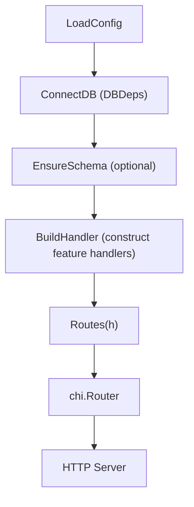
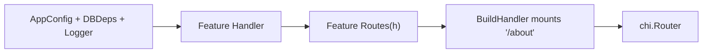

# How to Write Your First WAFFLE Service  
*A complete, architecture-aware, beginner‑friendly guide to your first WAFFLE-powered Go web application.*

This guide reflects the WAFFLE documentation philosophy:

- Always show **where code lives**
- Always show **how pieces connect**
- Always show **which files were generated by makewaffle**
- Always reinforce the **WAFFLE lifecycle**
- Always teach **the mental model before the code**

---

# 🧇 Introduction

WAFFLE — the **Web Application Framework for Flavorful Layered Engineering** — is a Go web application framework designed for:

- clarity  
- teaching  
- explicit architecture  
- AI-assisted development  
- modular, feature-based code  
- simple server-driven UI (HTMX + Tailwind)

This guide walks you through:

1. Installing WAFFLE tooling  
2. Generating your first WAFFLE project  
3. Understanding the structure WAFFLE created  
4. Running your app  
5. Adding your first feature  
6. Seeing how everything connects through the WAFFLE lifecycle  
7. Exploring deeper patterns with example docs  

Everything in this guide is grounded in real project paths and the WAFFLE mental model.

---

# 🏁 1. Install the WAFFLE CLI (makewaffle)

To scaffold new WAFFLE applications, install the WAFFLE CLI:

```bash
go install github.com/dalemusser/waffle/cmd/makewaffle@latest
```


Ensure that your Go bin directory  
(often `~/go/bin`) is on your PATH.

> **Need help setting your PATH?**  
> See: [Setting Your PATH](./set-path.md)

> **Optional:**  
> WAFFLE also provides **wafflectl**, following standard command‑line naming (like `kubectl`).  
> The two commands work the same.  
>  
> This guide uses **makewaffle** for clarity.

> **Need the full CLI reference?**  
> See: [makewaffle CLI Documentation](./makewaffle.md)

---

# 🧱 2. Generate Your First WAFFLE Project

WAFFLE applications begin with a clear, predictable structure generated for you.

Run:

```bash
makewaffle new hello \
  --module github.com/you/hello
```

This creates a full project under:

```
hello/
```

Now enter the project directory — you’ll remain here for the rest of the guide:

```bash
cd hello
```

Prepare your module:

```bash
go mod tidy
```

You now have a complete WAFFLE project skeleton created by the CLI.

---

# ▶️ 3. Run Your WAFFLE App

Start your new service:

```bash
go run ./cmd/hello
```

Open a **web browser** and visit:

```
http://localhost:8080
```

You should see:

```
Hello from WAFFLE!
```

🎉 **Your first WAFFLE app is running.**

---

# 🧰 4. Open the Project in VSCode

If you do not already have a preferred editor, install VSCode:

https://code.visualstudio.com/

Open the project.  
Make sure you are in the `hello` directory, then run:

```bash
code .
```

---

# 🧭 5. Guided Tour of the Project Structure  
*A tour only — no changes yet.*

Everything below was **generated by makewaffle**. Each section describes:

- **File path**  
- **Who created it**  
- **Its architectural role**  
- **Where it fits in the WAFFLE lifecycle**

---

# 🟦 The WAFFLE Lifecycle (Always Keep This in Mind)

Every WAFFLE app follows this flow:

```
LoadConfig
    ↓
ConnectDB (produces DBDeps)
    ↓
EnsureSchema
    ↓
BuildHandler (constructs feature handlers)
    ↓
Routes(h)
    ↓
Chi Router
    ↓
HTTP Server (single Go binary)
```

### WAFFLE Lifecycle Diagram



See also the [WAFFLE Lifecycle](./waffle-architecture-diagrams.md#-waffle-lifecycle) diagram in the Architecture Diagrams reference.

---

# ⚙️ 5.1 Application Configuration  
**File:** `internal/app/bootstrap/appconfig.go`  
**Created by:** makewaffle  
**Role:** your app’s custom configuration struct

```go
package bootstrap

type AppConfig struct {
    Greeting string
}
```

WAFFLE configuration values can come from:
- **config files** (`config.toml`, `config.yaml`, or `config.json`)
- **environment variables**
- **command-line parameters**

WAFFLE automatically merges these sources using its configuration loader.  
Values in `AppConfig` correspond to keys in these configuration inputs.  
For example, `Greeting` would be populated from a config file field like `greeting = "Hello"` or an environment variable like `WAFFLE_GREETING=Hello`.

**When you edit this:** when your app needs its own configuration values.

**See also:**  
[Examples of AppConfig Patterns](./examples/examples-of-appconfig-patterns.md)

---

# 🗄️ 5.2 Database / Backend Dependencies (DBDeps)  
**File:** `internal/app/bootstrap/dbdeps.go`  
**Created by:** makewaffle  
**Role:** central place for long‑lived dependencies (Mongo, Postgres, Redis, AWS SDK clients, etc.)

```go
package bootstrap
type DBDeps struct{}
```

You will populate this struct as soon as your app needs a database or service connection.

**See examples:**  
- [MongoDB DBDeps](./examples/dbdeps-mongo.md)  
- [Postgres DBDeps](./examples/dbdeps-postgres.md)  
- [Redis DBDeps](./examples/dbdeps-redis.md)

---

# 🔌 5.3 WAFFLE Hooks (Center of the Universe)  
**File:** `internal/app/bootstrap/hooks.go`  
**Created by:** makewaffle  
**Role:** connects your app to the WAFFLE lifecycle

This file contains:

- `LoadConfig`  
- `ConnectDB`  
- `EnsureSchema`  
- `BuildHandler`  
- `Hooks{}` struct tying everything together

This file is where your app’s architecture becomes real.

Later, you will:

- modify `ConnectDB` to initialize DBDeps  
- modify `BuildHandler` to mount features  
- add middleware  
- define how all pieces connect  

**See deeper routing & middleware patterns:**  
[Routes & Middleware Guide](./routes-and-middleware-guide.md)

---

# 🚀 5.4 The WAFFLE Entry Point  
**File:** `cmd/hello/main.go`  
**Created by:** makewaffle  
**Role:** the executable command that runs your service

```go
package main

import (
    "context"
    "log"

    "github.com/dalemusser/waffle/app"
    "github.com/you/hello/internal/app/bootstrap"
)

func main() {
    if err := app.Run(context.Background(), bootstrap.Hooks); err != nil {
        log.Fatal(err)
    }
}
```

This file:

- triggers the WAFFLE lifecycle  
- loads config  
- connects databases  
- builds handlers  
- runs the HTTP server  
- manages graceful shutdown  

You will almost never modify this.

---

# 🧩 6. Add Your First Feature (and See the Architecture in Action)

Now you will:

1. create a feature folder  
2. create a handler  
3. create routes  
4. wire the feature into `BuildHandler`  

This shows the **complete WAFFLE flow** in miniature.

---

## 📁 6.1 Create a Feature Folder

Run:

```bash
mkdir internal/app/features/about
```

---

## 🧱 6.2 Create the Feature Handler  
**File:** `internal/app/features/about/about.go`  
**Created by:** you  
**Role:** code that responds to HTTP requests

```go
package about

import "net/http"

func Handler(w http.ResponseWriter, r *http.Request) {
    w.Write([]byte("WAFFLE apps are deliciously layered."))
}
```

This handler has no dependencies yet. You will later use a struct‑based handler when you need DBDeps.

---

## 🛣️ 6.3 Create the Routes  
**File:** `internal/app/features/about/routes.go`  
**Created by:** you  
**Role:** defines the subrouter mounted under `/about`

```go
package about

import "github.com/go-chi/chi/v5"

func Routes() chi.Router {
    r := chi.NewRouter()
    r.Get("/", Handler)
    return r
}
```

> WAFFLE lesson:  
> In real apps, features will use `Routes(h *Handler)` to receive dependencies.  
> This simple example is dependency‑free.

---

## 🔌 6.4 Wire the Feature Into WAFFLE  
**File:** `internal/app/bootstrap/hooks.go`  
**Created by:** makewaffle; **modified by you**  
**Role:** tells WAFFLE where in the app this feature lives

Find the `BuildHandler` function and add:

```go
r.Mount("/about", about.Routes())
```

This is the key mental model:

- **Top‑level decides WHERE** (`/about`)
- **Feature decides WHAT** (routes within its namespace)

Restart:

```bash
go run ./cmd/hello
```

Visit:

```
http://localhost:8080/about
```

Success!

### Handler → Routes → BuildHandler Diagram



See the detailed version in  
[Handler / Routes / BuildHandler Relationship](./waffle-architecture-diagrams.md#-handler--routes--buildhandler-relationship).

---

# 🧰 7. Optional WAFFLE Toolkit Enhancements

These modules live under:

```
waffle/toolkit/
```

and can be used in your application by importing and calling their functions, types, or middleware.

---

## 🌐 CORS Support  
**File to modify:** `internal/app/bootstrap/hooks.go`

Add:

```go
import "github.com/dalemusser/waffle/toolkit/cors"
```

Then:

```go
r := chi.NewRouter()
r.Use(cors.Default())
```

**Examples:**  
[CORS Examples](./examples/cors-examples.md)

---

## 🪟 Windows Service Support  
Add:

```go
import "github.com/dalemusser/waffle/toolkit/windowsservice"
```

Then create a Windows-only entry point.  
See the full example:  
[Windows Service Examples](./examples/windows-service-examples.md)

---

# 🧱 8. Growing Your WAFFLE Application

As your app matures, you will:

- Add DBDeps in `ConnectDB`  
- Add indexes in `EnsureSchema`  
- Create feature handlers with dependencies  
- Use `Routes(h *Handler)` patterns  
- Add middleware in `BuildHandler`  
- Build HTML templates  
- Create JSON APIs  
- Add authentication and permissions  

The WAFFLE architecture ensures everything has a clear, predictable place.

---

# 🎉 Congratulations!

You’ve now:

- Installed the WAFFLE CLI  
- Generated a fully structured WAFFLE project  
- Understood each file and its role  
- Learned the WAFFLE lifecycle  
- Created your first feature  
- Mounted routes correctly  
- Explored toolkit enhancements  
- Built a mental model for growing real apps

With this foundation, you can confidently build:

- **StrataHub**  
- **StrataLog**  
- **StrataSave**  
- or any complex WAFFLE-based system.

Go build something delicious. 🧇🚀
