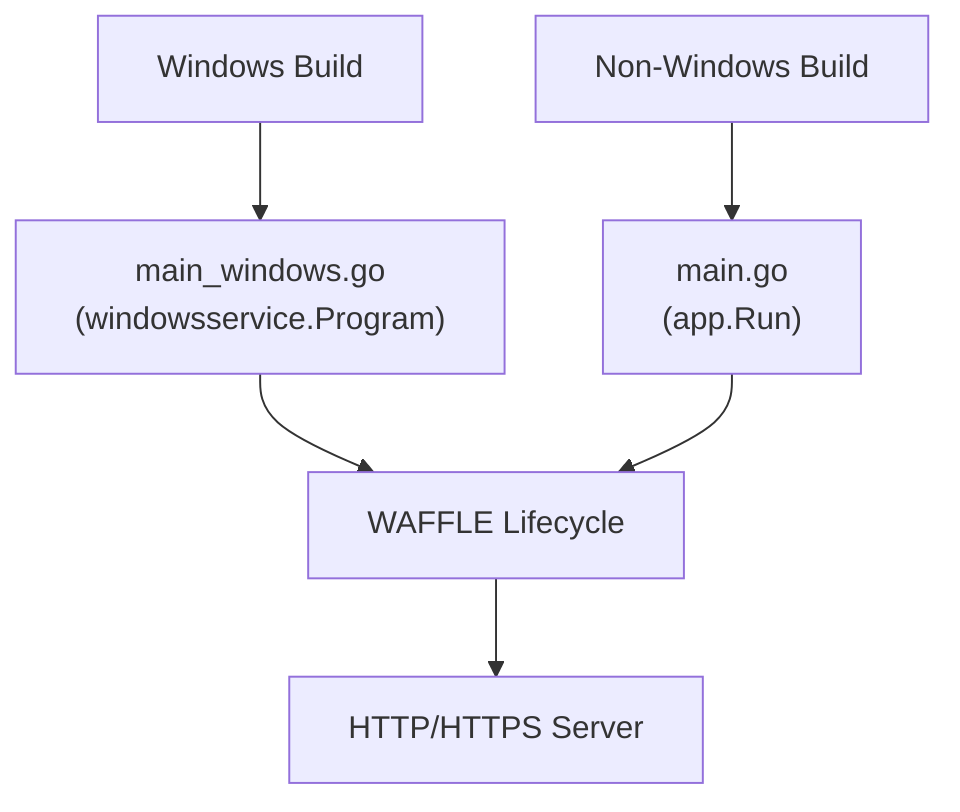

# Windows Service Examples
*How to run a WAFFLE application as a Windows Service using the `windowsservice` package.*

WAFFLE includes optional support for running applications as native Windows Services.
This document shows how to structure your project and create the Windows-only entry point needed to support service installation and execution.

### Windows Service Entry Structure Diagram



This diagram shows how WAFFLE selects the correct entry point on Windows vs. Linux/macOS.
See also the full architecture in
[WAFFLE Lifecycle](../../core/architecture.md#-waffle-lifecycle).

---

# 1. Install Dependencies

If you haven't already, make sure your WAFFLE project has these dependencies:

```bash
go get github.com/dalemusser/waffle/windowsservice
go get github.com/kardianos/service
```

---

# 2. Create a Windows-Only `main_windows.go`

Create this file at:

```
cmd/hello/main_windows.go
```

(Replace `hello` with your actual command name under `cmd/`.)

This file is **only compiled on Windows** because of the build tag:

```go
//go:build windows

package main

import (
    "log"

    "github.com/kardianos/service"
    "github.com/dalemusser/waffle/windowsservice"
    "github.com/you/hello/internal/app/bootstrap"
)

func main() {
    // Create the Windows service program wrapper
    prg := &windowsservice.Program[bootstrap.AppConfig, bootstrap.DBDeps]{
        Hooks: bootstrap.Hooks,
    }

    // Configure the service
    svcConfig := &service.Config{
        Name:        "HelloService",
        DisplayName: "Hello WAFFLE Service",
        Description: "A WAFFLE application running as a Windows service.",
    }

    // Create the service
    s, err := service.New(prg, svcConfig)
    if err != nil {
        log.Fatal(err)
    }

    // Run the service (blocks until stopped)
    if err := s.Run(); err != nil {
        log.Fatal(err)
    }
}
```

This file ensures your service:

- Responds properly to SCM (Service Control Manager) events
- Handles stop/shutdown gracefully via context cancellation
- Runs WAFFLE's lifecycle inside a Windows service environment

---

# 3. Modify `main.go` to Exclude Windows Builds

Your regular `main.go` should *exclude* Windows builds:

```go
//go:build !windows

package main

import (
    "context"
    "log"

    "github.com/dalemusser/waffle/app"
    "github.com/you/hello/internal/app/bootstrap"
)

func main() {
    if err := app.Run(context.Background(), bootstrap.Hooks); err != nil {
        log.Fatal(err)
    }
}
```

This ensures that:

- Linux/macOS builds use the normal main
- Windows builds use `main_windows.go`

---

# 4. Install & Manage the Windows Service

Once the service is built for Windows, you can install it using PowerShell:

```powershell
sc.exe create HelloService binPath= "C:\path\to\hello.exe"
```

Start it:

```powershell
sc.exe start HelloService
```

Stop it:

```powershell
sc.exe stop HelloService
```

Remove it:

```powershell
sc.exe delete HelloService
```

---

# 5. Graceful Shutdown

WAFFLE applications already support graceful shutdown.
The Windows service wrapper ensures that:

- Stop requests from SCM trigger context cancellation
- Your WAFFLE app receives the cancellation and exits cleanly
- Your DB connections (Mongo, MySQL, SQLite, Postgres, Redis) can close properly via the Shutdown hook

---

# 6. Testing the Windows Service Locally

You can run your Windows-only build using:

```powershell
go build -o hello.exe .
.\hello.exe
```

But remember:

- The normal executable will run as a console app
- The service behavior only applies when launched by `sc.exe`

To simulate the Windows service lifecycle, use PowerShell and `Start-Service` / `Stop-Service`.

---

# 7. Cross-Compiling for Windows

From Linux or macOS, you can cross-compile for Windows:

```bash
GOOS=windows GOARCH=amd64 go build -o hello.exe ./cmd/hello
```

---

# Summary

This example showed how to:

1. Add Windows service support to a WAFFLE app
2. Use build tags to separate Windows and non-Windows entry points
3. Install, start, stop, and uninstall the service
4. Maintain proper graceful shutdown behavior

This pattern keeps Windows-specific logic isolated while letting the rest of the WAFFLE application remain fully cross-platform.
