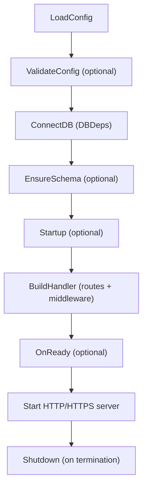

# Application Lifecycle

*How WAFFLE manages your application from startup to shutdown.*

---

## Overview

Every WAFFLE service begins with a single call:

```go
app.Run(context.Background(), hooks)
```

This hands all lifecycle control to WAFFLE. Your application defines behavior through hooks; WAFFLE handles everything else.

---

## Lifecycle Sequence



For more detail, see the [WAFFLE Lifecycle](../../core/architecture.md#waffle-lifecycle) diagram.

---

## Hooks

Each service defines a `Hooks[C, D]` struct:

```go
type Hooks[C any, D any] struct {
    Name           string
    LoadConfig     func(*zap.Logger) (*config.CoreConfig, C, error)
    ValidateConfig func(*config.CoreConfig, C, *zap.Logger) error
    ConnectDB      func(context.Context, *config.CoreConfig, C, *zap.Logger) (D, error)
    EnsureSchema   func(context.Context, *config.CoreConfig, C, D, *zap.Logger) error
    Startup        func(context.Context, *config.CoreConfig, C, D, *zap.Logger) error
    BuildHandler   func(*config.CoreConfig, C, D, *zap.Logger) (http.Handler, error)
    OnReady        func(*config.CoreConfig, C, D, *zap.Logger) error
    Shutdown       func(context.Context, *config.CoreConfig, C, D, *zap.Logger) error
}
```

### Required Hooks

| Hook | Purpose |
|------|---------|
| `LoadConfig` | Load CoreConfig and AppConfig from environment/files |
| `ConnectDB` | Establish database connections, return DBDeps |
| `BuildHandler` | Assemble routes and middleware, return http.Handler |

### Optional Hooks

| Hook | Purpose |
|------|---------|
| `ValidateConfig` | Validate configuration after loading |
| `EnsureSchema` | Run migrations, create indexes |
| `Startup` | Initialize caches, warm connections |
| `OnReady` | Log startup complete, notify external systems |
| `Shutdown` | Close connections, flush buffers |

Set optional hooks to `nil` if not needed.

---

## Server Startup

WAFFLE's server layer handles:

- HTTP vs HTTPS selection
- Automatic Let's Encrypt certificates
- HTTP → HTTPS redirect when needed
- Concurrent ACME and main server
- SIGINT/SIGTERM handling
- Configurable timeouts

All via:

```go
server.ListenAndServeWithContext(ctx, coreCfg, handler, logger)
```

Applications do not call `ListenAndServe` directly.

---

## Graceful Shutdown

WAFFLE supports graceful shutdown on:

- **Linux/macOS**: SIGINT/SIGTERM signals
- **Windows Services**: SCM Stop events (via windowsservice)

### Shutdown Flow

1. WAFFLE receives stop signal
2. Cancels the root context
3. HTTP server begins graceful termination
4. Active requests complete within timeout
5. `Shutdown` hook is called
6. Logger syncs
7. Clean exit

This behavior is automatic.

---

## Database Connections

WAFFLE has no database preference. Applications define their own DBDeps struct and connect through the `ConnectDB` hook:

```go
ConnectDB(ctx, coreCfg, appCfg, logger) (DBDeps, error)
```

Your DBDeps struct can contain any connections:

```go
type DBDeps struct {
    Postgres *pgxpool.Pool
    Redis    *redis.Client
    Mongo    *mongo.Client
}
```

---

## Schema Initialization

For migrations, index creation, or other schema work:

```go
EnsureSchema(ctx, coreCfg, appCfg, dbDeps, logger) error
```

WAFFLE supplies context timeout and logs errors.

---

## See Also

- [Configuration](./configuration.md) — CoreConfig and AppConfig
- [Routing](./routing.md) — BuildHandler and middleware
- [Core Architecture](../../core/architecture.md) — Detailed diagrams

---

[← Back to Development Guide](./README.md)
