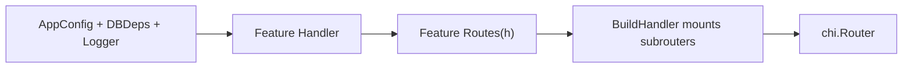

# Routing

*HTTP routing and middleware in WAFFLE applications.*

---

## Overview

Applications assemble a router in the `BuildHandler` hook:

```go
BuildHandler(coreCfg, appCfg, dbDeps, logger) (http.Handler, error)
```

WAFFLE provides `router.New()` which returns a [Chi](https://github.com/go-chi/chi) router pre-configured with standard middleware.

---

## Creating a Router

```go
func BuildHandler(coreCfg *config.CoreConfig, appCfg AppConfig, dbDeps DBDeps, logger *zap.Logger) (http.Handler, error) {
    r := router.New(coreCfg, logger)

    r.Get("/status", statusHandler)
    r.Route("/api", func(r chi.Router) {
        r.Get("/users", listUsers)
        r.Post("/users", createUser)
    })

    return r, nil
}
```

---

## Standard Middleware Stack

`router.New()` provides WAFFLE's standard middleware:

| Middleware | Purpose |
|------------|---------|
| RequestID | Unique ID for each request (for tracing) |
| RealIP | Extract client IP from X-Forwarded-For headers |
| Recoverer | Panic recovery with stack trace logging |
| Body size limits | Enforce MaxRequestBodyBytes from config |
| HTTP metrics | Prometheus request duration histograms |
| Request logging | Structured access logs |
| JSON 404/405 | Consistent error responses |

---

## Bare Router

Use `chi.NewRouter()` directly if you need a router without WAFFLE middleware:

```go
r := chi.NewRouter()
r.Use(yourCustomMiddleware)
```

---

## Handler / Routes / BuildHandler Pattern



### Feature Handler

```go
type UserHandler struct {
    db     *pgxpool.Pool
    logger *zap.Logger
}

func NewUserHandler(db *pgxpool.Pool, logger *zap.Logger) *UserHandler {
    return &UserHandler{db: db, logger: logger.Named("user")}
}
```

### Feature Routes

```go
func UserRoutes(h *UserHandler) chi.Router {
    r := chi.NewRouter()
    r.Get("/", h.List)
    r.Post("/", h.Create)
    r.Get("/{id}", h.Get)
    r.Put("/{id}", h.Update)
    r.Delete("/{id}", h.Delete)
    return r
}
```

### BuildHandler Mounts Features

```go
func BuildHandler(coreCfg *config.CoreConfig, appCfg AppConfig, dbDeps DBDeps, logger *zap.Logger) (http.Handler, error) {
    r := router.New(coreCfg, logger)

    userHandler := NewUserHandler(dbDeps.Postgres, logger)
    r.Mount("/api/users", UserRoutes(userHandler))

    productHandler := NewProductHandler(dbDeps.Postgres, logger)
    r.Mount("/api/products", ProductRoutes(productHandler))

    return r, nil
}
```

---

## Route Parameters

Chi supports URL parameters:

```go
r.Get("/users/{id}", func(w http.ResponseWriter, r *http.Request) {
    id := chi.URLParam(r, "id")
    // ...
})
```

---

## Route Groups

Group routes with shared middleware:

```go
r.Route("/admin", func(r chi.Router) {
    r.Use(authMiddleware)
    r.Get("/dashboard", adminDashboard)
    r.Get("/users", adminUsers)
})
```

---

## See Also

- [Lifecycle](./lifecycle.md) — BuildHandler in the lifecycle
- [Route Examples](../patterns/routes.md) — Detailed routing patterns
- [Handler Patterns](../patterns/handlers.md) — Handler structure
- [Middleware Examples](../patterns/middleware.md) — Custom middleware
- [Core Routing](../../core/routing.md) — Chi router reference

---

[← Back to Development Guide](./README.md)
