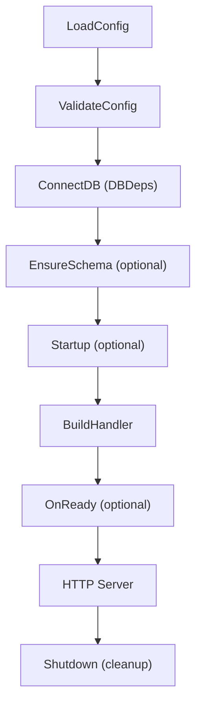
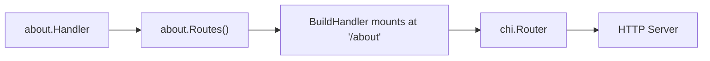

# How to Write Your First WAFFLE Service
*A complete, architecture-aware, beginner‑friendly guide to your first WAFFLE-powered Go web application.*

This guide reflects the WAFFLE documentation philosophy:

- Always show **where code lives**
- Always show **how pieces connect**
- Always show **which files were generated by makewaffle**
- Always reinforce the **WAFFLE lifecycle**
- Always teach **the mental model before the code**

---

## Prerequisites

Before starting, ensure you have:

- **Go 1.21 or later** installed ([download Go](https://go.dev/dl/))
- A terminal/command prompt
- A text editor (VSCode recommended)
- Basic familiarity with Go syntax

Verify your Go installation:

```bash
go version
```

---

# 🧇 Introduction

WAFFLE — the **Web Application Framework for Flavorful Layered Engineering** — is a Go web application framework designed for:

- clarity
- teaching
- explicit architecture
- AI-assisted development
- modular, feature-based code
- simple server-driven UI (HTMX + Tailwind)

This guide walks you through:

1. Installing WAFFLE tooling
2. Generating your first WAFFLE project
3. Understanding the structure WAFFLE created
4. Running your app
5. Adding your first feature
6. Seeing how everything connects through the WAFFLE lifecycle
7. Exploring deeper patterns with example docs

Everything in this guide is grounded in real project paths and the WAFFLE mental model.

---

# 🏁 1. Install the WAFFLE CLI (makewaffle)

To scaffold new WAFFLE applications, install the WAFFLE CLI:

```bash
go install github.com/dalemusser/waffle/cmd/makewaffle@latest
```

Verify the installation:

```bash
makewaffle --help
```

You should see:

```
WAFFLE CLI (makewaffle)

Usage:
  makewaffle new <appname> --module <module-path>

Options:
  --module         Go module path for the new app (required)
  --waffle-version Version of waffle to require (optional)
  --go-version     Go language version (default: 1.21)
  --template       Template to use: full (default: full)
  --force          Scaffold into existing directory

Example:
  makewaffle new myapp --module github.com/you/myapp
```

> **Command not found?**
> Ensure your Go bin directory (often `~/go/bin`) is on your PATH.
> See: [Setting Your PATH](./set-path.md)

> **Optional:**
> WAFFLE also provides **wafflectl**, following standard command‑line naming (like `kubectl`).
> The two commands work the same.
>
> This guide uses **makewaffle** for clarity.

---

# 🧱 2. Generate Your First WAFFLE Project

WAFFLE applications begin with a clear, predictable structure generated for you.

Run:

```bash
makewaffle new hello --module github.com/you/hello
```

> **What is `--module`?**
> This is the Go module path for your project. For learning, `github.com/you/hello` works fine.
> For real projects, use your actual GitHub username or organization.

You'll see:

```
Creating WAFFLE app "hello" with module "github.com/you/hello"
Done!

Next steps:
  cd hello
  go mod tidy
  go run ./cmd/hello
  go to http://localhost:8080 in web browser
```

Now enter the project directory — you'll remain here for the rest of the guide:

```bash
cd hello
```

Download dependencies:

```bash
go mod tidy
```

You now have a complete WAFFLE project skeleton created by the CLI.

---

# ▶️ 3. Run Your WAFFLE App

Start your new service:

```bash
go run ./cmd/hello
```

You'll see log output indicating the server has started:

```
{"level":"info","msg":"bootstrap logger initialized","app":"hello"}
{"level":"info","msg":"config loaded","env":"dev","log_level":"info"}
{"level":"info","msg":"logger initialized","app":"hello"}
{"level":"info","msg":"starting HTTP server","addr":":8080"}
```

Open a **web browser** and visit:

```
http://localhost:8080
```

You should see:

```
Hello from WAFFLE!
```

🎉 **Your first WAFFLE app is running.**

To stop the server, press `Ctrl+C` in your terminal.

---

# 🧰 4. Open the Project in Your Editor

Open the project in your preferred editor.

**VSCode** (recommended):
```bash
code .
```

**GoLand:**
Open the `hello` folder as a project.

**Other editors:**
Open the `hello` folder.

Take a moment to explore the file structure before continuing.

---

# 🧭 5. Guided Tour of the Project Structure
*A tour only — no changes yet.*

Everything below was **generated by makewaffle**. Each section describes:

- **File path**
- **Who created it**
- **Its architectural role**
- **Where it fits in the WAFFLE lifecycle**

---

## 📁 5.0 Complete Project Structure

Here is what makewaffle generates:

```
hello/
├── go.mod                              # Go module definition
├── cmd/
│   └── hello/
│       └── main.go                     # Application entry point
└── internal/
    ├── app/
    │   ├── bootstrap/                  # WAFFLE lifecycle hooks
    │   │   ├── hooks.go                # Hooks struct wiring
    │   │   ├── config.go               # LoadConfig & ValidateConfig
    │   │   ├── appconfig.go            # AppConfig struct
    │   │   ├── db.go                   # ConnectDB & EnsureSchema
    │   │   ├── dbdeps.go               # DBDeps struct
    │   │   ├── startup.go              # Startup hook
    │   │   ├── routes.go               # BuildHandler (HTTP routing)
    │   │   └── shutdown.go             # Shutdown hook
    │   ├── features/                   # Feature modules (with README)
    │   ├── resources/                  # Embedded files (with README)
    │   ├── system/                     # App-specific shared utilities (with README)
    │   ├── store/                      # Data persistence layer (with README)
    │   └── policy/                     # Authorization logic (with README)
    └── domain/
        └── models/                     # Domain models (with README)
```

Each empty directory contains a README.md explaining its purpose. Open these READMEs to learn what code belongs where.

> **Why `internal/`?**
> Go's `internal` directory is special — code inside cannot be imported by other modules.
> This keeps your app's implementation private and prevents accidental dependencies.

---

# 🟦 The WAFFLE Lifecycle (Always Keep This in Mind)

Every WAFFLE app follows this flow. Understanding this is the key to working with WAFFLE:

```
LoadConfig          ← Load settings from files, env vars, flags
    ↓
ValidateConfig      ← Verify settings are valid (optional)
    ↓
ConnectDB           ← Connect to databases, create DBDeps
    ↓
EnsureSchema        ← Create indexes, run migrations (optional)
    ↓
Startup             ← Load templates, warm caches (optional)
    ↓
BuildHandler        ← Create HTTP router, mount features
    ↓
OnReady             ← Signal readiness, start workers (optional)
    ↓
HTTP Server         ← Serve requests until shutdown signal
    ↓
Shutdown            ← Close connections, cleanup (optional)
```

### WAFFLE Lifecycle Diagram



**Key insight:** Each phase has a dedicated file in the `bootstrap/` directory. When you need to add database connections, you edit `db.go`. When you need to add routes, you edit `routes.go`. The architecture tells you where to look.

---

# 🚀 5.1 The Entry Point (Where It All Begins)
**File:** `cmd/hello/main.go`
**Created by:** makewaffle
**Role:** the executable that starts your service

```go
package main

import (
	"context"
	"log"

	"github.com/dalemusser/waffle/app"
	"github.com/you/hello/internal/app/bootstrap"
)

func main() {
	if err := app.Run(context.Background(), bootstrap.Hooks); err != nil {
		log.Fatal(err)
	}
}
```

This file does one thing: calls `app.Run()` with your `bootstrap.Hooks`.

WAFFLE takes over from here and executes the entire lifecycle automatically:
- loads config
- connects databases
- builds handlers
- runs the HTTP server
- manages graceful shutdown

**You will almost never modify this file.**

---

# 🔌 5.2 WAFFLE Hooks (The Wiring)
**File:** `internal/app/bootstrap/hooks.go`
**Created by:** makewaffle
**Role:** wires your app into the WAFFLE lifecycle

```go
package bootstrap

import (
	"github.com/dalemusser/waffle/app"
)

var Hooks = app.Hooks[AppConfig, DBDeps]{
	Name:           "hello",
	LoadConfig:     LoadConfig,
	ValidateConfig: ValidateConfig,
	ConnectDB:      ConnectDB,
	EnsureSchema:   EnsureSchema,
	Startup:        Startup,
	BuildHandler:   BuildHandler,
	Shutdown:       Shutdown,
}
```

This file declares which functions handle each lifecycle phase. The functions themselves are in separate files for clarity and organization.

**You rarely edit this file** — instead, you edit the individual function files.

---

# ⚙️ 5.3 Configuration Loading
**File:** `internal/app/bootstrap/config.go`
**Created by:** makewaffle
**Role:** loads WAFFLE core config and app-specific config

```go
func LoadConfig(logger *zap.Logger) (*config.CoreConfig, AppConfig, error) {
	coreCfg, err := config.Load(logger)
	if err != nil {
		return nil, AppConfig{}, err
	}

	appCfg := AppConfig{
		Greeting: "Hello from WAFFLE!",
	}

	return coreCfg, appCfg, nil
}

func ValidateConfig(coreCfg *config.CoreConfig, appCfg AppConfig, logger *zap.Logger) error {
	// Add validation logic here
	return nil
}
```

**Two types of configuration:**

1. **CoreConfig** — WAFFLE framework settings (ports, TLS, logging, timeouts)
2. **AppConfig** — Your app's settings (database URLs, API keys, feature flags)

WAFFLE configuration can come from:
- **config files** (`config.yaml`, `config.json`, or `config.toml`)
- **`.env` files** (loaded automatically if present)
- **environment variables** (with `WAFFLE_` prefix)
- **command-line flags**

WAFFLE automatically merges these with precedence: flags > env > .env > files > defaults.

---

# 📋 5.4 Application Configuration Struct
**File:** `internal/app/bootstrap/appconfig.go`
**Created by:** makewaffle
**Role:** your app's custom configuration struct

```go
package bootstrap

type AppConfig struct {
	Greeting string
	// Add your app-specific config fields here:
	// MongoURI   string
	// RedisAddr  string
	// EnableDemo bool
}
```

**When you edit this:** when your app needs its own configuration values.

**See also:**
[Examples of AppConfig Patterns](../patterns/appconfig.md)

---

# 🗄️ 5.5 Database Connection
**File:** `internal/app/bootstrap/db.go`
**Created by:** makewaffle
**Role:** establishes database connections and schema setup

```go
func ConnectDB(ctx context.Context, coreCfg *config.CoreConfig, appCfg AppConfig, logger *zap.Logger) (DBDeps, error) {
	// Connect to databases here
	return DBDeps{}, nil
}

func EnsureSchema(ctx context.Context, coreCfg *config.CoreConfig, appCfg AppConfig, deps DBDeps, logger *zap.Logger) error {
	// Create indexes, run migrations here
	return nil
}
```

**When you edit this:** when your app needs a database.

The starter app has no database — these functions return empty values. When you add MongoDB, Postgres, or Redis, you'll connect here and populate `DBDeps`.

**See examples:**
- [MongoDB DBDeps](../databases/mongo.md)
- [PostgreSQL DBDeps](../databases/postgres.md)
- [MySQL DBDeps](../databases/mysql.md)
- [SQLite DBDeps](../databases/sqlite.md)
- [Redis DBDeps](../databases/redis.md)

---

# 🗃️ 5.6 Database Dependencies Struct
**File:** `internal/app/bootstrap/dbdeps.go`
**Created by:** makewaffle
**Role:** holds database clients and backend connections

```go
package bootstrap

type DBDeps struct {
	// Add your database clients here:
	// MongoClient *mongo.Client
	// RedisClient *redis.Client
}
```

**Why a struct?**
`DBDeps` is passed to handlers so they can access the database. This is dependency injection — your handlers don't create connections, they receive them.

---

# 🚀 5.7 Startup Hook
**File:** `internal/app/bootstrap/startup.go`
**Created by:** makewaffle
**Role:** one-time initialization after DB is ready, before serving requests

```go
func Startup(ctx context.Context, coreCfg *config.CoreConfig, appCfg AppConfig, deps DBDeps, logger *zap.Logger) error {
	// Load shared templates, warm caches, etc.
	return nil
}
```

**When you edit this:**
- Load shared templates from the `resources/` directory
- Warm caches with frequently accessed data
- Initialize background workers
- Perform any setup that needs database access

---

# 🛣️ 5.8 HTTP Routing (BuildHandler)
**File:** `internal/app/bootstrap/routes.go`
**Created by:** makewaffle
**Role:** constructs the HTTP router and mounts features

```go
func BuildHandler(coreCfg *config.CoreConfig, appCfg AppConfig, deps DBDeps, logger *zap.Logger) (http.Handler, error) {
	r := router.New(coreCfg, logger)

	r.Get("/", func(w http.ResponseWriter, r *http.Request) {
		_, _ = w.Write([]byte(appCfg.Greeting))
	})

	// Mount feature routers here:
	// r.Mount("/users", users.Routes(deps, logger))
	// r.Mount("/about", about.Routes())

	return r, nil
}
```

**This is where you'll spend most of your time** as you add features to your app.

`router.New(coreCfg, logger)` provides WAFFLE's standard middleware stack:
- **RequestID** — unique ID per request for tracing
- **RealIP** — client IP extraction from proxies
- **Recoverer** — panic recovery (prevents crashes)
- **Body size limits** — protection against large payloads
- **HTTP metrics** — Prometheus-compatible metrics
- **Request logging** — structured access logs
- **JSON 404/405** — consistent error responses

**See deeper routing & middleware patterns:**
[Routes & Middleware Guide](../../core/routing.md)

---

# 🛑 5.9 Shutdown Hook
**File:** `internal/app/bootstrap/shutdown.go`
**Created by:** makewaffle
**Role:** graceful cleanup when the server stops

```go
func Shutdown(ctx context.Context, coreCfg *config.CoreConfig, appCfg AppConfig, deps DBDeps, logger *zap.Logger) error {
	// Close database connections here:
	// if deps.MongoClient != nil {
	//     return deps.MongoClient.Disconnect(ctx)
	// }
	return nil
}
```

**When you edit this:** when you have database connections or other resources to close cleanly.

The `ctx` has a timeout — if cleanup takes too long, it will be cancelled.

---

# 📁 5.10 Project Directories

Each of these directories is created by makewaffle with a README explaining its purpose:

| Directory | Purpose | When to Use |
|-----------|---------|-------------|
| `features/` | Self-contained feature modules | Adding new pages or API endpoints |
| `resources/` | Embedded files via `go:embed` | Shared templates, images, JSON files |
| `system/` | App-specific shared utilities | Code used by multiple features |
| `store/` | Data persistence/repository layer | Database access code |
| `policy/` | Authorization and business rules | Permission checks, validation logic |
| `domain/models/` | Domain models and entities | Data structures representing your domain |

**Tip:** Read the README.md in each directory — they contain examples and guidance.

---

# 🧩 6. Add Your First Feature (Hands-On)

Now you will:

1. Create a feature folder
2. Create a handler
3. Create routes
4. Wire the feature into `BuildHandler`

This shows the **complete WAFFLE flow** in miniature.

---

## 📁 6.1 Create a Feature Folder

Run:

```bash
mkdir internal/app/features/about
```

---

## 🧱 6.2 Create the Feature Handler
**File:** `internal/app/features/about/about.go`
**Created by:** you
**Role:** code that responds to HTTP requests

Create this file with the following content:

```go
package about

import "net/http"

func Handler(w http.ResponseWriter, r *http.Request) {
	w.Write([]byte("WAFFLE apps are deliciously layered."))
}
```

This handler has no dependencies yet. Later, you'll use a struct‑based handler when you need database access.

---

## 🛣️ 6.3 Create the Routes
**File:** `internal/app/features/about/routes.go`
**Created by:** you
**Role:** defines the subrouter mounted under `/about`

Create this file:

```go
package about

import "github.com/go-chi/chi/v5"

func Routes() chi.Router {
	r := chi.NewRouter()
	r.Get("/", Handler)
	return r
}
```

> **WAFFLE pattern:**
> Each feature defines its own routes. The feature doesn't know its URL prefix — that's decided when mounting.

---

## 🔌 6.4 Wire the Feature Into WAFFLE
**File:** `internal/app/bootstrap/routes.go`
**Created by:** makewaffle; **modified by you**
**Role:** tells WAFFLE where in the app this feature lives

Open `internal/app/bootstrap/routes.go` and make these changes:

**1. Add the import** (at the top with other imports):

```go
import (
	"net/http"

	"github.com/you/hello/internal/app/features/about"  // ADD THIS LINE
	"github.com/dalemusser/waffle/config"
	"github.com/dalemusser/waffle/router"
	"go.uber.org/zap"
)
```

**2. Mount the feature** (inside `BuildHandler`, after the root route):

```go
r.Get("/", func(w http.ResponseWriter, r *http.Request) {
	_, _ = w.Write([]byte(appCfg.Greeting))
})

r.Mount("/about", about.Routes())  // ADD THIS LINE
```

**The key mental model:**

- **Top‑level decides WHERE** — `BuildHandler` chooses `/about`
- **Feature decides WHAT** — the about package defines its internal routes

---

## ▶️ 6.5 Test Your Feature

Restart the server:

```bash
go run ./cmd/hello
```

Visit:

```
http://localhost:8080/about
```

You should see:

```
WAFFLE apps are deliciously layered.
```

🎉 **Success! You've created and mounted your first feature.**

### Handler → Routes → BuildHandler Diagram



---

# 🧰 7. Optional WAFFLE Features

WAFFLE provides optional features you can enable in `BuildHandler`. These are commented out in the generated `routes.go` — uncomment them when needed.

## 🏥 Health Checks

Health checks let load balancers verify your app is ready:

```go
import "github.com/dalemusser/waffle/health"

// In BuildHandler:
checks := map[string]health.Check{
	"db": func(ctx context.Context) error {
		return deps.MongoClient.Ping(ctx, nil)
	},
}
health.Mount(r, checks, logger)
```

Visit `/health` to see the status.

## 📊 Metrics Endpoint

Expose Prometheus-compatible metrics:

```go
import "github.com/dalemusser/waffle/metrics"

// In BuildHandler:
r.Handle("/metrics", metrics.Handler())
```

## 🔍 Profiling (pprof)

Enable Go's profiling tools (development only):

```go
import "github.com/dalemusser/waffle/pprof"

// In BuildHandler:
if coreCfg.Env == "dev" {
	pprof.Mount(r)
}
```

---

# 🌐 8. WAFFLE Pantry

WAFFLE includes reusable utilities in the `pantry/` package:

| Package | Purpose |
|---------|---------|
| `pantry/db/postgres` | PostgreSQL connection helpers |
| `pantry/db/mysql` | MySQL connection helpers |
| `pantry/db/sqlite` | SQLite connection helpers |
| `pantry/db/mongo` | MongoDB connection helpers |
| `pantry/db/redis` | Redis connection helpers |
| `pantry/auth/oauth2` | OAuth2 providers (Google, GitHub, Clever, etc.) |
| `pantry/email` | Email sending via SMTP |
| `pantry/validate` | Input validation |
| `pantry/cache` | Caching utilities |
| `pantry/jobs` | Background job processing |
| `pantry/storage` | File storage abstraction |
| `pantry/templates` | Template rendering helpers |
| `windowsservice` | Windows service support |

Example — adding CORS:

```go
import "github.com/dalemusser/waffle/middleware"

// In BuildHandler:
// Option 1: Permissive CORS for development (allows all origins)
r.Use(middleware.CORSPermissive())

// Option 2: Custom CORS settings
r.Use(middleware.CORS(middleware.CORSOptions{
    AllowedOrigins:   []string{"https://app.example.com"},
    AllowedMethods:   []string{"GET", "POST", "PUT", "DELETE"},
    AllowCredentials: true,
}))

// Option 3: CORS from config (see config.toml CORS section)
r.Use(middleware.CORSFromConfig(coreCfg))
```

---

# 🧱 9. Growing Your WAFFLE Application

As your app matures, here's what you'll edit:

| Task | File to Edit |
|------|--------------|
| Add database connection | `db.go` — `ConnectDB` |
| Add database client to deps | `dbdeps.go` — `DBDeps` struct |
| Create indexes/migrations | `db.go` — `EnsureSchema` |
| Load shared templates | `startup.go` — `Startup` |
| Add new feature | Create folder in `features/`, mount in `routes.go` |
| Add middleware | `routes.go` — `BuildHandler` |
| Add configuration | `appconfig.go` — `AppConfig` struct |
| Load configuration | `config.go` — `LoadConfig` |
| Close connections on shutdown | `shutdown.go` — `Shutdown` |
| Add authorization logic | Create files in `policy/` |
| Add data access code | Create files in `store/` |
| Add domain models | Create files in `domain/models/` |

The WAFFLE architecture ensures everything has a clear, predictable place.

---

# 🎯 Quick Reference

## Key Files

| File | Purpose |
|------|---------|
| `cmd/hello/main.go` | Entry point (don't modify) |
| `bootstrap/hooks.go` | Lifecycle wiring (rarely modify) |
| `bootstrap/routes.go` | HTTP routing (frequently modify) |
| `bootstrap/db.go` | Database connections |
| `bootstrap/appconfig.go` | App configuration struct |

## Common Commands

```bash
# Run the app
go run ./cmd/hello

# Run with hot reload (using air)
air

# Build a binary
go build -o hello ./cmd/hello

# Run tests
go test ./...

# Update dependencies
go mod tidy
```

## WAFFLE Imports

```go
import (
	"github.com/dalemusser/waffle/app"       // app.Run, app.Hooks
	"github.com/dalemusser/waffle/config"    // config.CoreConfig, config.Load
	"github.com/dalemusser/waffle/router"    // router.New
	"github.com/dalemusser/waffle/health"    // health.Mount
	"github.com/dalemusser/waffle/metrics"   // metrics.Handler
	"github.com/dalemusser/waffle/pprof"     // pprof.Mount
)
```

---

# 🎉 Congratulations!

You've now:

- ✅ Installed the WAFFLE CLI
- ✅ Generated a fully structured WAFFLE project
- ✅ Understood each file and its role
- ✅ Learned the WAFFLE lifecycle
- ✅ Created your first feature
- ✅ Mounted routes correctly
- ✅ Explored optional features and pantry

With this foundation, you can confidently build complex WAFFLE-based systems.

## Next Steps

- Read the READMEs in each project directory
- Try adding a database connection:
  - [MongoDB](../databases/mongo.md)
  - [PostgreSQL](../databases/postgres.md)
  - [MySQL](../databases/mysql.md)
  - [SQLite](../databases/sqlite.md)
  - [Redis](../databases/redis.md)
- Create a feature with HTML templates
- Build a JSON API endpoint
- Explore the [Routes & Middleware Guide](../../core/routing.md)

Go build something delicious. 🧇🚀
