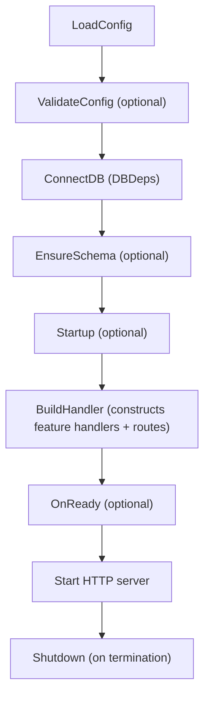
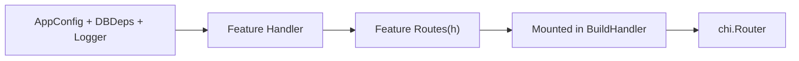

# WAFFLE Quickstart Guide  
*Build deliciously structured Go web services—fast.*

This guide follows the WAFFLE documentation principles:

- Always show **where** code lives  
- Always show **how components connect**  
- Reinforce the **WAFFLE lifecycle**  
- Link to **deeper documentation** for each topic  
- Keep everything explicit, predictable, and beginner‑friendly  

If you want a full step-by-step tutorial that teaches the architecture in detail, see the  
**[First WAFFLE Service How-To](./first-service.md)**.  
This Quickstart is the shorter version.

---

# 🍽️ Introduction

WAFFLE provides a clean, layered, explicit architecture for Go web applications.  
It handles:

- lifecycle  
- configuration  
- logging  
- metrics  
- graceful shutdown  
- routing  
- feature organization  

…while you focus on features.

This Quickstart gets you from zero → running WAFFLE service in minutes.

---

# 🧇 1. Install WAFFLE

Install the WAFFLE CLI so you can scaffold new apps:

```bash
go install github.com/dalemusser/waffle/cmd/makewaffle@latest
```

This installs the `makewaffle` command and downloads the WAFFLE module into your Go toolchain. When you later run `go mod tidy` in your generated project, Go will automatically add `github.com/dalemusser/waffle` to your `go.mod`.


Make sure your Go bin directory (often `~/go/bin`) is on your `PATH` so you can run `makewaffle` from the terminal.

> **Need help setting your PATH?**  
> See: [Setting Your PATH](./set-path.md)

If you prefer an industry-standard CLI name, you can install `wafflectl` instead:

```bash
go install github.com/dalemusser/waffle/cmd/wafflectl@latest
```
> **Need the full CLI reference?**  
> See: [makewaffle CLI Documentation](./makewaffle.md)

If you only want to use WAFFLE as a library in an existing Go module (without the CLI), you can add it with:

```bash
go get github.com/dalemusser/waffle@latest
```

This quickstart assumes you have installed the CLI as `makewaffle`.

---

# 🏗️ 2. Generate a New WAFFLE Project

Use the WAFFLE CLI to scaffold your service:

```bash
makewaffle new myservice \
  --module github.com/you/myservice
```

This creates:

```
myservice/
├── go.mod
├── cmd/myservice/
│   └── main.go
└── internal/
    ├── app/
    │   ├── bootstrap/
    │   │   ├── hooks.go
    │   │   ├── config.go
    │   │   ├── appconfig.go
    │   │   ├── db.go
    │   │   ├── dbdeps.go
    │   │   ├── startup.go
    │   │   ├── routes.go
    │   │   └── shutdown.go
    │   ├── features/
    │   │   └── README.md
    │   ├── resources/
    │   │   └── README.md
    │   ├── system/
    │   │   └── README.md
    │   ├── store/
    │   │   └── README.md
    │   └── policy/
    │       └── README.md
    └── domain/
        └── models/
            └── README.md
```

Move into the directory:

```bash
cd myservice
go mod tidy
```

Run the app:

```
go run ./cmd/myservice
```

Visit WAFFLE’s default address (port 8080):

```
http://localhost:8080
```

You should see:

```
Hello from WAFFLE!
```

Open it in VSCode inside the `myservice` directory:

```bash
code .
```

Note: WAFFLE’s default port (http_port) is 8080.

You can override it with:

- CLI flag → --http_port=9090
- Env var → WAFFLE_HTTP_PORT=9090

---

# 🧭 3. WAFFLE's Architecture (Mental Model)

Every WAFFLE app follows this lifecycle:

```
LoadConfig       → load core + app configuration
    ↓
ValidateConfig   → optional extra validation
    ↓
ConnectDB        → produces DBDeps (database clients)
    ↓
EnsureSchema     → optional DB setup (indexes, migrations)
    ↓
Startup          → optional one-time initialization
    ↓
BuildHandler     → constructs feature handlers + routes
    ↓
OnReady          → optional callback when server is ready
    ↓
Start HTTP server (single Go binary)
    ↓
Shutdown         → graceful cleanup when server stops
```

### WAFFLE Lifecycle Diagram



See also the  
[WAFFLE Lifecycle](../../core/architecture.md#-waffle-lifecycle) diagram in the architecture reference.

If this is unfamiliar, read the  
**[WAFFLE Documentation Guidelines](../documentation/writing-docs.md)**
which explains the philosophy behind WAFFLE docs.

---

# ⚙️ 4. Explore the Scaffolded Files

## 4.1 AppConfig
**File:** `internal/app/bootstrap/appconfig.go`
Created by makewaffle. Holds your app-specific configuration.

```go
type AppConfig struct {
    Greeting string `conf:"greeting" conf-default:"Hello from WAFFLE!"`
}
```

Learn more:
**[Examples of AppConfig Patterns](../patterns/appconfig.md)**
**[WAFFLE Configuration Overview](../../core/configuration.md)**

---

## 4.2 DBDeps
**File:** `internal/app/bootstrap/dbdeps.go`
Central place for long-lived dependencies such as database clients.

```go
type DBDeps struct {
    // Add your database clients here, e.g.:
    // MongoClient *mongo.Client
    // RedisClient *redis.Client
}
```

Examples:
- [MongoDB](../databases/mongo.md)
- [PostgreSQL](../databases/postgres.md)
- [MySQL](../databases/mysql.md)
- [SQLite](../databases/sqlite.md)
- [Redis](../databases/redis.md)

---

## 4.3 Hooks
**File:** `internal/app/bootstrap/hooks.go`
This file ties your application into the WAFFLE lifecycle by wiring all the hook functions together:

```go
var Hooks = app.Hooks[AppConfig, DBDeps]{
    Name:           "myservice",
    LoadConfig:     LoadConfig,
    ValidateConfig: ValidateConfig,
    ConnectDB:      ConnectDB,
    EnsureSchema:   EnsureSchema,
    Startup:        Startup,
    BuildHandler:   BuildHandler,
    Shutdown:       Shutdown,
}
```

Each hook function is defined in its own file:

| File | Hook Function |
|---|---|
| `config.go` | `LoadConfig`, `ValidateConfig` |
| `db.go` | `ConnectDB`, `EnsureSchema` |
| `startup.go` | `Startup` |
| `routes.go` | `BuildHandler` |
| `shutdown.go` | `Shutdown` |

Note: `OnReady` is another optional hook (not generated by default) that runs after the server starts listening. Useful for signaling readiness to load balancers or starting background workers.

Learn how it all connects:
**[Handler Structure Examples](../patterns/handlers.md)**
**[Routes & Middleware Guide](../../core/routing.md)**

---

# 🛣️ 5. Add a Feature

### Handler → Routes → BuildHandler Diagram



For the full version, see the  
[Handler / Routes / BuildHandler Relationship](../../core/architecture.md#-handler--routes--buildhandler-relationship) diagram.

Create:

**File:** `internal/app/features/about/routes.go`

```go
package about

import "github.com/go-chi/chi/v5"

func Routes(h *Handler) chi.Router {
    r := chi.NewRouter()
    r.Get("/", h.ServeAbout)
    return r
}
```

**File:** `internal/app/features/about/handler.go`

```go
package about

import (
    "net/http"
    "github.com/you/myservice/internal/app/bootstrap"
)

type Handler struct {
    AppCfg bootstrap.AppConfig
}

func NewHandler(cfg bootstrap.AppConfig) *Handler {
    return &Handler{AppCfg: cfg}
}

func (h *Handler) ServeAbout(w http.ResponseWriter, r *http.Request) {
    w.Write([]byte("WAFFLE is delicious! " + h.AppCfg.Greeting))
}
```

Mount it in `BuildHandler`:

**File:** `internal/app/bootstrap/routes.go`

```go
func BuildHandler(coreCfg *config.CoreConfig, appCfg AppConfig, deps DBDeps, logger *zap.Logger) (http.Handler, error) {
    r := router.New(coreCfg, logger)

    // Mount the about feature
    aboutHandler := about.NewHandler(appCfg)
    r.Mount("/about", about.Routes(aboutHandler))

    return r, nil
}
```

Restart:

```bash
go run ./cmd/myservice
```

Visit:  
`http://localhost:8080/about`

---

# 🍯 6. Use WAFFLE Helpers

WAFFLE provides helper packages for common tasks.

## Database Connections (Pantry)

```go
import "github.com/dalemusser/waffle/pantry/db/postgres"
import "github.com/dalemusser/waffle/pantry/db/mysql"
import "github.com/dalemusser/waffle/pantry/db/sqlite"
import "github.com/dalemusser/waffle/pantry/db/mongo"
import "github.com/dalemusser/waffle/pantry/db/redis"

// Connect with timeout and automatic ping
pool, err := postgres.ConnectPool(connString, 10*time.Second)
db, err := mysql.Connect(dsn, 10*time.Second)
db, err := sqlite.Connect("./app.db", 10*time.Second)
```

Full examples:
**[Database Guides](../databases/README.md)**

## CORS Middleware

```go
import "github.com/dalemusser/waffle/middleware"

r.Use(middleware.CORSPermissive())
```

Full examples:
**[CORS Examples](../apis/cors.md)**

## Windows Service

```go
import "github.com/dalemusser/waffle/windowsservice"
```

See full example:
**[Windows Service Examples](../deployment/windows-service.md)**

---

# 🧱 7. Configuration for Real Deployments

WAFFLE supports TOML, YAML, JSON, `.env` files, environment variables, and CLI flags.

Full configuration reference:
- **[WAFFLE Configuration Overview](../../core/configuration.md)**
- **[WAFFLE Provided Configuration Variables](../../reference/config-vars.md)**

---

# 💡 8. Best Practices

- Keep domain models in `internal/domain/models/`
- Keep persistence/repository code in `internal/app/store/`
- Keep authorization logic in `internal/app/policy/`
- Keep shared utilities in `internal/app/system/`
- Keep embedded files (templates, images) in `internal/app/resources/`
- Use feature-based folder structure in `internal/app/features/`
- Use `Routes(h)` pattern with handler struct dependencies
- Keep everything explicit—no magic, no guesswork

---

# 🧇 9. What to Build Next

Explore deeper topics:

- [Routes & Middleware Guide](../../core/routing.md)
- [Operational Endpoints Guide](../../core/operational-endpoints.md) — Health, metrics, and pprof
- [DBDeps Usage Examples](../databases/usage-examples.md)
- [Handler Structure Examples](../patterns/handlers.md)
- [CORS Examples](../apis/cors.md)
- [WAFFLE Configuration Overview](../../core/configuration.md)

Or build complete Strata services using WAFFLE:

- StrataHub  
- StrataLog  
- StrataSave  

WAFFLE provides the structure—  
**you bring the flavor.** 🍽️🧇🚀