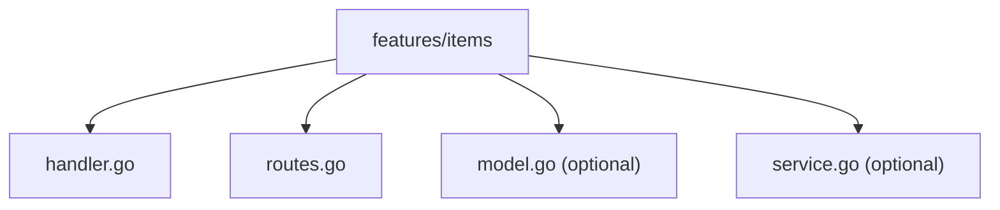

# Feature Structure Examples

*How to structure, organize, and compose features in a WAFFLE application.*

WAFFLE encourages **feature-oriented organization** — each feature gets its own folder, handler, routes, and supporting files. This document shows practical ways to structure real-world features.

---

## Typical Feature Layout

A feature named `items` might look like this:

```
internal/app/features/items/
    handler.go       — feature handler with DB, config, logger, etc.
    routes.go        — Routes(h *Handler) chi.Router
    model.go         — optional: data types related to this feature
    service.go       — optional: business logic unrelated to HTTP
```

### Feature Folder Structure Diagram



See the full diagram in [Feature Folder Structure](../../core/architecture.md#feature-folder-structure).

---

## 1. Basic Feature Structure

**File:** `internal/app/features/items/handler.go`

```go
package items

import (
    "github.com/dalemusser/waffle/config"
    "github.com/you/myapp/internal/app/bootstrap"
    "go.uber.org/zap"
)

type Handler struct {
    DB      bootstrap.DBDeps
    Logger  *zap.Logger
    CoreCfg *config.CoreConfig
    AppCfg  bootstrap.AppConfig
}

func NewHandler(coreCfg *config.CoreConfig, appCfg bootstrap.AppConfig, deps bootstrap.DBDeps, logger *zap.Logger) *Handler {
    return &Handler{
        DB:      deps,
        Logger:  logger,
        CoreCfg: coreCfg,
        AppCfg:  appCfg,
    }
}
```

This handler holds everything the items feature needs.

---

## 2. Routes Connected to the Handler

**File:** `internal/app/features/items/routes.go`

```go
package items

import "github.com/go-chi/chi/v5"

func Routes(h *Handler) chi.Router {
    r := chi.NewRouter()

    r.Get("/", h.ListItems)
    r.Get("/count", h.CountItems)

    return r
}
```

Each route calls a method on the handler. The feature does **not** construct its own handler — that happens in `BuildHandler`.

---

## 3. Feature Wiring in BuildHandler

**File:** `internal/app/bootstrap/routes.go`

```go
import (
    "net/http"

    "github.com/dalemusser/waffle/config"
    "github.com/dalemusser/waffle/router"
    "github.com/you/myapp/internal/app/features/items"
    "go.uber.org/zap"
)

func BuildHandler(coreCfg *config.CoreConfig, appCfg AppConfig, deps DBDeps, logger *zap.Logger) (http.Handler, error) {
    // router.New provides WAFFLE's standard middleware stack:
    // RequestID, RealIP, Recoverer, Compression, Body limits, Metrics, Logging
    r := router.New(coreCfg, logger)

    // Construct handler for feature
    itemsHandler := items.NewHandler(coreCfg, appCfg, deps, logger)

    // Mount feature router
    r.Mount("/items", items.Routes(itemsHandler))

    return r, nil
}
```

Here, the app decides:

- when the handler is created
- where the feature lives (`/items`)
- which dependencies the feature receives

This avoids magic and keeps control centralized.

**Important:** Use `router.New(coreCfg, logger)` instead of `chi.NewRouter()` to get WAFFLE's standard middleware stack (request IDs, logging, metrics, panic recovery, compression, body limits).

---

## 4. Feature With Multiple Route Sets (public + admin)

Sometimes a feature has different audiences:

**File:** `internal/app/features/items/routes.go`

```go
func PublicRoutes(h *Handler) chi.Router {
    r := chi.NewRouter()
    r.Get("/", h.ListItems)
    return r
}

func AdminRoutes(h *Handler) chi.Router {
    r := chi.NewRouter()
    r.Get("/stats", h.ListItemStats)
    return r
}
```

**BuildHandler:**

```go
r := router.New(coreCfg, logger)

itemsHandler := items.NewHandler(coreCfg, appCfg, deps, logger)

r.Mount("/items", items.PublicRoutes(itemsHandler))
r.Mount("/admin/items", items.AdminRoutes(itemsHandler))
```

Final URLs:

- `/items` — public access
- `/admin/items` — admin access

---

## 5. Feature With Mixed Public and Authenticated Areas

A feature can group protected routes:

```go
func Routes(h *Handler) chi.Router {
    r := chi.NewRouter()

    // public
    r.Get("/", h.PublicPage)

    // private (requires authentication)
    r.Group(func(pr chi.Router) {
        pr.Use(auth.RequireAuth)
        pr.Get("/edit", h.EditPage)
        pr.Post("/edit", h.SavePage)
    })

    return r
}
```

Mounted as usual:

```go
r.Mount("/profile", profile.Routes(profileHandler))
```

---

## 6. Feature + DBDeps + Services

A feature often has internal non-HTTP logic:

**File:** `internal/app/features/items/service.go`

```go
package items

import "context"

func (h *Handler) TotalValue(ctx context.Context) (float64, error) {
    rows, err := h.DB.Pool.Query(ctx, "SELECT price FROM items")
    if err != nil {
        return 0, err
    }
    defer rows.Close()

    var total float64
    for rows.Next() {
        var price float64
        if err := rows.Scan(&price); err != nil {
            return 0, err
        }
        total += price
    }
    return total, rows.Err()
}
```

The HTTP layer (routes + handler methods) calls into service methods.

---

## 7. Full Example: Multi-File Feature

```
internal/app/features/items/
    handler.go       — Handler struct + constructor
    routes.go        — Routes(h *Handler)
    service.go       — internal logic used by handler methods
    model.go         — Item model definitions
```

This keeps:

- HTTP concerns in routes.go + handler.go
- Business logic in service.go
- Data structures in model.go

A clean separation without overcomplication.

---

## Summary

This document shows how real WAFFLE features are structured:

- A dedicated feature folder
- A composite handler with all needed dependencies
- Routes that accept `*Handler`
- BuildHandler wiring that mounts features using `router.New`
- Optional admin/public splits
- Optional service/model layers

Together, these patterns create a clear, scalable feature architecture that matches modern Go web development practices and aligns with the WAFFLE lifecycle.

---

## See Also

- [Architecture Overview](../../core/architecture.md) — Project structure and lifecycle
- [Routing Reference](../../core/routing.md) — Chi router and WAFFLE middleware
- [AppConfig Patterns](./appconfig.md) — Configuration patterns
- [Database Guides](../databases/README.md) — Database connection patterns
