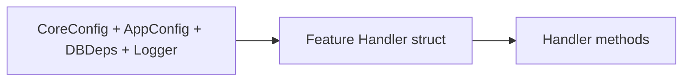

# Handler Structure Examples

*How to build real-world handlers that have DBDeps, config, and logging in WAFFLE.*

In smaller examples, we often show just one dependency (like `DBDeps`) on a handler. In real applications, your handlers usually need **multiple things**:

- Database connections (DBDeps)
- App-specific config
- Core framework config
- Logging
- Possibly other shared utilities

This document shows how to define a **composite handler** type for a feature, and how `BuildHandler` wires it together.

---

## Roles: Who Defines What?

To clear up a subtle but important distinction:

- A **feature package** (e.g., `internal/app/features/items`) **defines**:
  - The `Handler` struct for that feature
  - The `NewHandler(...)` constructor
  - The `Routes(h *Handler) chi.Router` function that binds URLs to handler methods

- The **bootstrap package** (`internal/app/bootstrap/routes.go`) **constructs**:
  - Concrete instances of those handlers
  - And passes them into `Routes(...)` inside `BuildHandler`

In other words:

- Feature defines the **shape** of what it needs (`Handler` + `NewHandler` + `Routes`)
- `BuildHandler` in bootstrap decides **when and how** to build it and mount it

---

## 1. Composite Handler Struct in a Feature

### Handler Structure Diagram



See the full version in [Handler / Routes / BuildHandler Relationship](../../core/architecture.md#handler-routes-buildhandler-relationship).

**File:** `internal/app/features/items/handler.go`

```go
package items

import (
    "github.com/dalemusser/waffle/config"
    "github.com/you/myapp/internal/app/bootstrap"
    "go.uber.org/zap"
)

// Handler contains everything the items feature needs.
type Handler struct {
    DB      bootstrap.DBDeps
    Logger  *zap.Logger
    CoreCfg *config.CoreConfig
    AppCfg  bootstrap.AppConfig
}
```

Here, `Handler` is a **feature-owned type**. The feature decides which fields it needs (DB, logger, configs, etc.).

---

## 2. Handler Constructor: NewHandler

Still in `internal/app/features/items/handler.go`:

```go
func NewHandler(coreCfg *config.CoreConfig, appCfg bootstrap.AppConfig, deps bootstrap.DBDeps, logger *zap.Logger) *Handler {
    return &Handler{
        DB:      deps,
        Logger:  logger,
        CoreCfg: coreCfg,
        AppCfg:  appCfg,
    }
}
```

This is where the feature says:

> "If you want to construct my handler, these are the pieces I need."

The feature **defines** the constructor, but does **not** decide when it's called.

---

## 3. Handler Methods Using All Dependencies

Example methods on the `Handler` type:

```go
func (h *Handler) ListItems(w http.ResponseWriter, r *http.Request) {
    ctx := r.Context()

    cursor, err := h.DB.Mongo.Collection("items").Find(ctx, bson.M{})
    if err != nil {
        h.Logger.Error("failed to list items", zap.Error(err))
        http.Error(w, "database error", http.StatusInternalServerError)
        return
    }
    defer cursor.Close(ctx)

    var items []Item
    if err := cursor.All(ctx, &items); err != nil {
        h.Logger.Error("failed to decode items", zap.Error(err))
        http.Error(w, "database error", http.StatusInternalServerError)
        return
    }

    h.Logger.Info("listing items", zap.Int("count", len(items)))

    w.Header().Set("Content-Type", "application/json")
    json.NewEncoder(w).Encode(items)
}

func (h *Handler) CountItems(w http.ResponseWriter, r *http.Request) {
    ctx := r.Context()

    var count int
    err := h.DB.Pool.QueryRow(ctx, "SELECT COUNT(*) FROM items").Scan(&count)
    if err != nil {
        h.Logger.Error("failed to count items", zap.Error(err))
        http.Error(w, "database error", http.StatusInternalServerError)
        return
    }

    w.Header().Set("Content-Type", "application/json")
    json.NewEncoder(w).Encode(map[string]int{"count": count})
}
```

Handlers now have **direct access** to:

- `h.DB` — database connections (Mongo, Postgres, Redis, etc.)
- `h.Logger` — Zap logger for structured logging
- `h.CoreCfg` — core framework config (ports, timeouts, etc.)
- `h.AppCfg` — app-specific config

---

## 4. Routes Function That Accepts *Handler

**File:** `internal/app/features/items/routes.go`

```go
package items

import "github.com/go-chi/chi/v5"

func Routes(h *Handler) chi.Router {
    r := chi.NewRouter()

    r.Get("/", h.ListItems)
    r.Get("/count", h.CountItems)

    return r
}
```

Note the difference from minimal examples:

- Minimal: `func Routes() chi.Router` — handler appears "from nowhere"
- Composite: `func Routes(h *Handler) chi.Router` — handler is **explicitly passed in**

The feature **defines** this signature and uses the passed-in handler.

---

## 5. BuildHandler Wiring: Where the Handler Is Constructed

Now we wire everything together in the bootstrap package.

**File:** `internal/app/bootstrap/routes.go`

```go
package bootstrap

import (
    "net/http"

    "github.com/dalemusser/waffle/config"
    "github.com/dalemusser/waffle/router"
    "github.com/you/myapp/internal/app/features/about"
    "github.com/you/myapp/internal/app/features/items"
    "go.uber.org/zap"
)

func BuildHandler(coreCfg *config.CoreConfig, appCfg AppConfig, deps DBDeps, logger *zap.Logger) (http.Handler, error) {
    // router.New provides WAFFLE's standard middleware stack
    r := router.New(coreCfg, logger)

    // Construct composite handler for the items feature
    itemsHandler := items.NewHandler(coreCfg, appCfg, deps, logger)

    // Mount items routes, passing the handler
    r.Mount("/items", items.Routes(itemsHandler))

    // A feature that doesn't need DBDeps can still use simple Routes()
    r.Mount("/about", about.Routes())

    return r, nil
}
```

Key points:

- `BuildHandler` lives in **bootstrap** (`internal/app/bootstrap/routes.go`)
- It is created by **makewaffle** and **meant to be edited**
- Use `router.New(coreCfg, logger)` to get WAFFLE's standard middleware stack
- This is where you:
  - Call `NewHandler(...)`
  - Pass the resulting handler into `Routes(h *Handler)`
  - Decide which URL prefixes features live under

---

## 6. Variations: Passing Env vs Individual Fields

If you prefer a slightly different shape, you can wrap multiple things in an Env struct:

```go
type Env struct {
    CoreCfg *config.CoreConfig
    AppCfg  AppConfig
    DB      DBDeps
    Logger  *zap.Logger
}
```

Then your handler might hold `Env` instead of separate fields:

```go
type Handler struct {
    Env Env
}

func NewHandler(env Env) *Handler {
    return &Handler{Env: env}
}
```

From the feature's perspective, both patterns are fine:

- `Handler` with multiple fields: `h.DB`, `h.Logger`, `h.CoreCfg`, `h.AppCfg`
- `Handler` with a single `Env` field: `h.Env.DB`, `h.Env.Logger`, etc.

Choose the style that best matches how you think about your app.

---

## Summary

This document ties together the complete handler pattern:

- **Features define**:
  - The `Handler` struct (what they need)
  - `NewHandler(...)` (how to construct it)
  - `Routes(h *Handler)` (how to bind URLs to methods)

- **Bootstrap's BuildHandler** (in `internal/app/bootstrap/routes.go`):
  - Creates the router with `router.New(coreCfg, logger)`
  - Constructs handler instances per feature
  - Mounts feature routers with those handlers

This pattern ensures:

> "In a feature, I can assume my handler has what I need: DB, config, logger, etc."

From here, you can:

- Reuse this pattern across all features
- Expand `Handler` as your app's needs grow
- Keep the wiring centralized and explicit in `BuildHandler`

---

## See Also

- [Feature Structure Examples](./features.md) — Complete feature organization
- [Architecture Overview](../../core/architecture.md) — Project structure and lifecycle
- [Routing Reference](../../core/routing.md) — Chi router and WAFFLE middleware
- [Database Guides](../databases/README.md) — Database connection patterns
