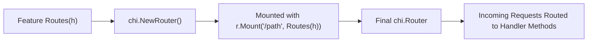

# Route Examples

*Practical patterns for defining feature routes in a WAFFLE application.*

These examples show **concrete, minimal code** for adding routes inside a feature using WAFFLE's recommended **subrouter + Mount** model.

### Routing Diagram: Subrouter + Mount



For a broader architectural view, see the [Handler / Routes / BuildHandler Relationship](../../core/architecture.md#handler-routes-buildhandler-relationship) diagram.

All examples follow this file structure:

```
internal/app/features/<feature>/routes.go
internal/app/bootstrap/routes.go   (BuildHandler)
```

---

## 1. Basic Route

A feature with a single route:

**File:** `internal/app/features/about/routes.go`

```go
package about

import (
    "net/http"

    "github.com/go-chi/chi/v5"
)

func Routes() chi.Router {
    r := chi.NewRouter()

    r.Get("/", func(w http.ResponseWriter, r *http.Request) {
        w.Write([]byte("About page"))
    })

    return r
}
```

**Mount in `BuildHandler`:**

```go
r := router.New(coreCfg, logger)
r.Mount("/about", about.Routes())
```

**Result URL:** `/about`

---

## 2. Multiple Routes in a Feature

**File:** `internal/app/features/info/routes.go`

```go
package info

import (
    "net/http"

    "github.com/go-chi/chi/v5"
)

func Routes() chi.Router {
    r := chi.NewRouter()

    r.Get("/", func(w http.ResponseWriter, r *http.Request) {
        w.Write([]byte("Info Home"))
    })

    r.Get("/team", func(w http.ResponseWriter, r *http.Request) {
        w.Write([]byte("Team page"))
    })

    r.Get("/contact", func(w http.ResponseWriter, r *http.Request) {
        w.Write([]byte("Contact page"))
    })

    return r
}
```

**Mount:**

```go
r.Mount("/info", info.Routes())
```

**Result URLs:**

- `/info`
- `/info/team`
- `/info/contact`

---

## 3. Parameterized Routes

**File:** `internal/app/features/items/routes.go`

```go
package items

import "github.com/go-chi/chi/v5"

func Routes(h *Handler) chi.Router {
    r := chi.NewRouter()

    r.Get("/", h.ListItems)
    r.Get("/{id}", h.GetItem)
    r.Post("/", h.CreateItem)
    r.Put("/{id}", h.UpdateItem)
    r.Delete("/{id}", h.DeleteItem)

    return r
}
```

**Handler method using URL parameter:**

```go
func (h *Handler) GetItem(w http.ResponseWriter, r *http.Request) {
    id := chi.URLParam(r, "id")

    // Use id to fetch item from database
    item, err := h.DB.GetItem(r.Context(), id)
    if err != nil {
        http.Error(w, "not found", http.StatusNotFound)
        return
    }

    w.Header().Set("Content-Type", "application/json")
    json.NewEncoder(w).Encode(item)
}
```

**Mount:**

```go
itemsHandler := items.NewHandler(coreCfg, appCfg, deps, logger)
r.Mount("/items", items.Routes(itemsHandler))
```

**Result URLs:**

- `GET /items` — list all
- `GET /items/123` — get by ID
- `POST /items` — create
- `PUT /items/123` — update
- `DELETE /items/123` — delete

---

## 4. Route Groups (Feature-Level Organization)

Group related routes under a subpath:

```go
func Routes(h *Handler) chi.Router {
    r := chi.NewRouter()

    // Public root
    r.Get("/", h.Home)

    // Group under /settings/...
    r.Route("/settings", func(sr chi.Router) {
        sr.Get("/", h.SettingsHome)
        sr.Get("/privacy", h.PrivacySettings)
        sr.Get("/notifications", h.NotificationSettings)
        sr.Post("/notifications", h.SaveNotificationSettings)
    })

    return r
}
```

**Result URLs** (assuming `r.Mount("/account", Routes(h))`):

- `/account`
- `/account/settings`
- `/account/settings/privacy`
- `/account/settings/notifications`

---

## 5. Mixing Public and Protected Routes

This pattern is common and useful.

**File:** `internal/app/features/profile/routes.go`

```go
func Routes(h *Handler) chi.Router {
    r := chi.NewRouter()

    // Public profile info
    r.Get("/", h.PublicProfile)
    r.Get("/{username}", h.ViewProfile)

    // Authenticated-only section
    r.Group(func(pr chi.Router) {
        pr.Use(auth.RequireAuth)

        pr.Get("/edit", h.EditProfile)
        pr.Post("/edit", h.SaveProfile)
        pr.Delete("/", h.DeleteAccount)
    })

    return r
}
```

**Mount:**

```go
profileHandler := profile.NewHandler(coreCfg, appCfg, deps, logger)
r.Mount("/profile", profile.Routes(profileHandler))
```

**Result URLs:**

- `/profile` — public
- `/profile/johndoe` — public (view any user)
- `/profile/edit` — authenticated only
- `DELETE /profile` — authenticated only

---

## 6. Feature Returning Multiple Subrouters

You may want separate public/admin subsets from the same feature.

**File:** `internal/app/features/dashboard/routes.go`

```go
func PublicRoutes(h *Handler) chi.Router {
    r := chi.NewRouter()
    r.Get("/", h.DashboardHome)
    r.Get("/stats", h.PublicStats)
    return r
}

func AdminRoutes(h *Handler) chi.Router {
    r := chi.NewRouter()
    r.Use(auth.RequireRole("admin"))
    r.Get("/", h.AdminDashboard)
    r.Get("/users", h.ListUsers)
    r.Get("/analytics", h.Analytics)
    return r
}
```

**Mount both:**

```go
dashHandler := dashboard.NewHandler(coreCfg, appCfg, deps, logger)
r.Mount("/dashboard", dashboard.PublicRoutes(dashHandler))
r.Mount("/admin/dashboard", dashboard.AdminRoutes(dashHandler))
```

**Result URLs:**

- `/dashboard` — public
- `/dashboard/stats` — public
- `/admin/dashboard` — admin only
- `/admin/dashboard/users` — admin only

---

## 7. Route + Query Parameters Example

```go
func (h *Handler) Search(w http.ResponseWriter, r *http.Request) {
    q := r.URL.Query().Get("q")
    page := r.URL.Query().Get("page")
    limit := r.URL.Query().Get("limit")

    if q == "" {
        http.Error(w, "query parameter 'q' is required", http.StatusBadRequest)
        return
    }

    results, err := h.DB.Search(r.Context(), q, page, limit)
    if err != nil {
        h.Logger.Error("search failed", zap.Error(err))
        http.Error(w, "search error", http.StatusInternalServerError)
        return
    }

    w.Header().Set("Content-Type", "application/json")
    json.NewEncoder(w).Encode(results)
}
```

**Route:**

```go
r.Get("/search", h.Search)
```

**Result:** `/items/search?q=hello&page=1&limit=20`

---

## Summary

This document showed practical routing patterns:

- Single feature route (simple static pages)
- Multi-route features
- Parameterized paths (`{id}`)
- RESTful resource routes (GET, POST, PUT, DELETE)
- Grouped routes under subpaths
- Public vs authenticated areas
- Multiple subrouters (public + admin)
- Query parameters

---

## See Also

- [Routing Reference](../../core/routing.md) — Chi router and WAFFLE middleware
- [Feature Structure Examples](./features.md) — Complete feature organization
- [Handler Patterns](./handlers.md) — Handler structure and wiring
- [Middleware Examples](./middleware.md) — Middleware patterns


