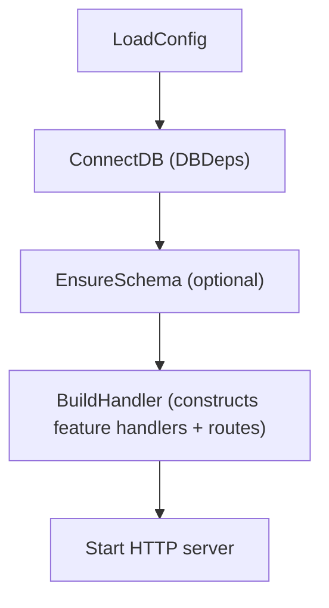
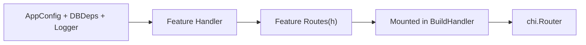

# WAFFLE Quickstart Guide  
*Build deliciously structured Go web services—fast.*

This guide follows the WAFFLE documentation principles:

- Always show **where** code lives  
- Always show **how components connect**  
- Reinforce the **WAFFLE lifecycle**  
- Link to **deeper documentation** for each topic  
- Keep everything explicit, predictable, and beginner‑friendly  

If you want a full step-by-step tutorial that teaches the architecture in detail, see the  
**[First WAFFLE Service How-To](./first-waffle-service-howto.md)**.  
This Quickstart is the shorter version.

---

# 🍽️ Introduction

WAFFLE provides a clean, layered, explicit architecture for Go web applications.  
It handles:

- lifecycle  
- configuration  
- logging  
- metrics  
- graceful shutdown  
- routing  
- feature organization  

…while you focus on features.

This Quickstart gets you from zero → running WAFFLE service in minutes.

---

# 🧇 1. Install WAFFLE

Install the WAFFLE CLI so you can scaffold new apps:

```bash
go install github.com/dalemusser/waffle/cmd/makewaffle@latest
```

This installs the `makewaffle` command and downloads the WAFFLE module into your Go toolchain. When you later run `go mod tidy` in your generated project, Go will automatically add `github.com/dalemusser/waffle` to your `go.mod`.


Make sure your Go bin directory (often `~/go/bin`) is on your `PATH` so you can run `makewaffle` from the terminal.

> **Need help setting your PATH?**  
> See: [Setting Your PATH](./set-path.md)

If you prefer an industry-standard CLI name, you can install `wafflectl` instead:

```bash
go install github.com/dalemusser/waffle/cmd/wafflectl@latest
```
> **Need the full CLI reference?**  
> See: [makewaffle CLI Documentation](./makewaffle.md)

If you only want to use WAFFLE as a library in an existing Go module (without the CLI), you can add it with:

```bash
go get github.com/dalemusser/waffle@latest
```

This quickstart assumes you have installed the CLI as `makewaffle`.

---

# 🏗️ 2. Generate a New WAFFLE Project

Use the WAFFLE CLI to scaffold your service:

```bash
makewaffle new myservice \
  --module github.com/you/myservice
```

This creates:

```
myservice/
  cmd/myservice/main.go
  internal/app/bootstrap/
      appconfig.go
      dbdeps.go
      hooks.go
  internal/app/features/
  internal/app/policy/
  internal/app/store/
  internal/domain/models/
```

Move into the directory:

```bash
cd myservice
go mod tidy
```

Run the app:

```
go run ./cmd/myservice
```

Visit WAFFLE’s default address (port 8080):

```
http://localhost:8080
```

You should see:

```
Hello from WAFFLE!
```

Open it in VSCode inside the `myservice` directory:

```bash
code .
```

Note: WAFFLE’s default port (http_port) is 8080.

You can override it with:

- CLI flag → --http_port=9090
- Env var → WAFFLE_HTTP_PORT=9090

---

# 🧭 3. WAFFLE’s Architecture (Mental Model)

Every WAFFLE app follows this lifecycle:

```
LoadConfig
    ↓
ConnectDB    → produces DBDeps
    ↓
EnsureSchema → optional DB setup
    ↓
BuildHandler → constructs feature handlers + routes
    ↓
Start HTTP server (single Go binary)
```

### WAFFLE Lifecycle Diagram



See also the  
[WAFFLE Lifecycle](./waffle-architecture-diagrams.md#-waffle-lifecycle) diagram in the architecture reference.

If this is unfamiliar, read the  
**[WAFFLE Documentation Creation Guidelines](./about-document-creation.md)**  
which explains the philosophy behind WAFFLE docs.

---

# ⚙️ 4. Explore the Scaffolded Files

## 4.1 AppConfig  
**File:** `internal/app/bootstrap/appconfig.go`  
Created by makewaffle. Holds your app‑specific configuration.

```go
type AppConfig struct {
    Message string
}
```

Learn more:  
**[Examples of AppConfig Patterns](./examples/examples-of-appconfig-patterns.md)**  
**[WAFFLE Configuration Overview](./examples/about-waffle-config.md)**

---

## 4.2 DBDeps  
**File:** `internal/app/bootstrap/dbdeps.go`  
Central place for long-lived dependencies such as database clients.

```go
type DBDeps struct{}
```

Examples:  
- [Mongo](./examples/dbdeps-mongo.md)  
- [Postgres](./examples/dbdeps-postgres.md)  
- [Redis](./examples/dbdeps-redis.md)  

---

## 4.3 Hooks  
**File:** `internal/app/bootstrap/hooks.go`  
This file ties your application into the WAFFLE lifecycle:

- LoadConfig  
- ConnectDB  
- EnsureSchema  
- BuildHandler  

This is the “center of the universe” for your app.

```go
var Hooks = app.Hooks[AppConfig, DBDeps]{ ... }
```

Learn how it all connects:  
**[Handler Structure Examples](./examples/handler-structure-examples.md)**  
**[Routes & Middleware Guide](./routes-and-middleware-guide.md)**

---

# 🛣️ 5. Add a Feature

### Handler → Routes → BuildHandler Diagram



For the full version, see the  
[Handler / Routes / BuildHandler Relationship](./waffle-architecture-diagrams.md#-handler--routes--buildhandler-relationship) diagram.

Create:

**File:** `internal/app/features/about/routes.go`

```go
package about

import "github.com/go-chi/chi/v5"

func Routes(h *Handler) chi.Router {
    r := chi.NewRouter()
    r.Get("/", h.ServeAbout)
    return r
}
```

**File:** `internal/app/features/about/handler.go`

```go
package about

import (
    "net/http"
    "github.com/you/myservice/internal/app/bootstrap"
)

type Handler struct {
    AppCfg bootstrap.AppConfig
}

func NewHandler(cfg bootstrap.AppConfig) *Handler {
    return &Handler{AppCfg: cfg}
}

func (h *Handler) ServeAbout(w http.ResponseWriter, r *http.Request) {
    w.Write([]byte("WAFFLE is delicious! " + h.AppCfg.Message))
}
```

Mount it in `BuildHandler`:

**File:** `internal/app/bootstrap/hooks.go`

```go
aboutHandler := about.NewHandler(cfg)
r.Mount("/about", about.Routes(aboutHandler))
```

Restart:

```bash
go run ./cmd/myservice
```

Visit:  
`http://localhost:8080/about`

---

# 🍯 6. Use Toolkit Helpers

WAFFLE Toolkit modules live under `waffle/toolkit/`.

## CORS

```go
import "github.com/dalemusser/waffle/toolkit/cors"

r.Use(cors.Default())
```

Full examples:  
**[CORS Examples](./examples/cors-examples.md)**

## Windows Service

```go
import "github.com/dalemusser/waffle/toolkit/windowsservice"
```

See full example:  
**[Windows Service Examples](./examples/windows-service-examples.md)**

---

# 🧱 7. Configuration for Real Deployments

WAFFLE supports TOML, YAML, JSON, environment variables, and CLI flags.

Full configuration reference:  
- **[WAFFLE Configuration Overview](./examples/about-waffle-config.md)**  
- **[WAFFLE Provided Configuration Variables](./examples/waffle-provided-config-vars.md)**

---

# 💡 8. Best Practices

- Keep domain logic in `internal/domain/models`
- Keep persistence in `internal/app/store`
- Use feature‑based folder structure
- Use `Routes(h)` and handler struct dependencies
- Keep everything explicit—no magic, no guesswork

---

# 🧇 9. What to Build Next

Explore deeper topics:

- [Routes & Middleware Guide](./routes-and-middleware-guide.md)
- [DBDeps Usage Examples](./examples/dbdeps-usage-examples.md)
- [Handler Structure Examples](./examples/handler-structure-examples.md)
- [CORS Examples](./examples/cors-examples.md)
- [WAFFLE Configuration Overview](./examples/about-waffle-config.md)

Or build complete Strata services using WAFFLE:

- StrataHub  
- StrataLog  
- StrataSave  

WAFFLE provides the structure—  
**you bring the flavor.** 🍽️🧇🚀