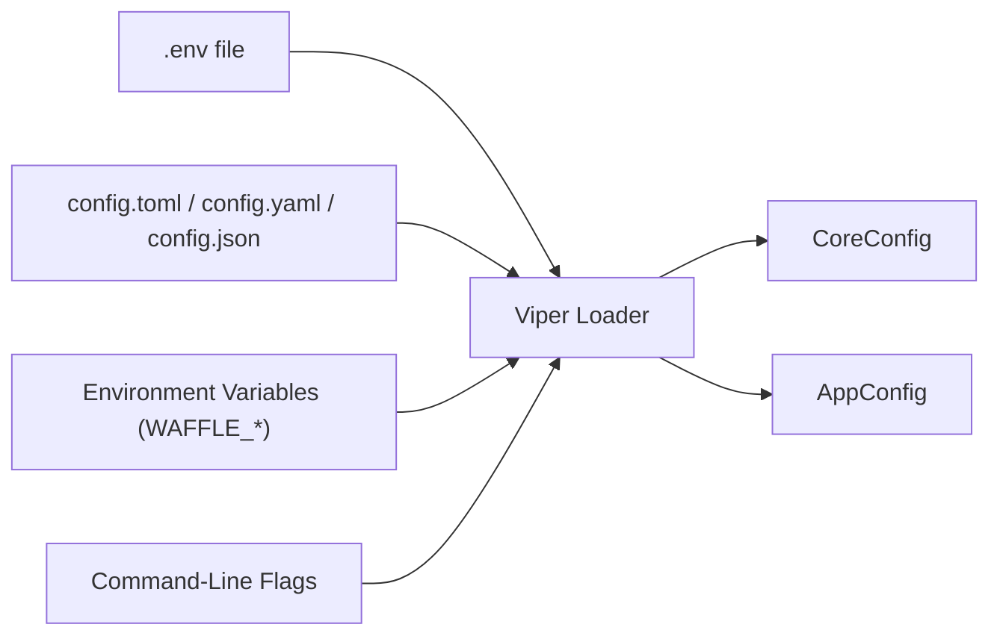

# WAFFLE Configuration Variables Reference

*A complete reference to all built-in WAFFLE CoreConfig variables, their meanings, requirements, and how to set them.*

This document lists **every WAFFLE-provided configuration variable**, including:

- Config file key
- Environment variable name (WAFFLE_…)
- Command-line flag
- Type & defaults
- Descriptions & constraints
- Example TOML, environment variable, and CLI usage

---

## Configuration Flow Diagram



**Precedence (highest wins):** Command-line flags > Environment variables > Config files > .env file > Defaults

See the full diagram in [Configuration Flow](../core/architecture.md#configuration-flow).

---

## Table of All WAFFLE CoreConfig Variables

*A concise, at-a-glance reference.*

| Config File Key | Environment Variable | CLI Flag | Description |
|-----------------|----------------------|----------|-------------|
| env | WAFFLE_ENV | --env | Runtime environment (dev, prod) |
| log_level | WAFFLE_LOG_LEVEL | --log_level | Logging verbosity (debug, info, warn, error) |
| http_port | WAFFLE_HTTP_PORT | --http_port | HTTP listening port |
| https_port | WAFFLE_HTTPS_PORT | --https_port | HTTPS listening port |
| use_https | WAFFLE_USE_HTTPS | --use_https | Enables HTTPS |
| read_timeout | WAFFLE_READ_TIMEOUT | --read_timeout | HTTP server read timeout |
| read_header_timeout | WAFFLE_READ_HEADER_TIMEOUT | --read_header_timeout | HTTP server header read timeout |
| write_timeout | WAFFLE_WRITE_TIMEOUT | --write_timeout | HTTP server write timeout |
| idle_timeout | WAFFLE_IDLE_TIMEOUT | --idle_timeout | HTTP server idle timeout |
| shutdown_timeout | WAFFLE_SHUTDOWN_TIMEOUT | --shutdown_timeout | Graceful shutdown timeout |
| use_lets_encrypt | WAFFLE_USE_LETS_ENCRYPT | --use_lets_encrypt | Enables ACME/Let's Encrypt |
| lets_encrypt_email | WAFFLE_LETS_ENCRYPT_EMAIL | --lets_encrypt_email | Email for ACME account |
| lets_encrypt_cache_dir | WAFFLE_LETS_ENCRYPT_CACHE_DIR | --lets_encrypt_cache_dir | Directory for ACME cache |
| lets_encrypt_challenge | WAFFLE_LETS_ENCRYPT_CHALLENGE | --lets_encrypt_challenge | ACME challenge type |
| acme_directory_url | WAFFLE_ACME_DIRECTORY_URL | --acme_directory_url | ACME directory URL |
| cert_file | WAFFLE_CERT_FILE | --cert_file | TLS certificate path (manual) |
| key_file | WAFFLE_KEY_FILE | --key_file | TLS key path (manual) |
| domain | WAFFLE_DOMAIN | --domain | Domain for TLS/ACME |
| route53_hosted_zone_id | WAFFLE_ROUTE53_HOSTED_ZONE_ID | --route53_hosted_zone_id | Hosted zone for DNS-01 |
| enable_cors | WAFFLE_ENABLE_CORS | --enable_cors | Enables CORS |
| cors_allowed_origins | WAFFLE_CORS_ALLOWED_ORIGINS | --cors_allowed_origins | CORS allowed origins |
| cors_allowed_methods | WAFFLE_CORS_ALLOWED_METHODS | --cors_allowed_methods | CORS allowed methods |
| cors_allowed_headers | WAFFLE_CORS_ALLOWED_HEADERS | --cors_allowed_headers | CORS allowed request headers |
| cors_exposed_headers | WAFFLE_CORS_EXPOSED_HEADERS | --cors_exposed_headers | Response headers exposed by CORS |
| cors_allow_credentials | WAFFLE_CORS_ALLOW_CREDENTIALS | --cors_allow_credentials | Allows credentialed CORS |
| cors_max_age | WAFFLE_CORS_MAX_AGE | --cors_max_age | CORS preflight cache duration |
| db_connect_timeout | WAFFLE_DB_CONNECT_TIMEOUT | --db_connect_timeout | DB connection timeout |
| index_boot_timeout | WAFFLE_INDEX_BOOT_TIMEOUT | --index_boot_timeout | Startup index/schema timeout |
| enable_compression | WAFFLE_ENABLE_COMPRESSION | --enable_compression | Enables gzip compression |
| compression_level | WAFFLE_COMPRESSION_LEVEL | --compression_level | Compression level (1-9) |
| max_request_body_bytes | WAFFLE_MAX_REQUEST_BODY_BYTES | --max_request_body_bytes | Max request body size |

---

## Detailed Variable Reference

*(This section contains full types, defaults, descriptions, and constraints.)*

---

## Runtime & Logging

### env / WAFFLE_ENV
- **Type:** string
- **Default:** "dev"
- **Description:**
  Logical runtime environment. Typically "dev" or "prod".
  Used to branch behavior (e.g., enable debug logging in dev, stricter settings in prod).
  Also affects ACME directory URL selection (staging for non-prod, production for prod).

### log_level / WAFFLE_LOG_LEVEL
- **Type:** string
- **Default:** "debug"
- **Description:**
  Logging verbosity. Valid values: "debug", "info", "warn", "error", "dpanic", "panic", "fatal".
  Controls how much detail appears in logs.

---

## HTTP / HTTPS

### http_port / WAFFLE_HTTP_PORT
- **Type:** int
- **Default:** 8080
- **Description:**
  Port for the HTTP listener. Must be in 1..65535.
- **Constraints:**
  - Cannot be equal to https_port when use_https=true.

### https_port / WAFFLE_HTTPS_PORT
- **Type:** int
- **Default:** 443
- **Description:**
  Port for the HTTPS listener when TLS is enabled. Must be in 1..65535.
- **Constraints:**
  - When use_https=true, https_port must not equal http_port.
  - When use_https=true, https_port cannot be 80 (reserved for the redirect/ACME server).

### use_https / WAFFLE_USE_HTTPS
- **Type:** bool
- **Default:** false
- **Description:**
  Enables HTTPS when true.
- **Constraints:**
  - If use_https=true and use_lets_encrypt=false, both cert_file and key_file must be provided (manual TLS).
  - If use_https=true and use_lets_encrypt=true, auto-TLS is used and manual cert/key must be absent.

---

## HTTP Server Timeouts

### read_timeout / WAFFLE_READ_TIMEOUT
- **Type:** duration
- **Default:** "15s"
- **Description:**
  Maximum duration for reading the entire request, including the body.
- **Constraints:**
  - Must be a positive duration.

### read_header_timeout / WAFFLE_READ_HEADER_TIMEOUT
- **Type:** duration
- **Default:** "10s"
- **Description:**
  Maximum duration for reading request headers. Required for Slowloris attack protection.
- **Constraints:**
  - Must be a positive duration.
  - Should not exceed read_timeout.

### write_timeout / WAFFLE_WRITE_TIMEOUT
- **Type:** duration
- **Default:** "60s"
- **Description:**
  Maximum duration before timing out writes of the response.
- **Constraints:**
  - Must be a positive duration.

### idle_timeout / WAFFLE_IDLE_TIMEOUT
- **Type:** duration
- **Default:** "120s"
- **Description:**
  Maximum time to wait for the next request when keep-alives are enabled.
- **Constraints:**
  - Must be a positive duration.

### shutdown_timeout / WAFFLE_SHUTDOWN_TIMEOUT
- **Type:** duration
- **Default:** "15s"
- **Description:**
  Maximum time to wait for active connections to complete during graceful shutdown.
- **Constraints:**
  - Must be a positive duration.

---

## TLS / Let's Encrypt

### use_lets_encrypt / WAFFLE_USE_LETS_ENCRYPT
- **Type:** bool
- **Default:** false
- **Description:**
  If true, WAFFLE uses Let's Encrypt (ACME) to obtain certificates.
- **Constraints:**
  - Requires use_https=true.
  - Cannot be combined with cert_file or key_file (no manual certs).
  - Requires valid domain and lets_encrypt_email.
  - lets_encrypt_challenge must be "http-01" or "dns-01".
  - For "dns-01", route53_hosted_zone_id must be set.

### lets_encrypt_email / WAFFLE_LETS_ENCRYPT_EMAIL
- **Type:** string
- **Default:** ""
- **Description:**
  Email address for the ACME account.
- **Constraints:**
  - Required when use_lets_encrypt=true.
  - Must be a valid email address (local@domain.tld format).

### lets_encrypt_cache_dir / WAFFLE_LETS_ENCRYPT_CACHE_DIR
- **Type:** string
- **Default:** "letsencrypt-cache"
- **Description:**
  Directory where ACME certificates and account data are cached.

### lets_encrypt_challenge / WAFFLE_LETS_ENCRYPT_CHALLENGE
- **Type:** string
- **Default:** "http-01"
- **Description:**
  ACME challenge type.
  - "http-01" → HTTP challenge on port 80.
  - "dns-01" → DNS challenge via Route 53.
- **Constraints:**
  - Must be either "http-01" or "dns-01".
  - If "dns-01", route53_hosted_zone_id is required.

### acme_directory_url / WAFFLE_ACME_DIRECTORY_URL
- **Type:** string
- **Default:** "" (auto-detected based on env)
- **Description:**
  ACME directory URL. When empty, automatically selects based on env:
  - Production (env="prod"): https://acme-v02.api.letsencrypt.org/directory
  - Staging (other): https://acme-staging-v02.api.letsencrypt.org/directory
- **Constraints:**
  - Must be a valid HTTPS URL if provided.

### cert_file / WAFFLE_CERT_FILE
- **Type:** string
- **Default:** ""
- **Description:**
  Path to TLS certificate file for manual TLS.
- **Constraints:**
  - When use_https=true and use_lets_encrypt=false, both cert_file and key_file must be non-empty.
  - Must be empty when use_lets_encrypt=true.

### key_file / WAFFLE_KEY_FILE
- **Type:** string
- **Default:** ""
- **Description:**
  Path to TLS private key file for manual TLS.
- **Constraints:**
  - When use_https=true and use_lets_encrypt=false, both cert_file and key_file must be non-empty.
  - Must be empty when use_lets_encrypt=true.

### domain / WAFFLE_DOMAIN
- **Type:** string
- **Default:** ""
- **Description:**
  Canonical domain used for TLS/ACME and possibly redirects.
- **Constraints:**
  - Required when use_lets_encrypt=true.

### route53_hosted_zone_id / WAFFLE_ROUTE53_HOSTED_ZONE_ID
- **Type:** string
- **Default:** ""
- **Description:**
  AWS Route 53 Hosted Zone ID used for DNS-01 challenges.
- **Constraints:**
  - Required if lets_encrypt_challenge="dns-01" and use_lets_encrypt=true.

---

## CORS Configuration

These fields live under CORSConfig and are only enforced when enable_cors=true.

### enable_cors / WAFFLE_ENABLE_CORS
- **Type:** bool
- **Default:** false
- **Description:**
  Enables CORS support when true.

### cors_allowed_origins / WAFFLE_CORS_ALLOWED_ORIGINS
- **Type:** []string
- **Default:** [] (empty slice)
- **Description:**
  List of allowed origins. May be set via JSON array in config or env.
- **Constraints:**
  - When enable_cors=true, must be non-empty.
  - Origins must be valid URLs with scheme (http:// or https://).
  - If "*" is present and cors_allow_credentials=true, this is invalid.

### cors_allowed_methods / WAFFLE_CORS_ALLOWED_METHODS
- **Type:** []string
- **Default:** []
- **Description:**
  HTTP methods allowed for CORS (e.g., ["GET","POST"]).
- **Constraints:**
  - When enable_cors=true, must be non-empty.
  - Valid methods: GET, POST, PUT, DELETE, PATCH, HEAD, OPTIONS, TRACE, CONNECT.

### cors_allowed_headers / WAFFLE_CORS_ALLOWED_HEADERS
- **Type:** []string
- **Default:** []
- **Description:**
  Request headers allowed for CORS.

### cors_exposed_headers / WAFFLE_CORS_EXPOSED_HEADERS
- **Type:** []string
- **Default:** []
- **Description:**
  Response headers exposed to the browser via CORS.

### cors_allow_credentials / WAFFLE_CORS_ALLOW_CREDENTIALS
- **Type:** bool
- **Default:** false
- **Description:**
  Whether to allow credentials in CORS (cookies, auth headers, etc.).
- **Constraints:**
  - Cannot be true when cors_allowed_origins contains "*".

### cors_max_age / WAFFLE_CORS_MAX_AGE
- **Type:** int
- **Default:** 0
- **Description:**
  Number of seconds a preflight request can be cached by the client.
- **Constraints:**
  - Must be >= 0.
  - Maximum: 604800 (1 week) - browsers cap this.
  - 0 disables caching.

---

## DB Timeouts

### db_connect_timeout / WAFFLE_DB_CONNECT_TIMEOUT
- **Type:** duration
- **Default:** "10s"
- **Description:**
  Timeout for connecting to your database on startup.
- **Constraints:**
  - Must be a positive duration (e.g., "5s", "30s", "1m").

### index_boot_timeout / WAFFLE_INDEX_BOOT_TIMEOUT
- **Type:** duration
- **Default:** "120s"
- **Description:**
  Time allowed for boot-time index creation / schema setup.
- **Constraints:**
  - Must be a positive duration.

---

## HTTP Behavior

### enable_compression / WAFFLE_ENABLE_COMPRESSION
- **Type:** bool
- **Default:** true
- **Description:**
  Whether to enable HTTP response compression (gzip).
  This improves bandwidth usage and performance for most apps.

### compression_level / WAFFLE_COMPRESSION_LEVEL
- **Type:** int
- **Default:** 5
- **Description:**
  Compression level for gzip (1-9).
  1 = fastest (least compression), 9 = best compression (slowest).
- **Constraints:**
  - Must be between 1 and 9 (or 0 for default level 5).

### max_request_body_bytes / WAFFLE_MAX_REQUEST_BODY_BYTES
- **Type:** int64
- **Default:** 2097152 (2 MiB)
- **Description:**
  Maximum allowed HTTP request body size in bytes.
- **Constraints:**
  - 0 means no limit.
  - -1 means reject all request bodies.
  - Use this to protect your app from large payloads.

---

## Configuration Examples

To see how configuration maps cleanly across file, environment, and CLI, here is a **single configuration represented multiple ways**.

Example values used:

- env: "prod"
- log_level: "info"
- http_port: 8080
- use_https: true
- use_lets_encrypt: true
- lets_encrypt_email: "admin@example.com"
- domain: "mywaffle.app"
- shutdown_timeout: "30s"
- db_connect_timeout: "5s"
- enable_compression: true

---

### .env File Example

```bash
WAFFLE_ENV=prod
WAFFLE_LOG_LEVEL=info
WAFFLE_HTTP_PORT=8080
WAFFLE_USE_HTTPS=true
WAFFLE_USE_LETS_ENCRYPT=true
WAFFLE_LETS_ENCRYPT_EMAIL=admin@example.com
WAFFLE_DOMAIN=mywaffle.app
WAFFLE_SHUTDOWN_TIMEOUT=30s
WAFFLE_DB_CONNECT_TIMEOUT=5s
WAFFLE_ENABLE_COMPRESSION=true
```

---

### TOML Example (config.toml)

```toml
env = "prod"
log_level = "info"

http_port = 8080
use_https = true
use_lets_encrypt = true
shutdown_timeout = "30s"

lets_encrypt_email = "admin@example.com"
domain = "mywaffle.app"

db_connect_timeout = "5s"
enable_compression = true
```

---

### YAML Example (config.yaml)

```yaml
env: "prod"
log_level: "info"

http_port: 8080
use_https: true
use_lets_encrypt: true
shutdown_timeout: "30s"

lets_encrypt_email: "admin@example.com"
domain: "mywaffle.app"

db_connect_timeout: "5s"
enable_compression: true
```

---

### JSON Example (config.json)

```json
{
  "env": "prod",
  "log_level": "info",
  "http_port": 8080,
  "use_https": true,
  "use_lets_encrypt": true,
  "shutdown_timeout": "30s",
  "lets_encrypt_email": "admin@example.com",
  "domain": "mywaffle.app",
  "db_connect_timeout": "5s",
  "enable_compression": true
}
```

---

### Environment Variables Example

```bash
export WAFFLE_ENV="prod"
export WAFFLE_LOG_LEVEL="info"
export WAFFLE_HTTP_PORT=8080
export WAFFLE_USE_HTTPS=true
export WAFFLE_USE_LETS_ENCRYPT=true
export WAFFLE_SHUTDOWN_TIMEOUT="30s"
export WAFFLE_LETS_ENCRYPT_EMAIL="admin@example.com"
export WAFFLE_DOMAIN="mywaffle.app"
export WAFFLE_DB_CONNECT_TIMEOUT="5s"
export WAFFLE_ENABLE_COMPRESSION=true
```

---

### Command-Line Example

```bash
go run ./cmd/myapp \
  --env=prod \
  --log_level=info \
  --http_port=8080 \
  --use_https=true \
  --use_lets_encrypt=true \
  --shutdown_timeout=30s \
  --lets_encrypt_email=admin@example.com \
  --domain=mywaffle.app \
  --db_connect_timeout=5s \
  --enable_compression=true
```

---

## Summary

This document provides the full authoritative reference for:

- All WAFFLE CoreConfig variables
- How to set them via .env files, config files, env vars, or CLI
- Defaults and constraints
- Practical examples across all configuration methods

Use this as the comprehensive, central reference whenever adding or modifying configuration.

---

## See Also

- [Configuration Overview](../core/configuration.md) — How configuration works
- [Architecture Overview](../core/architecture.md) — Project structure and lifecycle
- [CORS Guide](../guides/apis/cors.md) — CORS configuration patterns
- [Development Guide](../guides/development/README.md) — Full developer reference