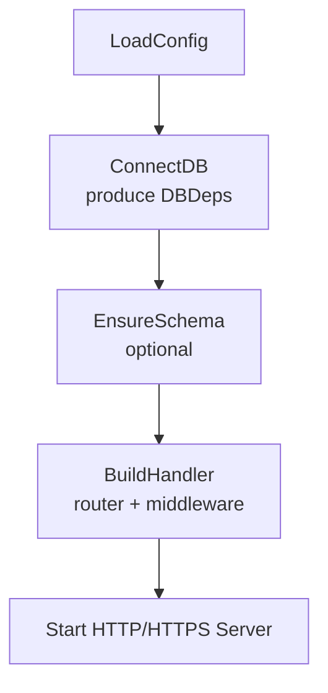
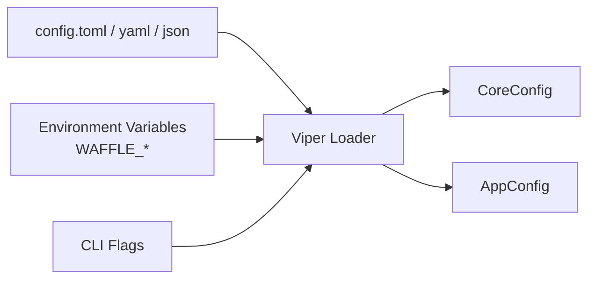
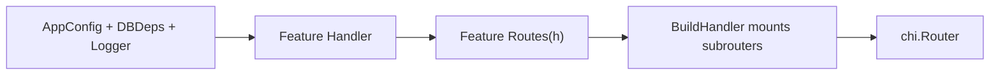
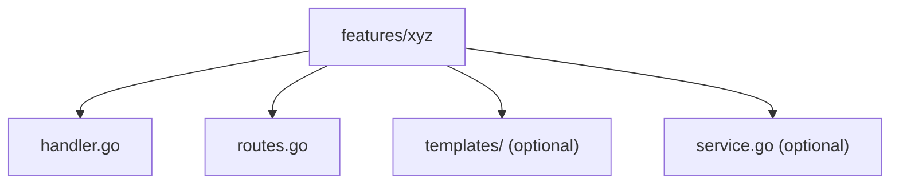
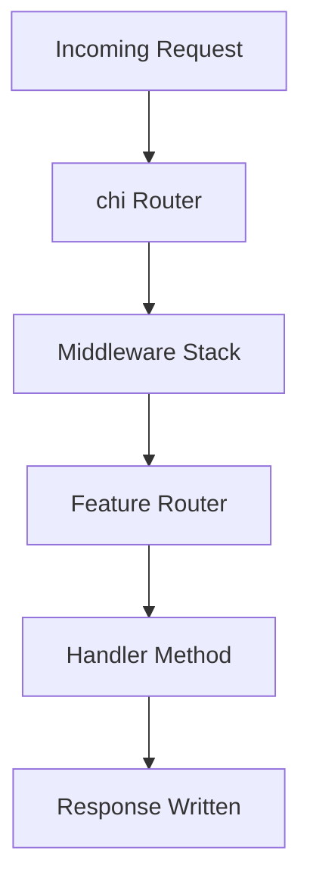
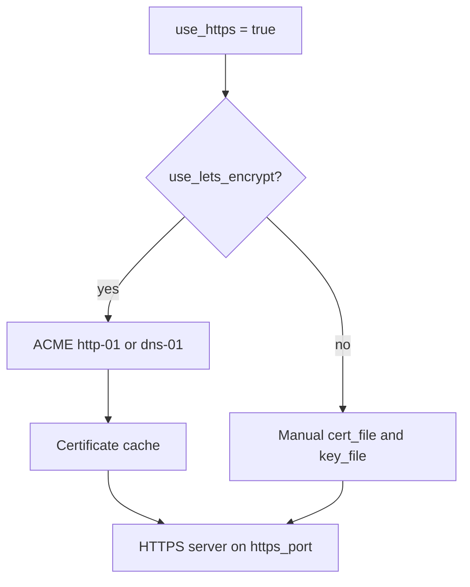
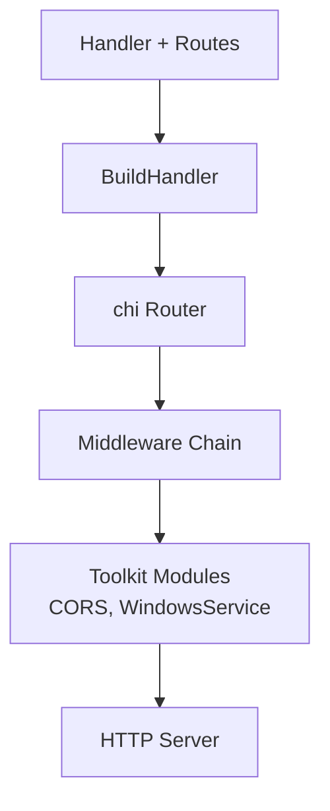
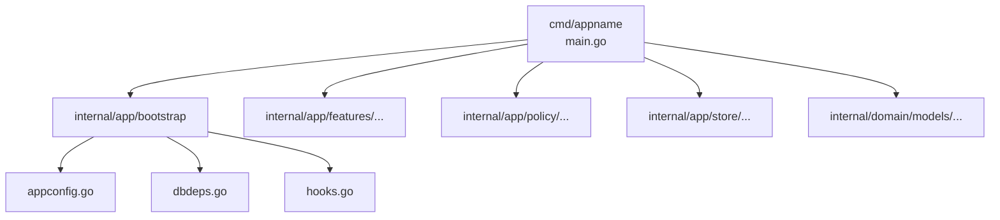

# WAFFLE Architecture Diagrams  
*A unified, linkable collection of diagrams illustrating core WAFFLE concepts.*

This file exists as the **central diagram index** for all WAFFLE documentation.  
Each diagram has a stable heading so other docs can link directly to it using GitHub’s auto‑generated anchors.

Diagrams are provided in two formats:

- **Mermaid diagrams** (rendered visually on GitHub)  
- **ASCII equivalents** (for plaintext readers, AI systems, and terminals)

Use these diagrams for:

- linking from other docs (e.g., Quickstart, Developer Docs, How‑To)
- teaching materials
- architectural overviews
- wafflestudio.ai documentation pages

---

# 🟦 WAFFLE Lifecycle  
*(How WAFFLE boots, connects, and serves your app)*

## Mermaid


## ASCII
```
LoadConfig
    ↓
ConnectDB (produces DBDeps)
    ↓
EnsureSchema (optional)
    ↓
BuildHandler (construct routes + middleware)
    ↓
Start HTTP/HTTPS Server
```

---

# 🟩 Configuration Flow  
*(How config values move into CoreConfig and AppConfig)*

## Mermaid


## ASCII
```
config file ─┐
env vars ────┼──→ Viper Loader → CoreConfig
CLI flags ───┘                  → AppConfig
```

---

# 🟧 Handler / Routes / BuildHandler Relationship  
*(How WAFFLE wires HTTP behavior together)*

## Mermaid


## ASCII
```
AppConfig + DBDeps + Logger
            ↓
        Handler
            ↓
     Routes(h *Handler)
            ↓
     Mounted in BuildHandler
            ↓
         chi.Router
```

---

# 🟨 Feature Folder Structure  
*(Recommended WAFFLE feature-based organization)*

## Mermaid


## ASCII
```
internal/app/features/xyz/
    handler.go
    routes.go
    templates/       (optional)
    service.go       (optional)
```

---

# 🟪 Request Flow Through WAFFLE  
*(What happens when an HTTP request arrives)*

## Mermaid


## ASCII
```
Incoming Request
      ↓
   chi Router
      ↓
Middleware Stack
      ↓
Feature Subrouter
      ↓
Handler Method
      ↓
Response
```

---

# 🟥 TLS / HTTPS / ACME Flow  
*(How WAFFLE manages HTTPS and Let’s Encrypt)*

## Mermaid


## ASCII
```
use_https = true
        ↓
   use_lets_encrypt?
       ↙        ↘
   yes           no
   ↓             ↓
ACME client   Manual cert_file/key_file
   ↓             ↓
Certificate Cache
        ↓
   HTTPS Server
```

---

# 🟫 WAFFLE Toolkit Integration  
*(Where optional helpers plug into the architecture)*

## Mermaid


## ASCII
```
Handlers & Routes
       ↓
   BuildHandler
       ↓
    chi Router
       ↓
 Middleware Chain
       ↓
 Toolkit (CORS, Windows services, etc.)
       ↓
   HTTP Server
```

---

# 🟦 WAFFLE Project Structure (Scaffolded)

## Mermaid


## ASCII
```
cmd/appname/main.go
internal/
  app/
    bootstrap/
      appconfig.go
      dbdeps.go
      hooks.go
    features/
    policy/
    store/
  domain/
    models/
```

---

# 🧇 Linking to Diagrams from Other Docs

You may deep‑link to any diagram heading using GitHub’s anchor format, e.g.:

```markdown
See the [WAFFLE Lifecycle](../waffle-architecture-diagrams.md#waffle-lifecycle) diagram.
```

Each heading in this file is intentionally stable and anchor-safe.

---

# ⭐ Summary

This document gathers **all WAFFLE architecture diagrams in one place** and provides:

- Mermaid diagrams for GitHub rendering  
- ASCII diagrams for plaintext readers  
- Stable anchors for deep-linking  
- A shared visual vocabulary for the framework  

Use these diagrams to enhance clarity across the entire WAFFLE documentation set.